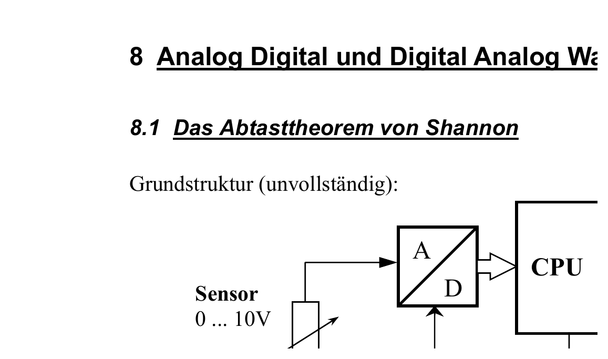
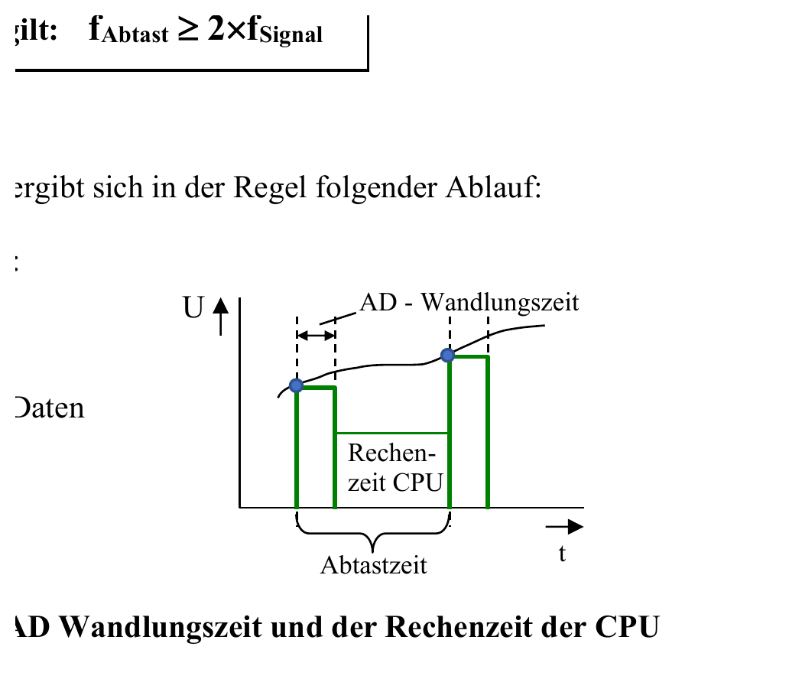

:::hbox
:::vbox
**Voraussetzungen**
- [[Sinuswellen & Effektivwert]]
:::
:::vbox
**Führt weiter zu**
- [[Aliasing]]
- [[AD-Wandler (Verfahren im Überblick)]]
:::
:::

---

Ein eingebettetes System, das eine analoge Welt überwacht und steuert, folgt fast immer derselben Grundstruktur: Ein Sensor liefert eine analoge Spannung — sagen wir 0…10 V —, ein → [[AD-Wandler (Verfahren im Überblick)|AD-Wandler]] verwandelt sie in eine digitale Zahl, die CPU verarbeitet diese Zahl, und ein DA-Wandler erzeugt daraus wieder eine analoge Ausgangsspannung für einen Aktor. Doch zwischen "analog" und "digital" klafft eine fundamentale Lücke: Ein digitales System kann ein zeitlich kontinuierliches Signal nur in einzelnen, zeitlich getrennten Momentaufnahmen erfassen. Wie oft muss man "hinschauen", damit dabei keine Information verloren geht? Genau diese Frage beantwortet das **Abtasttheorem von Shannon** — eine der folgenreichsten Erkenntnisse der gesamten Nachrichtentechnik.

## Die Grundregel: mindestens doppelt so schnell abtasten

:::merke
Nach dem Abtasttheorem von Shannon muss die **Abtastfrequenz** f_Abtast mindestens doppelt so gross sein wie die höchste relevante Frequenzkomponente f_Signal des abzutastenden Signals:

**f_Abtast ≥ 2 × f_Signal**

Nur wenn diese Bedingung erfüllt ist, lässt sich das Originalsignal aus seinen Abtastwerten verlustfrei rekonstruieren — die AD-Wandlung verläuft dann ohne Informationsverlust. Wird das Theorem verletzt, entsteht eine Signalverfälschung, die sich im Nachhinein **nicht mehr korrigieren** lässt — dazu mehr im Artikel → [[Aliasing|Aliasing]].
:::

## Wie ein Mikroprozessor das Abtasten organisiert

Arbeitet ein Mikroprozessor mit einem AD-Wandler zusammen, läuft typischerweise folgender Ablauf immer wieder von Neuem ab:

1. AD-Wandler starten
2. AD-Resultat einlesen
3. Rechenzeit der CPU — die Daten werden verarbeitet
4. Resultat ausgeben

:::tip
Die **Abtastzeit** setzt sich aus zwei Anteilen zusammen: der eigentlichen AD-Wandlungszeit und der anschliessenden Rechenzeit der CPU. Beide zusammen bestimmen, wie schnell das System überhaupt neue Abtastwerte liefern kann — und damit, welche Abtastfrequenz f_Abtast in der Praxis maximal erreichbar ist. Eine träge CPU oder ein langsamer Wandler begrenzen also direkt, welche Signalfrequenzen f_Signal nach dem Abtasttheorem überhaupt noch korrekt erfasst werden dürfen.
:::

## Das Beispiel: ein 2-kHz-Sinus, abgetastet mit 10 kHz

Am anschaulichsten lässt sich die Tragweite des Theorems an einem konkreten Beispiel zeigen: Ein Sinussignal mit 1 V Amplitude und 2 kHz Frequenz wird mit 10 kHz abgetastet — pro Periode entstehen dabei fünf Abtastwerte, das Abtasttheorem ist also klar erfüllt (10 kHz ≥ 2 × 2 kHz).

Am Ausgang des AD-Wandlers liegen aber nur noch die einzelnen Abtastwerte — die "Stützpunkte" — vor, nicht mehr die durchgehende Kurve. Und genau hier liegt eine überraschende Tatsache verborgen:

:::warning
Durch dieselben Stützpunkte lassen sich nicht nur die ursprüngliche 2-kHz-Sinuskurve, sondern auch ganz andere Sinuskurven mit völlig anderen Frequenzen legen — zum Beispiel eine Kurve mit 8 kHz oder mit 12 kHz durchläuft exakt dieselben Abtastpunkte! Ebenso funktionieren 18 kHz und 22 kHz, oder 28 kHz und 32 kHz — und so weiter. In den Stützpunkten eines AD-Wandlers "versteckt" sich also immer ein **ganzes Frequenzspektrum** möglicher Ursprungssignale. Aber nur dasjenige Sinussignal, dessen Frequenz tatsächlich kleiner als die halbe Abtastfrequenz ist (hier: 2 kHz), erfüllt wirklich das Abtasttheorem und wird korrekt rekonstruiert.
:::

## Die Spiegel-Regel: ein Muster mit System

Hinter diesen "passenden" Frequenzen steckt keine Beliebigkeit, sondern eine klare Gesetzmässigkeit:

:::merke
Die gesuchten Frequenzen spiegeln sich mit der Frequenz des Originalsignales um das Vielfache der Abtastfrequenz. Für unser Beispiel mit f_Abtast = 10 kHz und einem Originalsignal von 2 kHz ergibt sich folgendes Muster:

- Bei der einfachen Abtastfrequenz (10 kHz) ergeben sich 8 kHz und 12 kHz
- Bei der doppelten Abtastfrequenz (20 kHz) ergeben sich 18 kHz und 22 kHz
- Bei der dreifachen Abtastfrequenz (30 kHz) ergeben sich 28 kHz und 32 kHz
- Bei der vierfachen Abtastfrequenz (40 kHz) ergeben sich 38 kHz und 42 kHz
- … und so weiter

Allgemein gilt: Zu jedem ganzzahligen Vielfachen n der Abtastfrequenz gehören zwei "Geister-Frequenzen" bei n·f_Abtast − f_Signal und n·f_Abtast + f_Signal, die exakt dieselben Stützpunkte erzeugen wie das Originalsignal.
:::

## Frequenzblöcke: eine grafische Eselsbrücke

Stellt man sich das Frequenzspektrum als eine Reihe von "Blöcken" entlang der Frequenzachse vor — jeder Block so breit wie die Bandbreite des Nutzsignals —, lässt sich die Situation besonders übersichtlich darstellen: Bei einem Nutzsignal von 0…2 kHz und f_Abtast = 5 kHz reihen sich die gespiegelten Frequenzblöcke sauber getrennt aneinander auf — bei 3…7 kHz, bei 8…12 kHz, und so weiter. Ist das Abtasttheorem erfüllt, bleiben diese Blöcke **klar voneinander getrennt** und lassen sich anschliessend mit einem Tiefpassfilter sauber wieder auseinanderhalten.

Ist die Abtastfrequenz dagegen zu niedrig gewählt — zum Beispiel nur 3 kHz bei einem Nutzsignal von 0…2 kHz —, dann **überschneiden** sich die Frequenzblöcke bereits im Bereich des Nutzsignals selbst. Eine Trennung mit einem Filter ist dann unmöglich geworden: Die Information ist unwiderruflich vermischt.

Damit ist klar, *warum* das Abtasttheorem eingehalten werden muss — die viel praktischere Frage lautet aber: Was passiert eigentlich konkret, wenn es **verletzt** wird, und wie äussert sich das in einem realen Messsignal? Diesem Phänomen — und seiner wirksamen Gegenmassnahme — widmet sich der nächste Artikel: → [[Aliasing|Aliasing]].
