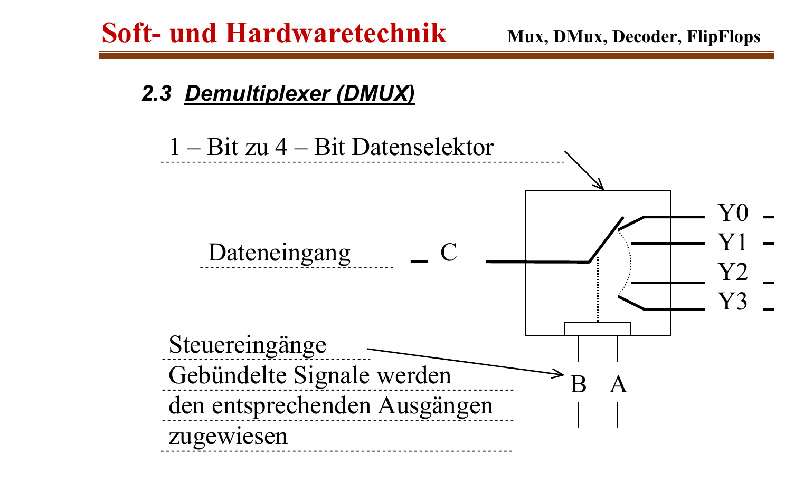

:::hbox
:::vbox
**Voraussetzungen**
- [[Multiplexer (MUX)]]
:::
:::vbox
**Verwandte Artikel**
- [[Encoder & Prioritätsencoder]]
- [[Code-Wandler (BCD-zu-7-Segment)]]
:::
:::

---

Während ein → [[Multiplexer (MUX)|Multiplexer]] mehrere Datenquellen auf eine gemeinsame Leitung "bündelt", arbeitet der **Demultiplexer (DMUX)** genau umgekehrt: Er nimmt das auf einer einzigen Leitung ankommende Signal entgegen und verteilt es — gesteuert durch ein Adresswort — gezielt auf einen von mehreren Ausgängen. Eng verwandt damit ist der **Decoder**, der ein Binärwort in genau ein aktives Ausgangssignal "übersetzt".

## Demultiplexer: 1-Bit-zu-4-Bit-Datenselektor

Ein Demultiplexer besitzt einen Dateneingang C, mehrere Datenausgänge Y0…Y3 sowie Steuereingänge (A, B), die festlegen, an welchen Ausgang das Eingangssignal durchgeschaltet wird:

| ĒN | C | B | A | aktiver Ausgang |
|---|---|---|---|---|
| 1 | X | X | X | alle Z (hochohmig) |
| 0 | C | 0 | 0 | Y0 = ¬A∧¬B∧C |
| 0 | C | 0 | 1 | Y1 = A∧¬B∧C |
| 0 | C | 1 | 0 | Y2 = ¬A∧B∧C |
| 0 | C | 1 | 1 | Y3 = A∧B∧C |

:::merke
Intern besteht ein Demultiplexer aus mehreren UND-Gattern mit Tristate-Ausgang (∇): Jedes Gatter erhält das Datensignal C sowie eine eindeutige Kombination der (ggf. invertierten) Adressbits A und B. Nur das Gatter, dessen Adress­kombination mit dem anliegenden Steuerwort übereinstimmt, lässt das Datensignal C durch — alle anderen bleiben gesperrt bzw. hochohmig. Das Funktionsprinzip ist also exakt das "Spiegelbild" des Multiplexers.
:::

## Decoder: vom Binärwort zum aktiven Ausgang

Legt man an den Dateneingang C eines Demultiplexers konstant eine logische 1, wird aus ihm ein **Decoder** (auch 1-aus-n-Decoder genannt): Er setzt ein n-Bit-Binärwort an seinen Adresseingängen in genau ein aktives Signal unter 2ⁿ Ausgängen um. Ein bekannter Vertreter ist der **74HC138** (3-zu-8-Decoder/Demultiplexer):

:::info
Der 74HC138 besitzt drei Adresseingänge A0…A2, acht **invertierte** Ausgänge Ȳ0…Ȳ7 (active LOW) sowie drei Enable-Eingänge Ē1, Ē2 (active LOW) und E3 (active HIGH). Nur wenn Ē1 = Ē2 = L und E3 = H ist, wird der Baustein aktiv — dann wird genau der Ausgang Ȳn auf Low gezogen, dessen Index n dem Binärwort an A2A1A0 entspricht; alle übrigen Ausgänge bleiben High. Über die mehrfachen Enable-Eingänge lassen sich mehrere 138er leicht zu grösseren Decodern (z. B. 1-aus-32) kaskadieren — der Zwillingsbaustein **74HC238** ist funktionsgleich, jedoch mit nicht-invertierenden (active HIGH) Ausgängen.
:::

## Anwendung: Adressdecodierung und Speicher-Selektion

Decoder sind das klassische Werkzeug, um in einem Mikroprozessorsystem aus einer Adresse zu bestimmen, **welcher** Baustein (RAM, ROM, Peripherie) gerade angesprochen wird:

:::tip
Liegt z. B. ein 74HC138 an den höchstwertigen Adressleitungen eines Busses, so aktiviert er — abhängig vom anliegenden 3-Bit-Adresswort — jeweils genau einen seiner acht Chip-Select-Ausgänge. Jeder dieser Ausgänge ist mit dem Enable-Eingang eines Speicherbausteins verbunden: Nur der adressierte Baustein wird "wach", alle anderen bleiben über ihre → [[Tristate-Ausgänge|Tristate-Ausgänge]] elektrisch vom Bus getrennt. So entsteht aus einer einzigen Adresse eine eindeutige, kollisionsfreie Auswahl unter vielen angeschlossenen Bausteinen.
:::

## Serieller Datentransfer: MUX und DMUX im Zusammenspiel

Multiplexer und Demultiplexer ergänzen sich ideal beim Aufbau einer **seriellen Übertragungsstrecke**: Auf der Senderseite bündelt ein 8:1-Multiplexer (z. B. 74LS251) acht parallele Datenbits (S0…S7) takt­gesteuert auf eine einzige Leitung; auf der Empfängerseite verteilt ein Demultiplexer/Decoder (z. B. 74LS138) diese Bits — synchron zum selben Zähler-Takt — wieder auf acht Ausgänge, an denen z. B. LEDs das ursprüngliche 8-Bit-Wort anzeigen. Zähler-ICs (74LS93) erzeugen dabei auf beiden Seiten synchron das nötige Adresswort, sodass Sender und Empfänger im Gleichschritt arbeiten — ein Grundprinzip, das auch der → [[Schieberegister|seriellen Datenübertragung]] über Schieberegister zugrunde liegt.

Wie aus einem Binärwort eine eindeutige *Auswahl* entsteht, zeigt der Decoder; den umgekehrten Weg — von einer aktiven Leitung zurück zu einem Binärwort — beschreibt der → [[Encoder & Prioritätsencoder|Encoder]].
