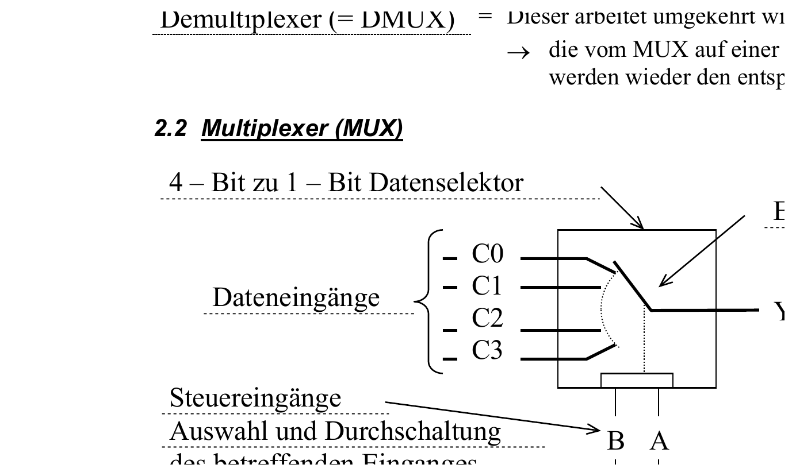

:::hbox
:::vbox
**Voraussetzungen**
- [[Logikgatter (UND, ODER, NICHT, NAND, NOR, EXOR)]]
:::
:::vbox
**Verwandte Artikel**
- [[Demultiplexer & Decoder]]
:::
:::vbox
**Führt weiter zu**
- [[Flipflops (SR, D, JK, T)]]
:::
:::

---

Ein **Datenselektor** wählt aus mehreren angebotenen Datensignalen das gewünschte aus und leitet es an einen einzigen Ausgang weiter. Wird diese Auswahl zeitabhängig über digitale Steuersignale getroffen, spricht man von einem **Multiplexer (MUX)** — einem der grundlegendsten "Verbindungsbausteine" der Digitaltechnik, der mehrere Quellen auf eine gemeinsame Leitung "bündelt".

## Aufbau und Funktionsprinzip

Ein **4-Bit-zu-1-Bit-Datenselektor** besitzt vier Dateneingänge C0…C3, einen Ausgang Y sowie zwei Steuereingänge A und B. Die Steuereingänge bestimmen, welcher der vier Dateneingänge auf den Ausgang durchgeschaltet wird — man kann sich den MUX als **elektronischen Umschalter** vorstellen, dessen Schaltarm durch das Binärwort an den Steuereingängen positioniert wird:

| ĒN | B | A | Y |
|---|---|---|---|
| 1 | X | X | Z (hochohmig) |
| 0 | 0 | 0 | C0 |
| 0 | 0 | 1 | C1 |
| 0 | 1 | 0 | C2 |
| 0 | 1 | 1 | C3 |

:::merke
Intern lässt sich ein 4:1-MUX direkt aus der Wahrheitstabelle als kombinatorische Schaltung aufbauen: Für jeden Dateneingang entsteht ein UND-Term, der das Datensignal nur dann durchlässt, wenn das Adresswort an A und B genau diesen Eingang "trifft" — z. B. y' = ¬A∧¬B∧C0, y'' = A∧¬B∧C1 usw. Ein abschliessendes ODER-Gatter mit Tristate-Ausgang (∇) fasst alle vier Terme zum Ausgang Y zusammen. Über den Freigabeeingang **ĒN** (Enable, active LOW) lässt sich der gesamte Baustein in den hochohmigen Z-Zustand versetzen — wichtig für die → [[Bussysteme (Adress-, Daten-, Steuerbus)|Buskopplung]].
:::

## Multiplexer als IC

Aus der TTL-Serie sind fertige Multiplexer-Bausteine verschiedener Grösse verfügbar:

| Funktion | Typische ICs |
|---|---|
| 2-zu-1-Datenselektor | 7498, 74157 |
| 4-zu-1-Datenselektor | 74153, 74352 |
| 8-zu-1-Datenselektor | 74251, 74351 |
| 16-zu-1-Datenselektor | 74850, 74851 |

:::tip
Steht für eine Aufgabe nicht der "passende" Baustein zur Verfügung, lassen sich kleinere Multiplexer **kaskadieren**: Zwei 4:1-MUX und ein zusätzlicher 2:1-MUX ergeben zusammen einen 8:1-Datenselektor — die beiden 4:1-Stufen wählen jeweils aus vier Eingängen vor, der nachgeschaltete 2:1-MUX entscheidet anhand des höchstwertigen Adressbits, welche der beiden Vorauswahlen am Ausgang erscheint. Auf diese Weise lässt sich praktisch jede gewünschte Eingangsbreite aus Standardbausteinen zusammensetzen.
:::

## Multiplexer als universeller Funktionsbaustein

Ein Multiplexer kann weit mehr als nur Daten "durchschalten": Da jeder Dateneingang fest auf 0 oder 1 gelegt werden kann, lässt sich **jede beliebige Wahrheitstabelle** direkt mit einem MUX realisieren — die Eingangsvariablen der Funktion werden einfach an die Steuereingänge gelegt, und an den Dateneingängen liegen die in der Wahrheitstabelle vorgegebenen Funktionswerte (0, 1 oder eine weitere Variable) an. Damit wird der MUX zu einer Art "programmierbarem" Logikbaustein, der ohne ein einziges zusätzliches Gatter komplexe Verknüpfungen abbilden kann.

Auch **analoge Signale** lassen sich mit speziellen Multiplexer-ICs (z. B. dem analogen 8-Kanal-Multiplexer/Demultiplexer 74HC4051 oder dem Schalter-IC DG408) digital ansteuern und auswählen — ein wichtiges Bindeglied zwischen analoger Sensorik und digitaler Verarbeitung, etwa beim sequenziellen Abtasten mehrerer Sensoreingänge durch einen einzigen → [[AD-Wandler (Verfahren im Überblick)|AD-Wandler]].

Bei → [[Schieberegister|seriellen Datenübertragungen]] dient der Multiplexer ausserdem dazu, parallel anliegende Datenbits (S0…S7) takt­gesteuert nacheinander auf eine einzige serielle Leitung zu legen — die Umkehrung dieser Operation übernimmt der → [[Demultiplexer & Decoder|Demultiplexer]].
