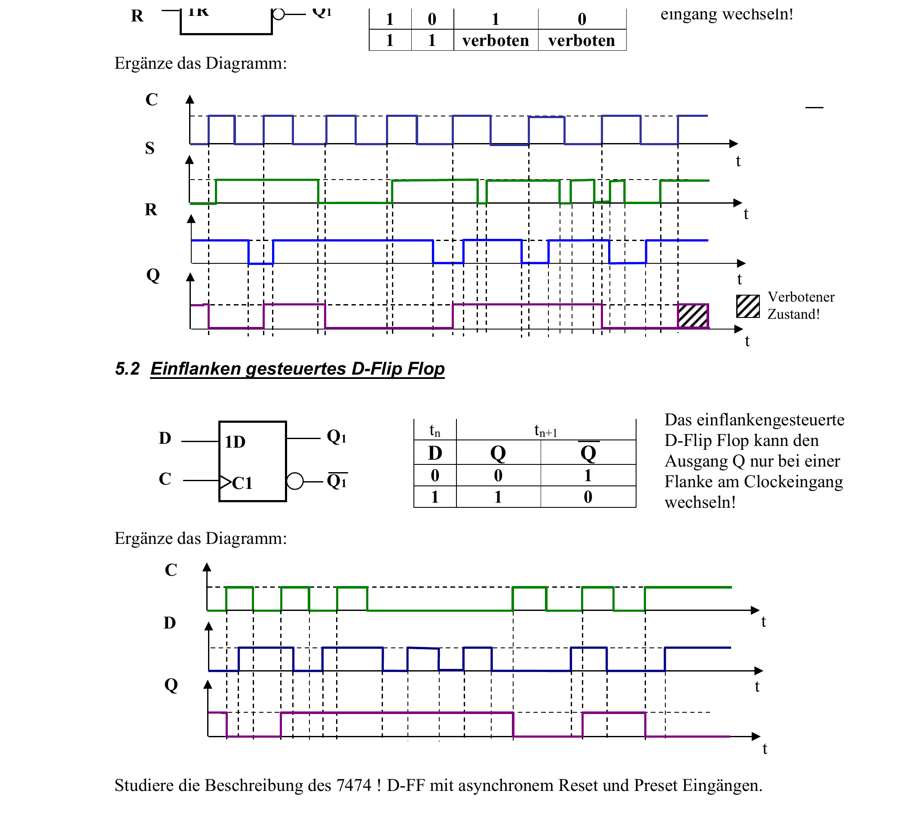
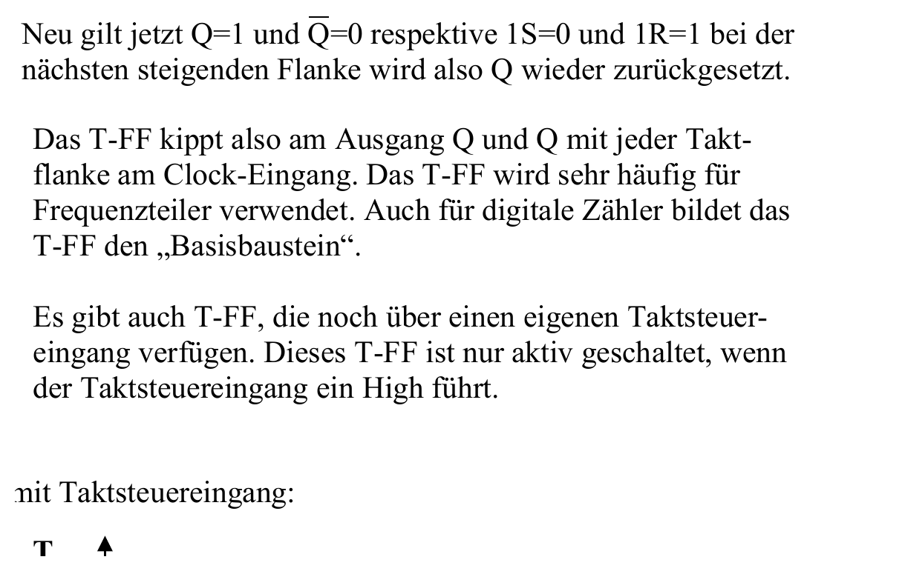

:::hbox
:::vbox
**Voraussetzungen**
- [[Logikgatter (UND, ODER, NICHT, NAND, NOR, EXOR)]]
:::
:::vbox
**Führt weiter zu**
- [[Asynchrone Zähler]]
- [[Synchrone Zähler]]
- [[Monoflop (Monostabile Kippstufe)]]
:::
:::

---

Ein einzelnes → [[Logikgatter (UND, ODER, NICHT, NAND, NOR, EXOR)|Logikgatter]] kennt nur den aktuellen Zustand seiner Eingänge — sein Ausgang "vergisst" sofort wieder, was vorher anlag. Verschaltet man Gatter jedoch so, dass der Ausgang auf den Eingang zurückwirkt, entsteht eine **bistabile Kippstufe**: eine Schaltung, die sich einen von zwei stabilen Zuständen "merkt", bis sie aktiv umgeschaltet wird. Diese Fähigkeit zur Speicherung macht das **Flipflop (FF)** zum fundamentalen Speicherelement der gesamten Digitaltechnik.

## Das SR-Flipflop: die einfachste Speicherzelle

Die Grundidee lässt sich an einer einfachen Sensor-Alarm-Schaltung zeigen: Ein Sensorimpuls soll eine Alarmleuchte einschalten, die auch dann eingeschaltet bleibt, wenn der Sensor längst wieder in Ruhe ist — erst eine separate Quittierungstaste darf den Alarm zurücksetzen. Genau dieses Verhalten — Setzen, Halten, Rücksetzen — leistet das **SR-Flipflop** (Set/Reset).

Aus zwei rückgekoppelten NOR-Gattern entsteht das **NOR-SR-Flipflop**:

| S | R | Q (neu) | Verhalten |
|---|---|---|---|
| 0 | 0 | Q (alt) | Halten (Speichern) |
| 1 | 0 | 1 | Setzen |
| 0 | 1 | 0 | Rücksetzen |
| 1 | 1 | 0 / 0 | **verboten** |

:::merke
Beim NOR-SR-Flipflop ist die Reset-Funktion **dominant**: Liegen S und R gleichzeitig auf 1, gewinnt stets der Reset-Pfad ("1 dominant" bezogen auf die NOR-Logik — der Ausgang Q wird zu 0 gezwungen). Sobald beide Eingänge wieder auf 0 zurückgehen, ist der nun erreichte Zustand jedoch nicht mehr eindeutig vorhersagbar.
:::

Eine spiegelbildliche Variante, das **NAND-S̄R̄-Flipflop**, arbeitet mit invertierten (active-LOW) Eingängen S̄ und R̄ — hier ist konsequenterweise "0 dominant": Der zuletzt auf 0 gezogene Eingang bestimmt den Zustand.

:::warning
Der Zustand S = R = 1 (bzw. S̄ = R̄ = 0) heisst **verbotener Zustand**: Beide Ausgänge Q und Q̄ nehmen denselben Pegel an — die sonst stets geltende Komplementärbeziehung zwischen Q und Q̄ ist aufgehoben. Springen anschliessend beide Eingänge gleichzeitig in den Halte-Zustand zurück, "rast" die Schaltung in einen von zwei möglichen Zuständen — welchen, hängt von winzigen, nicht kontrollierbaren Laufzeitunterschieden der Gatter ab. In der praktischen Schaltung wird dieser Eingangszustand deshalb durch eine **Vorschaltlogik mit dominantem Set bzw. Reset** von vornherein ausgeschlossen.
:::

Eine alltägliche Anwendung des einfachen SR-Flipflops ist die **Entprellschaltung**: Mechanische Taster "prellen" beim Betätigen — der Kontakt schliesst und öffnet für wenige Millisekunden mehrfach, bevor er zur Ruhe kommt. Ein SR-Flipflop, dessen Eingänge an die beiden Schaltstellungen eines Tasters gelegt werden, wechselt beim ersten Kontaktschluss sauber in den neuen Zustand und ignoriert das nachfolgende Prellen — am Ausgang erscheint ein einziger, sauberer Schaltimpuls.

## Taktflankensteuerung: vom Pegel zur Flanke

Das einfache SR-Flipflop reagiert **unmittelbar** auf jede Pegeländerung seiner Eingänge — in komplexeren Schaltungen, in denen viele Flipflops im Gleichschritt arbeiten müssen, ist das ein Problem: Ein Signal, das während einer ganzen Taktperiode "läuft", würde mehrfach übernommen. Die Lösung ist die **Taktflankensteuerung**: Das Flipflop übernimmt seinen Eingangswert nur in dem winzigen Moment, in dem der Takt von 0 auf 1 (positive bzw. steigende Flanke, Symbol ▷) oder von 1 auf 0 (negative bzw. fallende Flanke, Symbol ▷ mit Inversionskreis) wechselt.

:::tip
Der entscheidende Vorteil taktflankengesteuerter Flipflops: Ihr Ausgang ändert sich **nur einmal pro Taktperiode**, exakt synchron zur aktiven Flanke — und das unabhängig davon, wie lange die Eingangssignale davor oder danach anliegen. Erst dieses Verhalten erlaubt es, viele Flipflops zu Registern, → [[Asynchrone Zähler|Zählern]] oder → [[Schieberegister|Schieberegistern]] zusammenzuschalten, die zuverlässig im Gleichschritt takten.
:::

## Die wichtigsten taktflankengesteuerten Flipflop-Typen

Aus dem flankengesteuerten SR-Flipflop lassen sich durch geschickte Rückführung der Ausgänge auf die Eingänge drei weitere, in der Praxis weitaus häufiger eingesetzte Varianten ableiten:

| Typ | Eingänge | Verhalten |
|---|---|---|
| **D-Flipflop** | D (Data) | Übernimmt bei der aktiven Flanke den Wert von D: Q(neu) = D — ein reines "Verzögerungsglied" um eine Taktperiode |
| **Toggle-Flipflop (T-FF)** | T | T = 0: Q hält seinen Wert; T = 1: Q kippt bei jeder aktiven Flanke in den jeweils anderen Zustand (Q wird zu Q̄) |
| **JK-Flipflop** | J, K | Verhält sich wie ein SR-FF (J = Set, K = Reset, J = K = 0: Halten) — löst aber zusätzlich den verbotenen Zustand auf: Bei J = K = 1 **kippt** das Flipflop (Toggle-Funktion) |

:::merke
Das **JK-Flipflop** vereinigt damit alle Grundfunktionen in einem Baustein: Es speichert (J = K = 0), setzt (J = 1, K = 0), setzt zurück (J = 0, K = 1) und kippt (J = K = 1) — der einstige "verbotene Zustand" des SR-Flipflops wird hier zu einer nützlichen, klar definierten vierten Funktion. Verbindet man bei einem JK-Flipflop die Eingänge J und K fest miteinander (J = K), entsteht daraus unmittelbar ein **T-Flipflop**: Bei J = K = 0 hält es, bei J = K = 1 kippt es bei jeder Taktflanke — eine Schaltung, die als **Frequenzteiler** arbeitet, denn am Ausgang erscheint exakt die halbe Taktfrequenz. Reiht man mehrere T-Flipflops aneinander, entsteht eine Kaskade, die die Frequenz immer weiter halbiert: 1 MHz → 500 kHz → 250 kHz → 125 kHz … — das Grundprinzip des → [[Frequenzteiler|Frequenzteilers]] und des → [[Asynchrone Zähler|asynchronen Zählers]].
:::

## Master-Slave: zweiflankengesteuerte Flipflops

Eine besondere Bauform ist das **Master-Slave-Flipflop**: Es besteht intern aus zwei hintereinandergeschalteten Stufen — einem "Master" und einem "Slave" —, die von komplementären Taktphasen gesteuert werden.

:::info
Das Funktionsprinzip lässt sich mit einer **Schleuse** vergleichen: Während die erste Kammer (Master) befüllt wird, bleibt das Tor zur zweiten Kammer (Slave) geschlossen; ist der Master "voll" (Eingang bei der einen Taktflanke übernommen), schliesst sich sein Eingangstor, und erst dann öffnet sich das Tor zum Slave, der den Wert bei der **entgegengesetzten** Taktflanke übernimmt und an den Ausgang weitergibt. So ist sichergestellt, dass sich der Eingang während der gesamten aktiven Taktphase nicht mehr auf den bereits "festgelegten" Ausgang auswirken kann — ein wichtiger Schutz vor Race-Conditions in rückgekoppelten Schaltungen wie Zählern. Bekannte integrierte Vertreter sind die Master-Slave-SR- bzw. JK-Flipflops **7471/7472/7473** sowie das moderne Doppel-JK-Flipflop **74HC112** (mit zusätzlichen asynchronen Set-/Reset-Eingängen, negativ flankengetriggert).
:::

Damit stehen alle Bausteine bereit, um daraus die nächsten, grösseren Funktionseinheiten der Digitaltechnik aufzubauen: das zeitgebende → [[Monoflop (Monostabile Kippstufe)|Monoflop]], → [[Asynchrone Zähler|asynchrone]] und → [[Synchrone Zähler|synchrone Zähler]] sowie daraus abgeleitete → [[Frequenzteiler|Frequenzteiler]] und → [[Zustandsautomaten (FSM)|Zustandsautomaten]].
