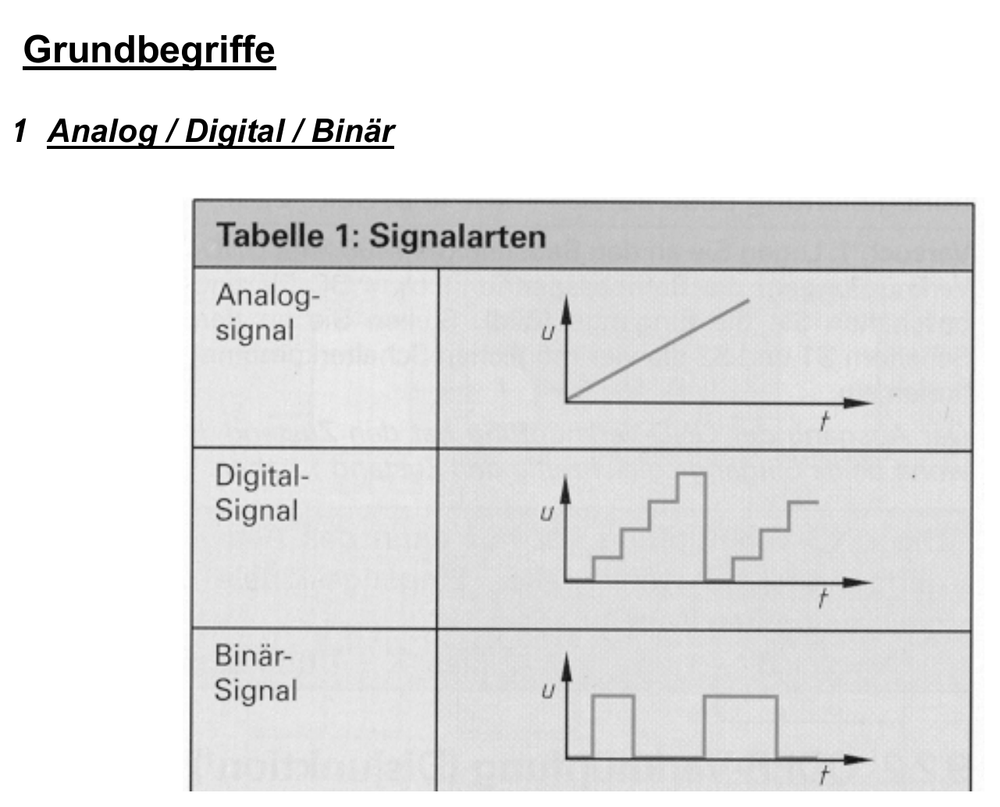

:::hbox
:::vbox
**Führt weiter zu**
- [[Zahlensysteme (Dual, Hexadezimal)]]
- [[Logikgatter (UND, ODER, NICHT, NAND, NOR, EXOR)]]
:::
:::

---

Jedes elektronische System verarbeitet Information in Form von Spannungsverläufen über die Zeit. Je nachdem, wie viele Werte ein Signal annehmen kann, unterscheidet man drei Signalarten — und genau diese Unterscheidung trennt die "analoge" von der "digitalen" Welt.

## Die drei Signalarten

| Signalart | Wertebereich | Verlauf | Beispiel |
|---|---|---|---|
| **Analog** | beliebig viele Werte in einem Bereich | stetig veränderbar | Mikrofonspannung, Temperatursensor |
| **Digital** | mehrere abzählbare Stufen | stufig (sprunghaft, gleicher Wertezuwachs) | Anzeige eines AD-Wandlers |
| **Binär** | genau zwei Zustände | EIN / AUS | Logikpegel, Schaltzustand |

**Analoge Signale** ändern ihren Wert kontinuierlich mit der verursachenden Grösse — sie können in ihrem Wertebereich jeden Zwischenwert annehmen. Eine Temperatur oder eine Mikrofonspannung sind typische Beispiele.

**Digitale Signale** ändern ihre Grösse sprunghaft, in gleich grossen Stufen. Sie sind "stufig" veränderbar — zwischen zwei benachbarten Stufen gibt es keinen gültigen Zwischenwert.

**Binäre Signale** sind der Spezialfall mit nur zwei möglichen Zuständen: 0 oder 1, EIN oder AUS, GND oder +5 V. In dieser Welt der zwei Zustände bewegt sich die gesamte Digitaltechnik.

:::merke
Binär ist ein Sonderfall von Digital: Digital heisst "in abzählbaren Stufen", binär heisst "in genau zwei Stufen". Jedes binäre Signal ist digital — aber nicht jedes digitale Signal ist binär (ein BCD-codierter Wert mit 10 Stufen ist digital, wird intern aber durch mehrere binäre Leitungen dargestellt).
:::

## Warum Digitaltechnik binär arbeitet

Ein Transistor lässt sich besonders einfach und zuverlässig zwischen zwei Zuständen schalten — leitend oder sperrend. Zwei eindeutig unterscheidbare Pegel sind robust gegenüber Rauschen und Bauteiltoleranzen: Selbst wenn der Pegel etwas schwankt, bleibt die Information eindeutig 0 oder 1. Aus dieser Robustheit folgt die ganze digitale Schaltungstechnik — Logikgatter, Speicher, Prozessoren — als systematischer Aufbau aus binären Grundbausteinen.

:::tip
In Schaltplänen und Datenblättern wird häufig festgelegt: 0 = GND (0 V), 1 = +5 V (oder eine andere Versorgungsspannung). Diese Zuordnung ist Konvention. → [[Schaltpegel & Störabstand]]
:::

## Vom analogen zum digitalen Signal

Reale physikalische Grössen (Temperatur, Druck, Schall) sind analog. Damit ein digitales System sie verarbeiten kann, müssen sie zunächst in eine binäre Darstellung umgewandelt werden — das Signal wird abgetastet und in Stufen quantisiert. → [[Abtasttheorem]], [[AD-Wandler-Verfahren]]

Umgekehrt erzeugt ein DA-Wandler aus einer binären Zahl wieder ein analoges Ausgangssignal. → [[DA-Wandler (R-2R, gewichtetes Netzwerk)]]
