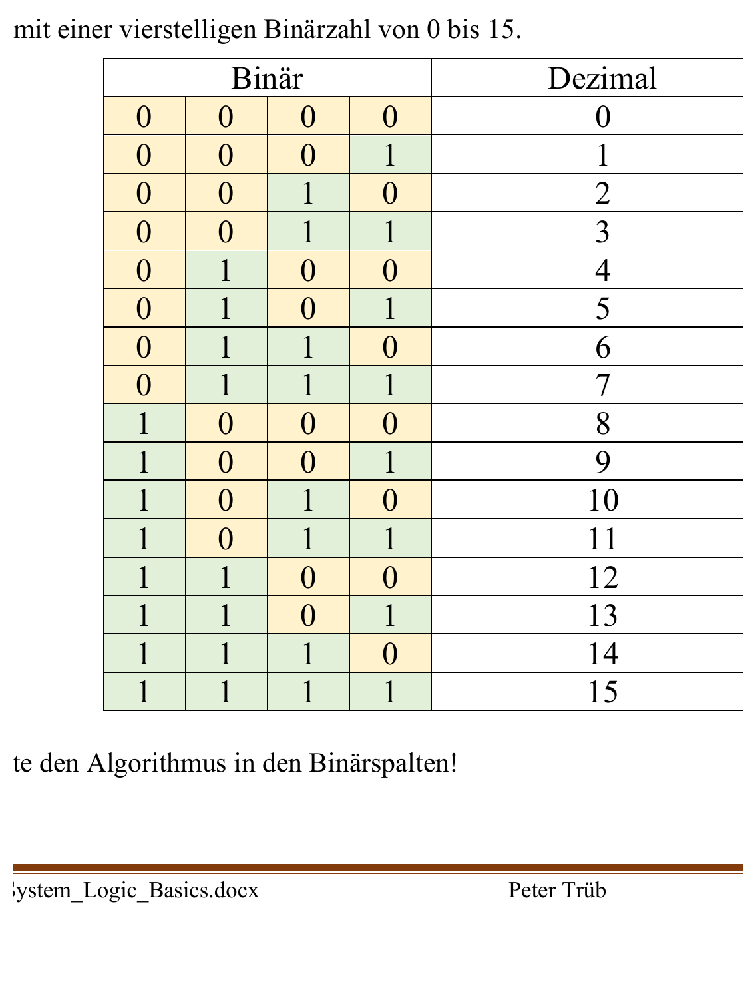

:::hbox
:::vbox
**Voraussetzungen**
- [[Signale (Analog, Digital, Binär)]]
:::
:::vbox
**Führt weiter zu**
- [[Digitale Codes (BCD, Gray, Hamming, ASCII)]]
- [[Binäre Arithmetik (Addition, Subtraktion, Zweierkomplement)]]
:::
:::

---

Digitale Systeme kennen nur zwei Zustände — deshalb rechnen sie nicht im gewohnten Zehnersystem, sondern im **Dualsystem** (Basis 2). Für Menschen ist das unhandlich zu lesen, weshalb in der Praxis das **Hexadezimalsystem** (Basis 16) als kompakte Schreibweise dient.

## Stellenwertsysteme

Jedes Stellenwertsystem funktioniert nach demselben Prinzip: Eine Ziffer an Position *n* hat den Wert *Ziffer × Basis^n*. Nur die Basis und der Ziffernvorrat unterscheiden sich.

| System | Basis | Ziffern | Beispiel |
|---|---|---|---|
| Dezimalsystem | 10 | 0 … 9 | 2385 = 2·10³ + 3·10² + 8·10¹ + 5·10⁰ |
| Dualsystem (Binär) | 2 | 0, 1 | 1001₂ = 1·2³ + 0·2² + 0·2¹ + 1·2⁰ = 9₁₀ |
| Hexadezimalsystem | 16 | 0…9, A…F | A32F₁₆ = 10·16³ + 3·16² + 2·16¹ + 15·16⁰ = 41775₁₀ |

Bei Hexadezimalzahlen entsprechen die Buchstaben A–F den Dezimalwerten 10–15.

## Das Kastensystem

Eine schnelle Methode, um Dualzahlen in Dezimalzahlen umzuwandeln, ist das **Kastensystem**: Man schreibt die Stellenwerte 2⁷ … 2⁰ (128, 64, 32, 16, 8, 4, 2, 1) über die Bits und addiert nur die Stellenwerte, an denen eine 1 steht.

| 128 (2⁷) | 64 (2⁶) | 32 (2⁵) | 16 (2⁴) | 8 (2³) | 4 (2²) | 2 (2¹) | 1 (2⁰) |
|---|---|---|---|---|---|---|---|
| 1 | 0 | 1 | 0 | 0 | 0 | 1 | 1 |

→ 128 + 32 + 2 + 1 = 163₁₀

:::tip
Umgekehrt (Dezimal → Dual) zieht man wiederholt die grösstmögliche Zweierpotenz ab und notiert für jede Stelle 1 (passt) oder 0 (passt nicht) — bis nichts mehr übrig bleibt.
:::

## Bit, Nibble, Byte, MSB und LSB

| Begriff | Bedeutung |
|---|---|
| **Bit** | eine einzelne Binärstelle (0 oder 1) |
| **Nibble** | Gruppe von 4 Bit |
| **Byte** | Gruppe von 8 Bit, Höchstwert 255 (vorzeichenlos) |
| **MSB** | Most Significant Bit — höchstwertiges Bit (2⁷ bei 8 Bit) |
| **LSB** | Least Significant Bit — niederwertigstes Bit (2⁰) |

:::merke
Eine Hexziffer entspricht genau einem Nibble (4 Bit), eine Oktalziffer 3 Bit. Das macht Hex besonders praktisch: zwei Hexziffern stellen exakt ein Byte dar (z. B. 0xA3 = 1010'0011₂).
:::

## Zwischen den Systemen umrechnen

**Dual ↔ Hex**: Da ein Hex-Zeichen genau 4 Bit (ein Nibble) entspricht, lässt sich eine Dualzahl direkt in 4er-Gruppen aufteilen und Nibble für Nibble in Hex übersetzen — ganz ohne Umweg über das Dezimalsystem.

**Beliebige Basis ↔ Beliebige Basis**: Allgemein rechnet man über das Dezimalsystem als Zwischenschritt um — zuerst in den Dezimalwert, dann mit Stellenwert-Division ins Zielsystem.

:::formel
**Allgemeine Stellenwertformel**

Z = z_n · B^n + z_{n-1} · B^{n-1} + … + z_0 · B^0

Z = dargestellter Wert, z_i = Ziffer an Stelle i, B = Basis des Zahlensystems
:::

## Binäres Zählen

Beim Hochzählen im Dualsystem kippt das niederwertigste Bit (LSB) bei jedem Schritt; ein Bit kippt jeweils dann, wenn alle rechts von ihm stehenden Bits von 1 auf 0 zurückspringen — derselbe Übertrags-Mechanismus wie beim Zehnersystem, nur mit Basis 2 statt 10.

| Binär | Dezimal |
|---|---|
| 0000 | 0 |
| 0001 | 1 |
| 0010 | 2 |
| 0011 | 3 |
| … | … |
| 1111 | 15 |

Diese Systematik ist die Grundlage für [[Asynchrone Zähler]] und [[Synchrone Zähler]] in der Digitaltechnik.
