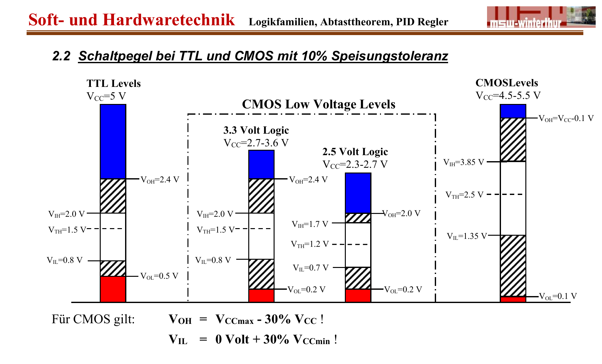

:::hbox
:::vbox
**Voraussetzungen**
- [[Logikfamilien (TTL, CMOS, BiCMOS, ECL)]]
:::
:::vbox
**Verwandte Artikel**
- [[Pull-Up- und Pull-Down-Widerstände]]
:::
:::

---

Damit ein digitales Gatter zuverlässig zwischen "Low" und "High" unterscheiden kann, sind die Eingangs- und Ausgangsspannungen nicht auf einen einzelnen Wert festgelegt, sondern auf **Spannungsbereiche** — die **Schaltpegel**. Wie gross der Sicherheitsabstand zwischen diesen Bereichen ist, bestimmt, wie störsicher eine Schaltung im Betrieb ist.

## Die vier Pegelgrenzen

Jede Logikfamilie definiert vier charakteristische Spannungswerte:

| Kürzel | Bedeutung |
|---|---|
| V_OH | minimale **Ausgangsspannung**, die als High erkannt wird |
| V_OL | maximale **Ausgangsspannung**, die als Low erkannt wird |
| V_IH | minimale **Eingangsspannung**, die als High akzeptiert wird |
| V_IL | maximale **Eingangsspannung**, die als Low akzeptiert wird |

Bei TTL-Pegeln (V_CC = 5 V) gelten beispielsweise typisch V_OH = 2.4 V, V_OL = 0.5 V, V_IH = 2.0 V und V_IL = 0.8 V. Bei CMOS-Pegeln gilt als Faustregel V_OH = V_CCmax − 30 % · V_CC und V_IL = 0 V + 30 % · V_CCmin.

:::merke
Zwischen V_OL und V_IH bzw. zwischen V_IL und V_OH liegt ein Bereich, der von keiner der beiden Definitionen abgedeckt wird — der **undefinierte Bereich**. Ein Signal, das in diesem Bereich liegt, kann von einem nachfolgenden Gatter nicht zuverlässig als Low oder High interpretiert werden.
:::

## Der DC-Störabstand

Schliesst man zwei Gatter derselben Logikfamilie hintereinander, ergibt sich aus der Differenz von Ausgangs- und Eingangspegel der **statische (DC-)Störabstand**:

:::formel
**DC-Störabstand Low-Pegel**: U_OL − U_IL

**DC-Störabstand High-Pegel**: U_IH − U_OH
:::

Der Störabstand gibt an, wie stark sich eine Störspannung (z. B. eingekoppelt über lange Leitungen oder Schaltvorgänge benachbarter Gatter) dem Nutzsignal überlagern darf, ohne dass das empfangende Gatter den Pegel falsch interpretiert. Je grösser der Störabstand, desto **störsicherer** ist die Schaltung.

:::tip
Beim Zusammenschalten **verschiedener** Logikfamilien (z. B. 5-V-TTL an 5-V-CMOS) muss zusätzlich geprüft werden, ob die Ausgangspegel der einen Familie innerhalb der Eingangspegel-Grenzen der anderen liegen. Reicht der TTL-High-Pegel (typisch 2.4 V) nicht aus, um den CMOS-Eingang sicher auf High zu schalten (V_IH ≈ 3.85 V), wird ein → [[Pull-Up- und Pull-Down-Widerstände|Pull-Up-Widerstand]] zur Pegelanpassung benötigt. In die Gegenrichtung (TTL-Low zu CMOS-Low) ist meist keine Anpassung nötig, da der TTL-Low-Pegel ohnehin tiefer liegt als der CMOS-Low-Pegel.
:::

## Mittlere Durchlaufzeit t_PD

Neben der Störsicherheit ist auch das zeitliche Verhalten beim Pegelwechsel wichtig. Die **Signallaufzeit** t_PLH gibt die Verzögerung zwischen Eingangs- und Ausgangssignal beim Wechsel von Low nach High an, t_PHL die Verzögerung beim Wechsel von High nach Low. Die **mittlere Durchlaufzeit** ist deren Mittelwert:

:::formel
t_PD = (t_PLH + t_PHL) / 2

bezogen auf den Spannungspunkt U_PD = 0.5 · (U_OL + U_OH)
:::

Zusätzlich werden die **Anstiegs- und Abfallzeiten** der Flanken (T_r, T_f) zwischen den 10-%- und 90-%-Punkten der Signalamplitude gemessen — sie bestimmen, wie "steil" ein Signal schaltet, und beeinflussen damit unter anderem, ob ein Gatter mit Schmitt-Trigger-Eingang nötig ist.
