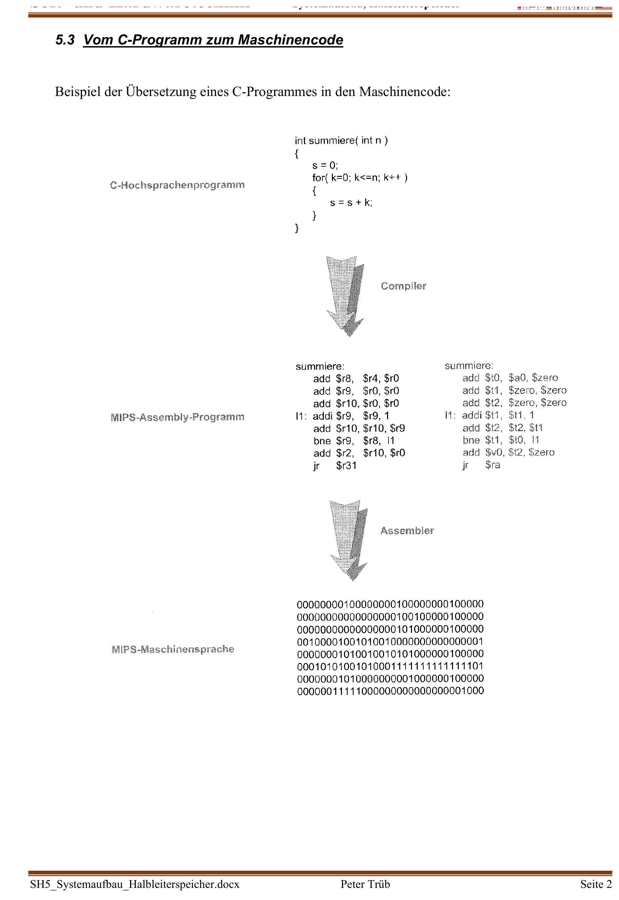

:::hbox
:::vbox
**Voraussetzungen**
- [[Aufbau eines Mikroprozessorsystems]]
:::
:::vbox
**Führt weiter zu**
- [[Rechnerarchitekturen (CISC, RISC, DSP)]]
:::
:::

---

Ein Mikroprozessor "versteht" kein C und kein Assembly — er kennt nur Folgen von Nullen und Einsen, den **Maschinencode**. Wie aus einem lesbaren Hochsprachenprogramm letztlich genau diese Bitmuster entstehen und wie die CPU sie Schritt für Schritt abarbeitet, zeigt der Befehlszyklus.

## Vom C-Programm zum Maschinencode

Auf dem Weg von der Hochsprache zur Hardware durchläuft ein Programm mehrere Übersetzungsstufen:

:::merke
Ein **Compiler** übersetzt ein C-Programm zunächst in **Assembler-Code** — eine für Menschen noch lesbare, aber bereits prozessornahe Befehlsfolge (z. B. `add $r8, $r4, $r0`, `addi $r9, $r9, 1`, `bne $r9, $r8, l1`). Ein **Assembler** übersetzt diesen Assembler-Code anschliessend in den eigentlichen **Maschinencode** — reine Bitmuster, die der Prozessor direkt aus dem Speicher laden und ausführen kann. Jede Zeile Assembler-Code entspricht dabei genau einer Maschinencode-Zeile fester Länge (bei MIPS z. B. 32 Bit).
:::

## Aufbau eines Maschinenbefehls: Opcode und Operandencode

Jeder Maschinenbefehl trägt zwei Arten von Information in sich:

:::tip
Der **Operationscode (Opcode)** legt fest, *welche* Operation ausgeführt werden soll (Addition, Laden, Sprung, …) — er definiert quasi den "Befehlstyp". Der **Operandencode** liefert die dazu nötigen Zusatzinformationen: *welche* Register oder Konstanten an der Operation beteiligt sind. Beim Befehl `add $r8, $r4, $r0` (= `$r8 = $r4 + $r0`) zerfällt das 32-Bit-Maschinenwort in feste Felder: 6 Bit Opcode, je 5 Bit für die Quellregister `$rs` und `$rt`, 5 Bit für das Zielregister `$rd`, 5 Bit "Shift Amount" und 6 Bit "Function" — aus dem Bitmuster `000000 00100 00000 01000 00000 100000` liest der Befehlsdecoder so exakt heraus, *was* zu tun ist und *womit*.
:::

Der so erzeugte Maschinencode wird beim Programmstart in den Speicher geladen — von dort holt ihn die CPU sich Befehl für Befehl.

## Der Befehlszyklus: Holen, Decodieren, Ausführen

Jeder einzelne Maschinenbefehl durchläuft beim Abarbeiten dieselben drei Grundphasen:

:::merke
**1. Befehl holen (Fetch)**: Der **Programmcounter (PC)** wird auf den Adressbus geschaltet — er zeigt stets auf die Speicherzelle des nächsten auszuführenden Befehls. Über den Datenbus wird der dort gespeicherte Maschinencode in das **Befehlsregister (IR)** eingelesen, anschliessend wird der PC automatisch um eins erhöht (er "zeigt" damit bereits auf den nächsten Befehl).
**2. Befehl decodieren (Decode)**: Der **Befehlsdecoder** im Steuerwerk wertet den Inhalt des IR aus — er erkennt aus dem Opcode, um welche Operation es sich handelt, und sorgt dafür, dass die richtigen Register an die ALU geschaltet werden.
**3. Befehl ausführen (Execute)**: Das **Rechenwerk** (ALU) führt die eigentliche Operation aus — Addition, Vergleich, Adressberechnung — und das Ergebnis wird je nach Befehlstyp in ein Register geschrieben, in den Speicher zurückgeschrieben oder als neue Programmadresse in den PC geladen. Dabei setzt die ALU auch die Statusbits im **PSW** (Programmstatuswort: N = Negativ, Z = Zero/Null, C = Carry/Übertrag, V = Overflow/Überlauf) — wichtige Informationen für nachfolgende Vergleichs- und Sprungbefehle.
:::

Dieser Dreischritt — Holen, Decodieren, Ausführen — wiederholt sich unablässig, solange das Programm läuft. Vier typische Befehlsklassen zeigen, wie unterschiedlich die "Ausführen"-Phase im Detail ablaufen kann:

## Arithmetisch-logischer Befehl: `add $r1, $r2, $r3`

Der Befehl bedeutet `$r1 = $r2 + $r3`. Nach Fetch und Decode kopiert das Steuerwerk `$r2` in das Hilfsregister A und `$r3` in das Hilfsregister B; die ALU addiert A + B und legt das Ergebnis schliesslich im Zielregister `$r1` ab. Eine reine **Registeroperation** — der Speicher wird dabei kein zweites Mal angesprochen.

## Ladebefehl: `lw $r1, 8($r2)`

Der Befehl lädt `$r1` mit dem Inhalt der Speicherzelle `$r2 + 8`. Hier zeigt sich der entscheidende Unterschied zur reinen Registeroperation:

:::info
Nach dem Decodieren kopiert das Steuerwerk den Registerwert `$r2` nach A und die im Befehl codierte Konstante `8` nach B. Die ALU berechnet nun **nicht das Endergebnis**, sondern die **Zieladresse**: A + B = `$r2 + 8`. Diese Adresse wird über das **Adressregister (AR)** auf den Adressbus gelegt — jetzt findet, getrennt von der eigentlichen Befehlsabarbeitung, ein zusätzlicher **Lesezyklus** (Readcycle) statt: Der Inhalt der so adressierten Speicherzelle wird über den Datenbus in `$r1` geladen. Genau dieser Doppelschritt — erst Adresse berechnen, dann Speicher zugreifen — unterscheidet einen Lade- oder Speicherbefehl von einer reinen Registeroperation.
:::

## Speicherbefehl: `sw $r1, 8($r2)`

Der Befehl speichert den Inhalt von `$r1` an der Speicherzelle `$r2 + 8` — er läuft praktisch spiegelbildlich zum Ladebefehl ab: Die ALU berechnet wieder die Zieladresse `$r2 + 8`, diese wird über das AR auf den Adressbus gelegt — anschliessend wird jedoch nicht gelesen, sondern der Inhalt von `$r1` über den Datenbus in die so adressierte Speicherzelle geschrieben (**Schreibzyklus**, Writecycle).

## Sprungbefehl: `j 1234`

Der Befehl `j 1234` (Jump) weist das Programm an, an der Adresse 1234 weiterzufahren:

:::warning
Bei einem Sprungbefehl wird **kein** Rechenwerk-Ergebnis benötigt — stattdessen wird die im Befehl codierte Sprungadresse direkt aus dem IR in den **Programcounter (PC)** geladen. Damit "zeigt" der PC nun auf die neue Programmstelle, und der nächste Fetch-Zyklus holt den Befehl von dort statt von der ursprünglich nächsten Adresse. Genau hier liegt auch eine Schwierigkeit moderner, gepipelinter Prozessoren verborgen: Bereits "vorgeholte" Folgebefehle müssen verworfen werden, sobald ein Sprung tatsächlich ausgeführt wird — ein Effekt, der unter dem Namen *Branch Penalty* bekannt ist.
:::

So entsteht aus dem immer gleichen Dreischritt — Holen, Decodieren, Ausführen — durch geschickte Kombination von Registeroperationen, Adressberechnungen, Speicherzugriffen und PC-Manipulationen der gesamte Befehlssatz eines Prozessors. Wie umfangreich oder schlank dieser Befehlssatz ausfällt — und welche Konsequenzen das für Aufbau und Geschwindigkeit der CPU hat —, ist die zentrale Frage der → [[Rechnerarchitekturen (CISC, RISC, DSP)|Rechnerarchitekturen]].
