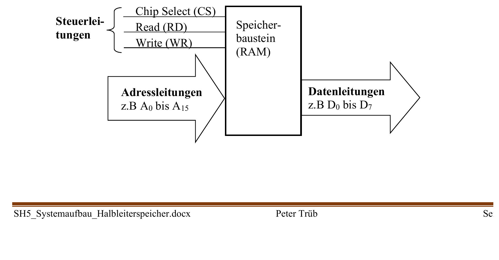

:::hbox
:::vbox
**Voraussetzungen**
- [[Tristate-Ausgänge]]
:::
:::vbox
**Führt weiter zu**
- [[Aufbau eines Mikroprozessorsystems]]
:::
:::

---

Ein Mikroprozessor wäre ohne Speicher und Peripheriebausteine nutzlos — er braucht eine Möglichkeit, mit ihnen Daten auszutauschen. Diese Verbindung übernimmt der **Systembus**: ein Bündel gemeinsamer Leitungen, über die CPU, Speicher und Ein-/Ausgabebausteine miteinander kommunizieren. Damit dieses "Sammelkabel" nicht im Chaos endet — schliesslich hängen mehrere Bausteine an denselben Leitungen —, ist es in drei klar getrennte Teilbusse gegliedert.

## Das Adressierungsprinzip: ein Speicherbaustein als "Briefkasten"

Stell dir einen Speicherbaustein als eine Reihe nummerierter Briefkästen vor: Jeder Briefkasten trägt eine eindeutige Adresse, und in ihm liegt ein Datenwert.

:::merke
Ein Speicherbaustein ordnet jeder **Adresse** ein **Datenmuster** zu. Mit *n* Adressleitungen lassen sich 2ⁿ verschiedene Adressen bilden — mit drei Adressleitungen also acht (2³ = 8) unterschiedliche Speicherzellen ansprechen, mit 15 Adressleitungen bereits 2¹⁵ = 32'768 (32K) Zellen. Damit der Baustein die Daten an der richtigen Adresse korrekt ablegen oder ausgeben kann, braucht es zusätzlich zu den Adress- und Datenleitungen noch **Steuerleitungen**, die festlegen, *ob* gerade gelesen oder geschrieben werden soll und *wann* der Baustein überhaupt aktiv ist.
:::

## Die drei Teilbusse

Genau diese drei Aufgaben — Adresse wählen, Daten übertragen, Vorgang steuern — übernehmen die drei Teilbusse des Systembusses:

| Bus | Aufgabe | Richtung |
|---|---|---|
| **Adressbus** | wählt die anzusprechende Speicherzelle oder den Peripherie-Baustein aus | unidirektional, von der CPU zu den Bausteinen |
| **Datenbus** | überträgt die eigentlichen Nutzdaten | bidirektional — mal liest, mal schreibt die CPU |
| **Steuerbus** | koordiniert *wann* und *wie* der Datenaustausch stattfindet (Chip Select, Read, Write) | je nach Signal in beide Richtungen |

Auf dem Steuerbus sind insbesondere drei Signale entscheidend:

:::info
**Chip Select (CS)**: "schaltet" einen bestimmten Baustein frei — nur wenn sein CS-Signal aktiv ist, "hört" er auf den Adress- und Datenbus und reagiert. Alle anderen Bausteine bleiben in dieser Zeit von den Bussen "abgekoppelt". **Read (RD)**: legt fest, dass Daten *aus* dem angesprochenen Baustein gelesen werden sollen — der Baustein schaltet seinen Ausgangstreiber durch und legt die angeforderten Daten auf den Datenbus. **Write (WR)**: legt fest, dass Daten *in* den Baustein geschrieben werden sollen — der Baustein übernimmt die auf dem Datenbus anliegenden Werte in seine Speicherzelle.

:::

## Warum Tristate die Voraussetzung für gemeinsame Busse ist

Mehrere Bausteine sind über dieselben Datenleitungen verbunden — würden sie alle gleichzeitig versuchen, ihre Werte auf den Bus zu treiben, käme es zu einem Kurzschluss zwischen High- und Low-Pegeln. Genau dieses Problem löst die → [[Tristate-Ausgänge|Tristate-Technik]]:

:::merke
Jeder Baustein, der an den Datenbus angeschlossen ist, besitzt **Tristate-Treiber**: Solange sein Chip-Select-Signal nicht aktiv ist, schalten diese Treiber in den hochohmigen ("dritten") Zustand — der Baustein ist für den Bus elektrisch "unsichtbar", er belastet die Leitungen nicht. Erst wenn die CPU genau diesen einen Baustein über CS auswählt, schaltet dieser seinen Treiber durch und gibt entweder Daten auf den Bus aus (Lesezyklus, S-Treiber durchgeschaltet) oder übernimmt die anliegenden Daten (Schreibzyklus, E-Treiber durchgeschaltet). So kann sich zu jedem Zeitpunkt **immer nur ein einziger** Baustein aktiv mit dem Datenbus verbinden — Kollisionen sind ausgeschlossen.
:::

## Lese- und Schreibzyklus: der zeitliche Ablauf

Die Kommunikation zwischen CPU und einem Speicherbaustein (z. B. einem RAM) folgt dabei einem festgelegten zeitlichen Schema:

:::tip
**Lesezyklus (Readcycle)**: 1) Die CPU legt die gewünschte Adresse auf den Adressbus. 2) Sie aktiviert das Chip-Select-Signal des Bausteins (CS = 0) — der Baustein "koppelt sich an" den Datenbus an. 3) Das Steuerwerk setzt RD = 0; der Ausgangstreiber des Bausteins schaltet durch, die Daten der adressierten Zelle erscheinen auf dem Datenbus und werden von der CPU übernommen. 4) RD wird wieder auf 1 gesetzt — der Baustein koppelt seinen Treiber vom Bus ab. 5) Schliesslich wird auch CS wieder auf 1 gesetzt: Der Baustein ist nun wieder hochohmig ("unsichtbar") am Bus.

**Schreibzyklus (Writecycle)** läuft praktisch identisch ab — nur dass anstelle von RD das Signal WR aktiviert wird: Die CPU legt die Daten auf den Bus, der Eingangstreiber des Bausteins übernimmt sie in die adressierte Speicherzelle.

Wichtig dabei: Andere Bausteine, deren CS-Signal *nicht* aktiv ist, bleiben während des gesamten Vorgangs hochohmig — auch wenn an ihnen ebenfalls RD- und WR-Signale anliegen, "interessiert" sie das nicht, solange sie nicht über CS angesprochen wurden.
:::

Mit diesem Dreiklang aus Adress-, Daten- und Steuerbus — und der Tristate-Technik, die den gefahrlosen "Mehrfachanschluss" überhaupt erst ermöglicht — steht das Grundgerüst, auf dem sich ein vollständiges Mikroprozessorsystem aus CPU, Speicher und Peripheriebausteinen aufbauen lässt: → [[Aufbau eines Mikroprozessorsystems|der Aufbau eines Mikroprozessorsystems]].
