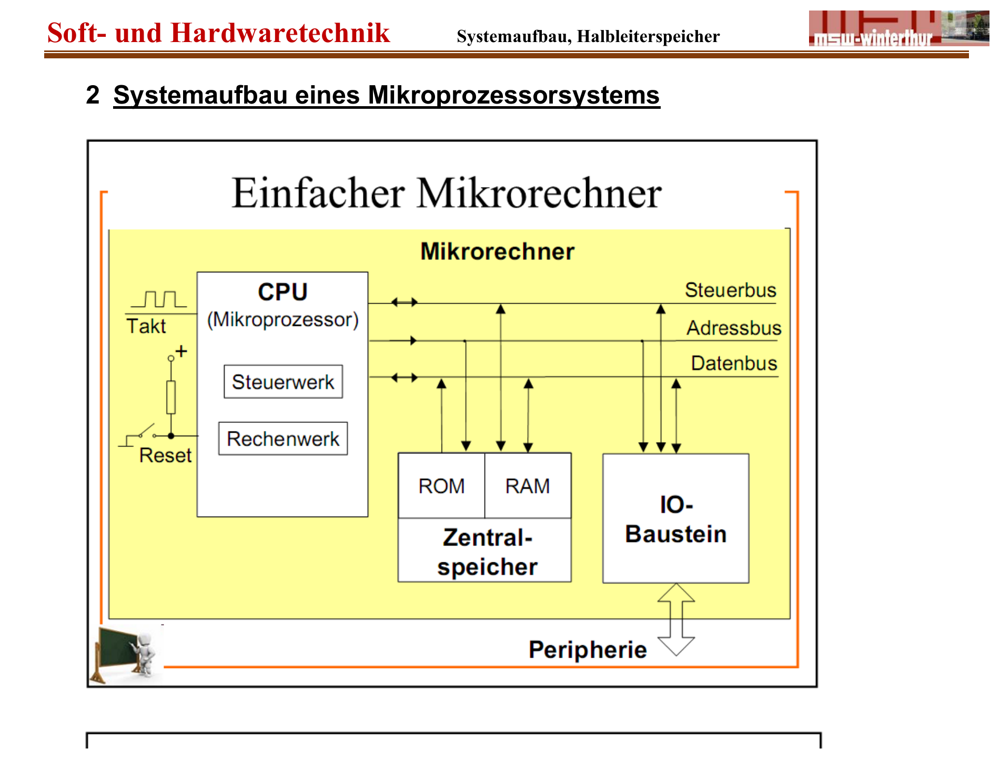

:::hbox
:::vbox
**Voraussetzungen**
- [[Bussysteme (Adress-, Daten-, Steuerbus)]]
:::
:::vbox
**Führt weiter zu**
- [[Befehlszyklus & Maschinencode]]
- [[Speicherarten (Übersicht)]]
:::
:::

---

Verbindet man eine CPU über den → [[Bussysteme (Adress-, Daten-, Steuerbus)|Systembus]] mit Speicher- und Ein-/Ausgabebausteinen, entsteht ein vollständiges **Mikroprozessorsystem** — ein "einfacher Mikrorechner". Sein Grundgerüst findet sich, in unterschiedlichster Ausprägung, in praktisch jedem digitalen Gerät wieder: vom historischen Z80-Einplatinenrechner über den Single-Chip-Mikrocontroller bis zum modernen Smartphone.

## Die Bausteine eines Mikrorechners

:::merke
Ein Mikrorechner besteht aus der **CPU** (mit Steuerwerk und Rechenwerk), dem **Zentralspeicher** — aufgeteilt in **ROM** (für das Programm, das beim Einschalten bereits vorhanden sein muss) und **RAM** (für veränderliche Daten und Variablen) — sowie **I/O-Bausteinen**, über die das System mit der Aussenwelt (Tastatur, Display, Sensoren, Aktoren) kommuniziert. Ein Taktgenerator liefert den gemeinsamen Systemtakt, eine Reset-Beschaltung sorgt für einen definierten Startzustand. Alle diese Komponenten sind über den dreigeteilten Systembus miteinander verbunden — Adress-, Daten- und Steuerbus.
:::

Beim **Mikrocontroller** (Single Chip Computer) sind all diese Bausteine — Prozessorkern, RAM, ROM und I/O — bereits in einem einzigen Gehäuse vereint, ergänzt durch externe Beschaltung wie Quarz und gegebenenfalls Batterie für die Datenerhaltung. Beim klassischen **Mikroprozessorsystem** dagegen sind CPU und Speicher- bzw. Peripheriebausteine getrennte, über den Systembus verbundene Chips.

## Anschluss der Bausteine an den Systembus

Damit mehrere Bausteine den gemeinsamen Datenbus nutzen können, ohne sich gegenseitig zu stören, besitzt jeder Baustein an seinen Datenpins **Tristate-Treiber**, die durch das Steuerwerk der CPU gezielt durchgeschaltet oder hochohmig geschaltet werden:

:::info
Will die CPU aus dem RAM **lesen**, legt sie zunächst die Adresse auf den Adressbus und aktiviert das Chip-Select-Signal (CS̄ = 0) des RAM-Bausteins — dadurch koppelt sich dessen Datenbus-Anschluss an. Anschliessend setzt das Steuerwerk RD̄ = 0: Der Ausgangstreiber (S) im RAM schaltet durch, der Eingangstreiber (E) in der CPU ist ebenfalls durchgeschaltet — die Daten fliessen vom RAM zur CPU. Beim **Schreiben** läuft es symmetrisch ab: WR̄ = 0 schaltet den Eingangstreiber (E) im RAM durch, sodass die von der CPU auf den Bus gelegten Daten übernommen werden. Wichtig dabei: Der I/O-Baustein "hört" zwar ebenfalls die RD̄- und WR̄-Signale, bleibt aber während des gesamten RAM-Zugriffs hochohmig — sein eigenes CS̄-Signal wurde ja nie aktiviert, er ist für den Bus "unsichtbar".
:::

## Die Memorymap: wer ist wo erreichbar?

Da Adressbus und Datenbus von **allen** Bausteinen gemeinsam genutzt werden, muss eindeutig festgelegt sein, welcher Baustein auf welchen Adressbereich "hört". Diese Zuordnung nennt man **Memorymap**:

:::merke
Bei einem Adressbus mit 16 Leitungen (A₀ … A₁₅) ergeben sich 2¹⁶ = 65'536 (64K) mögliche Adressen. Diese werden in zusammenhängende Bereiche aufgeteilt — z. B. 0000h…7FFFh für ein EPROM (32K), 8000h…BFFFh für RAM (16K) und C000h…FFFFh für I/O-Bausteine. Welcher Bereich welchem Baustein zugeordnet ist, legen sogenannte **Enable-Decoder** (oft mit Bausteinen wie dem 74LS138, einem 3:8-Decoder) fest: Sie werten die höchstwertigen Adressbits (z. B. A₁₄, A₁₅) aus und erzeugen daraus das passende Chip-Select-Signal für genau den Baustein, dessen Adressbereich gerade getroffen wird. Die niederwertigen Adressbits (A₀ … A₁₃) gehen direkt an den jeweiligen Baustein und wählen dort die konkrete Speicherzelle aus.
:::

So lässt sich aus dem Aufbau einer Schaltung — etwa einem 32K-EPROM, einem 16K-RAM und einem I/O-Baustein 8255 — durch genaues Hinschauen auf die Decoder-Beschaltung die zugehörige Memorymap rekonstruieren: Welche Adressbits bilden den "Auswahlbereich" für den Decoder, welche werden direkt an den Baustein durchgereicht, und welcher Adressbereich ergibt sich daraus für jeden einzelnen Baustein.

:::tip
Manche Systeme unterscheiden zusätzlich zwischen **Memory Request (MEMREQ)** und **Input/Output Request (IOREQ)**: Während MEMREQ aktiv ist, "hören" nur die Speicherbausteine (ROM, RAM) auf den Adressbus; während IOREQ aktiv ist, sind es die Peripheriebausteine (Ports). Auf diese Weise lässt sich derselbe Adressbereich — z. B. die Adressen 00h…FFh — sowohl für Speicherzugriffe als auch für I/O-Zugriffe verwenden, ohne dass es zu Kollisionen kommt. Diese Technik findet sich z. B. bei der Intel-8085-Architektur.
:::

Mit CPU, Speicher und I/O-Bausteinen sauber über den Systembus verbunden und durch eine Memorymap eindeutig adressierbar, ist das Grundgerüst des Mikroprozessorsystems komplett. Wie die CPU innerhalb dieses Systems nun tatsächlich **Befehle** aus dem Speicher holt, decodiert und ausführt, zeigt der nächste Schritt: der → [[Befehlszyklus & Maschinencode|Befehlszyklus]].
