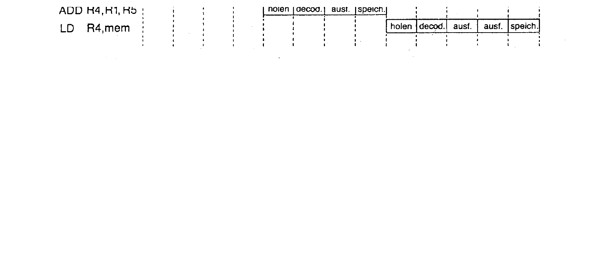
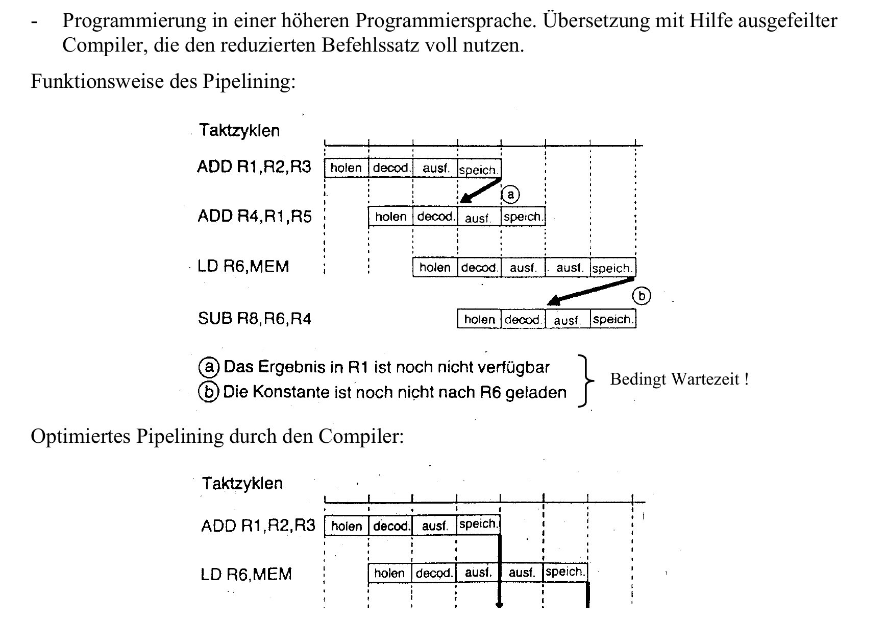

:::hbox
:::vbox
**Voraussetzungen**
- [[Befehlszyklus & Maschinencode]]
:::
:::vbox
**Führt weiter zu**
- [[Mikrocontroller]]
:::
:::

---

Wie ein Prozessor seinen → [[Befehlszyklus & Maschinencode|Befehlszyklus]] organisiert — wie umfangreich sein Befehlssatz ist, wie er auf den Speicher zugreift und wie stark er Befehle parallel verarbeitet — prägt seine gesamte **Rechnerarchitektur**. Zwei grundsätzlich verschiedene Philosophien haben sich dabei herausgebildet: CISC und RISC.

## CISC: viele, mächtige Befehle

Die ältere und über Jahrzehnte dominierende Philosophie ist **CISC** (Complex Instruction Set Computer):

:::merke
Ein einzelner CISC-Assemblerbefehl wie `MOV A, @R1` löst im Hintergrund eine ganze Kette von Aktionen aus — etwa das Laden eines Hilfsregisters, das Anlegen einer Adresse auf den Adressbus, das korrekte Steuern von Chip-Select- und Read-Leitungen und das Erhöhen des Programcounters. Jedem Assemblerbefehl ist dazu ein **Mikroprogramm** mit rund zehn internen Mikrobefehlen zugeordnet — fest "eingebrannt" und nicht veränderbar. Ein typischer CISC-Befehlssatz umfasst 200–300 Befehle, was ein entsprechend **komplexes Steuerwerk** verlangt.
:::

Untersuchungen zeigen jedoch eine bemerkenswerte Schieflage: Rund 10 % aller Assemblerbefehle machen bereits etwa 80 % des tatsächlich ausgeführten Programmcodes aus — die übrigen 90 % der Befehle werden kaum genutzt. Das aufwendige Mikrocodeprogramm ist aber für **alle** Befehle gleichermassen ausgelegt:

:::warning
Bei CISC verlangsamen die "ungenützten 90 % Befehle" das Ausführen genau jener 10 % Befehle, die tatsächlich am häufigsten gebraucht werden — ein struktureller Schwachpunkt, an dem die RISC-Architektur gezielt ansetzt.
:::

## RISC: wenige, einfache Befehle — dafür schnell und parallel

**RISC** (Reduced Instruction Set Computer) kehrt das Prinzip um:

:::tip
RISC-Prozessoren verfügen über einen kleinen Befehlssatz von nur etwa 30–100 Befehlen — wodurch der Programmcode zwar rund 30 % grösser ausfällt (komplexere Anweisungen müssen aus mehreren einfachen Befehlen zusammengesetzt werden), dafür aber jeder einzelne Befehl **ohne Mikrocodeprogrammspeicher** auskommt: Der eingelesene Befehlscode wirkt direkt über Decoder und festverdrahtete Logik auf Register und Rechenwerk. Weitere Kennzeichen sind eine auf hohen Durchsatz ausgelegte Hardware mit **Pipelining**, sehr viele CPU-interne Register (teils 500 oder mehr, um externe Speicherzugriffe zu reduzieren), getrennte Daten- und Programmspeicher mit eigenen Bussen (→ [[FPGA (Field Programmable Gate Array)|Harvard-Architektur]]) sowie die Programmierung in einer höheren Programmiersprache mit ausgefeilten Compilern, die den reduzierten Befehlssatz optimal ausnutzen.
:::

## Pipelining: mehrere Befehle gleichzeitig in Bearbeitung

Das Herzstück der RISC-Geschwindigkeit ist das **Pipelining** — die drei Phasen des Befehlszyklus (Holen, Decodieren, Ausführen plus Speichern) werden überlappend statt nacheinander durchlaufen:

:::merke
Während Befehl 1 gerade ausgeführt wird, wird Befehl 2 bereits decodiert und Befehl 3 schon aus dem Speicher geholt — im Idealfall verlässt so in jedem Taktzyklus ein fertig bearbeiteter Befehl die Pipeline, statt dass jeder Befehl die volle Zeit aller Phasen beansprucht. In der Praxis treten dabei jedoch **Abhängigkeiten** auf: Will `ADD R4, R1, R5` das Ergebnis von `ADD R1, R2, R3` weiterverarbeiten, ist dieses zum benötigten Zeitpunkt unter Umständen noch gar nicht verfügbar — die Pipeline muss eine Wartezeit einlegen ("Bubble"). Ein cleverer **Compiler** kann solche Konflikte entschärfen, indem er die Befehlsreihenfolge so umstellt, dass unabhängige Befehle die Wartezeit überbrücken (z. B. einen `LD`-Befehl zwischen zwei voneinander abhängige `ADD`-Befehle schiebt) — notfalls auch durch Einfügen eines `NOP` (No Operation), eines Leerbefehls, der die Pipeline gezielt "auffüllt".
:::

:::info
**Fazit**: RISC-Prozessoren sind durch Pipelining schneller als CISC-Prozessoren, ihre Hardware ist dafür komplexer (zwei getrennte Bussysteme für Daten und Programm) und stellt höhere Anforderungen an den Compiler, der das Pipelining durch geschickte Befehlsreihenfolge optimal ausnutzen muss.
:::

## DSP: digitale Signalverarbeitung in Echtzeit

Ein spezialisierter, ganz typischer Vertreter der RISC-Philosophie ist der **digitale Signalprozessor (DSP)**:

:::merke
DSPs müssen Signale in **Echtzeit** verarbeiten — Eingabe, Verarbeitung und Ausgabe laufen praktisch zeitgleich ab. Sie nutzen dazu eine **modifizierte Harvard-Architektur**: Befehlsdaten (aus dem ROM/Flash) und Programmdaten (aus dem RAM) werden über zwei getrennte Systembusse geführt — können bei Bedarf aber auch Daten zwischen beiden Bussystemen austauschen. So lassen sich Befehle, die Speicherdaten verarbeiten, in nur **einem** Speicherzyklus durchführen, weil Befehls- und Datenwort gleichzeitig über die beiden Busse in die CPU geladen werden. Typische DSP-Bausteine wie der TMS320C24x bringen dafür spezialisierte Recheneinheiten mit — einen 16×16-Bit-Multiplizierer, eine 32-Bit-ALU, einen 32-Bit-Akkumulator sowie zahlreiche Hilfsregister und Hardware-Timer.
:::

DSPs eignen sich daher besonders für die Verarbeitung **analoger** Signale — ergänzt durch vorgeschaltete Analoginterfaces (ADC/DAC mit Filterstufen), die das analoge Signal digitalisieren, aufbereiten und nach der Verarbeitung wieder ausgeben. Anwendungsfelder mit wachsender Bedeutung sind die moderne digitale Kommunikationstechnik und die digitale Regelungstechnik.

Damit ist der Bogen von CISC über RISC bis zum spezialisierten DSP gespannt — drei Antworten auf dieselbe Grundfrage, wie sich Befehlssatz, Speicherorganisation und Parallelverarbeitung am besten zu einer leistungsfähigen Rechnerarchitektur kombinieren lassen. Genau diese Bausteine — CPU, Speicher, Peripherie — verschmelzen schliesslich im → [[Mikrocontroller|Mikrocontroller]] zu einem vollständigen System auf einem einzigen Chip.
