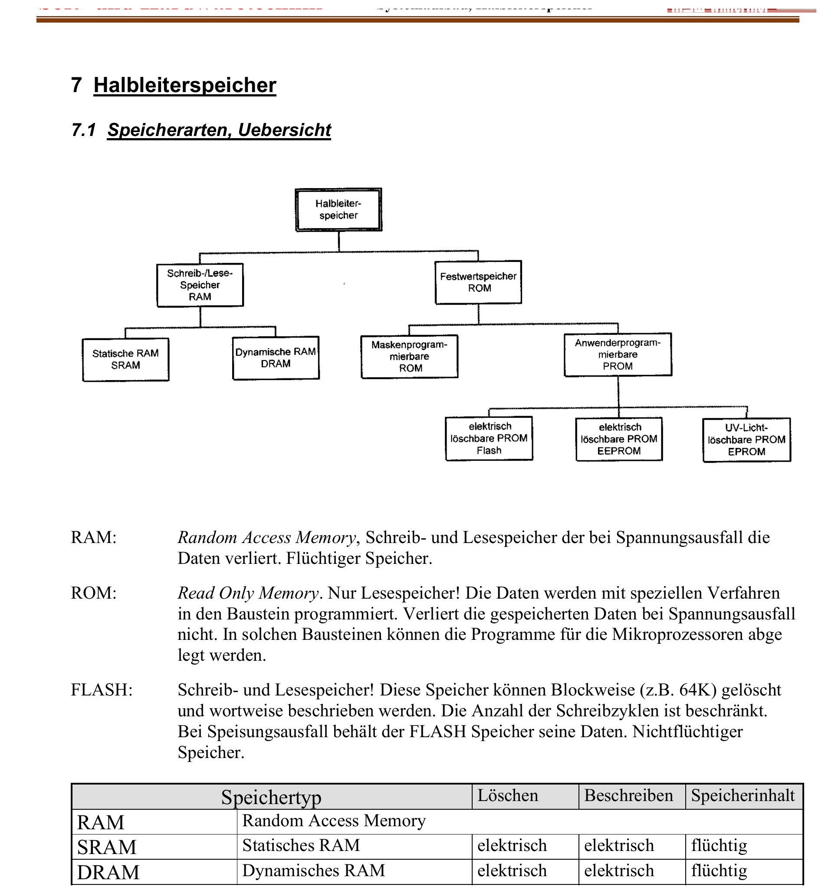

:::hbox
:::vbox
**Voraussetzungen**
- [[Aufbau eines Mikroprozessorsystems]]
:::
:::vbox
**Führt weiter zu**
- [[Halbleiterspeicher (RAM, ROM)]]
:::
:::

---

Im → [[Aufbau eines Mikroprozessorsystems|Mikroprozessorsystem]] übernimmt der Zentralspeicher zwei grundverschiedene Aufgaben: Er muss das **Programm** bereithalten, das beim Einschalten sofort verfügbar sein muss, und er muss **veränderliche Daten** während der Laufzeit aufnehmen und wieder hergeben können. Für diese beiden Anforderungen haben sich zwei grundsätzlich verschiedene Speicherfamilien herausgebildet.

## Die Grundunterscheidung: flüchtig oder nichtflüchtig?

:::merke
**RAM** (Random Access Memory, Schreib-/Lesespeicher) lässt sich beliebig oft in beliebiger Reihenfolge lesen und beschreiben — ist aber **flüchtig**: Bei einem Spannungsausfall gehen alle gespeicherten Daten verloren. **ROM** (Read Only Memory, Festwertspeicher) kann im Normalbetrieb nur gelesen werden, behält seinen Inhalt aber auch **ohne Versorgungsspannung** — genau deshalb ist es der natürliche Aufbewahrungsort für das Programm eines Mikroprozessorsystems, das ja unmittelbar nach dem Einschalten lauffähig sein muss.
:::

Diese Grundunterscheidung — flüchtig vs. nichtflüchtig — durchzieht die gesamte Speicherlandschaft: Statisches und dynamisches RAM (SRAM, DRAM) sind flüchtig; maskenprogrammierte ROMs (MROM), anwenderprogrammierbare PROMs sowie deren elektrisch oder per UV-Licht löschbare Varianten (EPROM, EEPROM, Flash) sind nichtflüchtig.

## Speicherbausteine im Überblick

| Speichertyp | Löschen | Beschreiben | Speicherinhalt |
|---|---|---|---|
| **SRAM** (Statisches RAM) | elektrisch | elektrisch | flüchtig |
| **DRAM** (Dynamisches RAM) | elektrisch | elektrisch | flüchtig |
| **Zero-Power-RAM** (RAM mit Batterie) | elektrisch | elektrisch | nicht flüchtig |
| **MROM** (Maskable ROM) | unmöglich | per Maske beim Hersteller | nicht flüchtig |
| **PROM** (Programmable ROM) | unmöglich | elektrisch (einmalig) | nicht flüchtig |
| **EPROM** (Erasable PROM) | UV-Licht | elektrisch | nicht flüchtig |
| **EEPROM** (Electrically Erasable PROM) | elektrisch | elektrisch | nicht flüchtig |
| **Flash** | elektrisch (blockweise) | elektrisch (wortweise) | nicht flüchtig |

## Flash: die Brücke zwischen RAM und ROM

Eine Sonderstellung nimmt der **Flash-Speicher** ein — er vereint Eigenschaften beider Welten:

:::tip
Flash-Speicher kann **blockweise** gelöscht (z. B. in Blöcken von 64 kByte) und **wortweise** beschrieben werden — die Anzahl möglicher Löschvorgänge ist dabei begrenzt (typisch 10⁵ bis 10⁶ Zyklen). Anders als RAM behält Flash seinen Inhalt aber auch bei Spannungsausfall — ein **nichtflüchtiger Schreib-/Lesespeicher**. Man unterscheidet zwei Bauarten: **NOR-Flash** verhält sich beim Lesen wie ein RAM (wahlfreier Zugriff auf jede einzelne Speicherzelle) und eignet sich deshalb gut als Programmspeicher; **NAND-Flash** lässt sich nur blockweise lesen (z. B. in 512-Byte-Seiten, dem Grundprinzip einer Festplatte ähnlich), ist dafür aber deutlich dichter und günstiger — die typische Bauform für USB-Sticks und Speicherkarten.
:::

## Wo welcher Speicher zum Einsatz kommt

Welcher Speichertyp in einem System verbaut wird, hängt direkt davon ab, welche Art von Daten er aufnehmen soll:

:::info
**Bios / Konfigurationsdaten**: müssen schon beim Power-on vorhanden sein und sich dennoch gelegentlich ändern lassen → EEPROM. **Programmcode**: muss nach dem Einschalten sofort verfügbar sein, ändert sich kaum → MROM, EPROM, EEPROM oder Flash. **Systemdaten** (z. B. Fehlermeldungen, Zähler): müssen verändert werden können, aber Vorsicht ist geboten — die Anzahl der Schreibzyklen ist begrenzt → EEPROM, Flash. **Arbeitsspeicher**: muss beliebig oft schnell gelesen und beschrieben werden können → SRAM, DRAM, Flash (z. B. bei Speicherkarten). **Cache-Speicher**: ein sehr schnelles SRAM zwischen CPU und Arbeitsspeicher, das häufig benötigte Daten zwischenpuffert. **Grafikkarte**: ein spezielles DRAM, das Lese- und Schreibzyklus gleichzeitig ausführen kann (auch VRAM genannt).
:::

Damit ist die grobe Landkarte der Speicherwelt abgesteckt — flüchtig gegen nichtflüchtig, frei programmierbar gegen einmalig beschreibbar. Wie diese Bausteine aber **innen** aufgebaut sind — wie eine einzelne Speicherzelle eine "1" oder "0" festhält, und wie aus Tausenden solcher Zellen ein adressierbarer Baustein entsteht — zeigt der nächste Schritt: → [[Halbleiterspeicher (RAM, ROM)|Halbleiterspeicher im Detail]].
