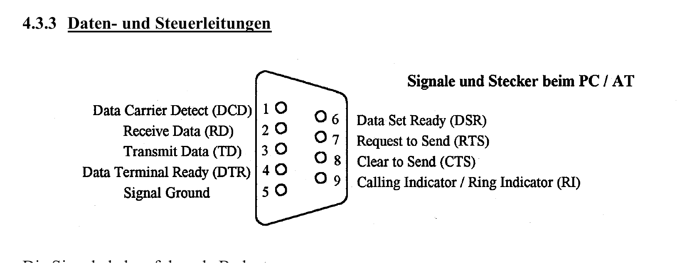

:::hbox
:::vbox
**Voraussetzungen**
- [[UART]]
:::
:::vbox
**Verwandte Artikel**
- [[RS422 & Current Loop]]
:::
:::

---

→ [[UART|UART]] beschreibt das *Protokoll* der seriellen asynchronen Übertragung — Startbit, Datenbits, Parität, Stoppbit. Welche **elektrischen Pegel** dabei tatsächlich auf der Leitung anliegen und wie viele Geräte sich überhaupt eine gemeinsame Leitung teilen dürfen, regeln die genormten Schnittstellen-Standards. Zwei der bekanntesten — **RS232** und **RS485** — bilden das Thema dieses Artikels: der eine für die klassische Punkt-zu-Punkt-Verbindung über kurze Distanzen, der andere für robuste Mehrpunkt-Bussysteme über lange Strecken.

## RS232: der klassische serielle PC-Anschluss

:::merke
**RS232** (auch unter der Norm V.24/V.28 bekannt) war jahrzehntelang der Standard-Anschluss (COM-Port) eines PCs. Er überträgt für jede Richtung auf einer eigenen Leitung — **vollduplex**. Die wichtigsten Eigenschaften: Pegel **±12 V** mit invertierter Logik (Low = positive Spannung zwischen +3 V und +15 V, High = negative Spannung zwischen −3 V und −15 V), eine maximale Übertragungslänge von rund **15 m** und eine maximale Baudrate von etwa **20 kBit/s**. Heute ist RS232 weitgehend durch USB-UART-Konverter (FTDI, CH340) ersetzt worden — bei industriellen Mess- und Steuergeräten findet man die Schnittstelle aber nach wie vor häufig.
:::

## Datenleitungen und Steuerleitungen: der 9-polige Stecker

:::tip
Der klassische 9-polige RS232-Stecker (Sub-D9) führt sowohl reine Datenleitungen als auch eine Reihe von Steuerleitungen:

| Signal | Bedeutung |
|---|---|
| TD (Transmit Data) | Sendedaten |
| RD (Receive Data) | Empfangsdaten |
| DTR (Data Terminal Ready) | Empfänger ist betriebsbereit |
| DSR (Data Set Ready) | Sender ist betriebsbereit |
| RTS (Request to Send) | Sendeanforderung |
| CTS (Clear to Send) | Gerät ist bereit, Daten zu senden |
| DCD (Data Carrier Detect) | Empfangsleitung funktioniert |
| RI (Ring Indicator) | Klingelsignal (nur bei Modems) |

Die meisten Steuerleitungen stammen ursprünglich aus der Modem-Welt. Werden stattdessen andere Geräte — Drucker, Terminals, Computer — direkt verbunden, ergeben sich oft andere Anschlussbelegungen; fehlende Signale werden dann häufig durch gezieltes "Brücken" der entsprechenden Pins so beschaltet, dass das prüfende Gerät einen plausiblen Zustand vorfindet. In der Praxis braucht man minimal nur drei Leitungen: RxD, TxD und GND — und ganz wichtig: **TxD und RxD müssen über Kreuz verbunden werden**, sonst findet keine Kommunikation statt.

Für die Pegelwandlung zwischen den ±12-V-RS232-Pegeln und den 3,3-V/5-V-Logikpegeln eines Mikrocontrollers kommt typischerweise ein Baustein wie der **MAX232** zum Einsatz — er übernimmt die komplette Umsetzung inklusive der nötigen Spannungswandlung über externe Ladungspumpen-Kondensatoren.
:::

## RS485: robuste Mehrpunkt-Kommunikation für die Industrie

Während RS232 nur zwei Geräte direkt miteinander verbindet, braucht die Industrie häufig Bussysteme, an denen viele Teilnehmer gleichzeitig hängen — und die auch über grosse Distanzen und in elektrisch stark gestörten Umgebungen zuverlässig funktionieren. Genau dafür wurde RS485 entwickelt:

:::info
**RS485** überträgt **differenziell** über ein Adernpaar (A und B): Störsignale, die auf beide Leitungen gleichermassen einwirken (Gleichtaktstörungen), heben sich beim Empfänger durch die Differenzbildung gegenseitig auf — das macht die Übertragung extrem **störsicher**. RS485 ist als **bidirektionales Bussystem mit bis zu 32 Teilnehmern** konzipiert, von denen jeder über eine eindeutige Adresse verfügt und sowohl senden als auch empfangen kann. Damit auf der gemeinsamen Leitung niemals zwei Sender gleichzeitig aktiv sind, sorgt das jeweilige Übertragungsprotokoll dafür, dass sich alle anderen Sender währenddessen im **hochohmigen Zustand** befinden — die Empfänger "hören" zwar ständig mit, doch die Auswertungssoftware berücksichtigt nur jene Daten, die tatsächlich zur eigenen Adresse gehören.

RS485 bildet die elektrische Basis für zahlreiche bekannte Feldbus-Systeme — allen voran **Modbus RTU**, eines der weitverbreitetsten Industrieprotokolle überhaupt, sowie PROFIBUS. Unzählige Geräte wie SPS-Steuerungen, Frequenzumrichter und Sensoren sind serienmässig mit einer RS485-Schnittstelle ausgestattet. Wie bei jedem längeren Bussystem sind auch hier **Abschlusswiderstände** (120 Ω zwischen A und B an beiden Leitungsenden) wichtig, um störende Signalreflexionen zu unterdrücken.
:::

## RS232 und RS485 im direkten Vergleich

| Standard | Pegel | Übertragungsart | Max. Länge | Max. Datenrate | Teilnehmer |
|---|---|---|---|---|---|
| RS232 (V.24/V.28) | ±12 V | asymmetrisch | 15 m | 20 kBit/s | 1 Sender, 1 Empfänger |
| RS485 (V.11/X.27) | ±5 V differenziell | symmetrisch | 1200 m | 10 Mbit/s | bis zu 32 |

Der Unterschied könnte deutlicher kaum sein: RS232 ist auf kurze Punkt-zu-Punkt-Verbindungen ausgelegt, RS485 auf lange, störsichere Mehrpunkt-Busse. Doch zwischen diesen beiden Extremen gibt es noch weitere genormte Schnittstellen, die ähnliche Probleme mit anderen Schwerpunkten lösen — etwa für Umgebungen mit besonders starken elektrischen Störeinflüssen oder für die galvanische Trennung zwischen Sender und Empfänger. Diese Varianten — RS422 und die Current-Loop-Schnittstelle — stellt der nächste Artikel vor: → [[RS422 & Current Loop|RS422 & Current Loop]].
