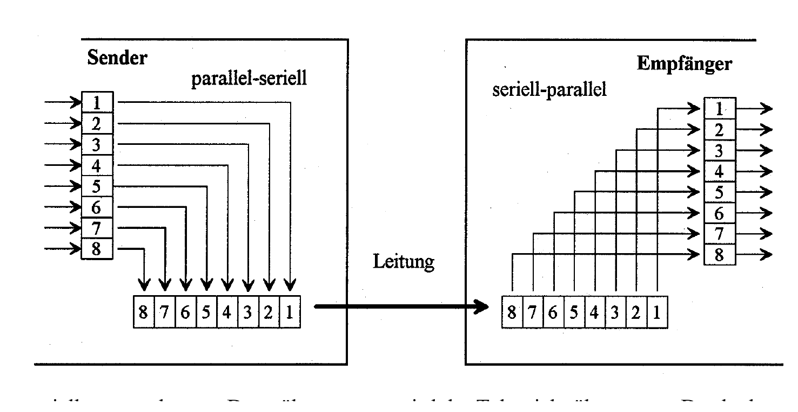

:::hbox
:::vbox
**Voraussetzungen**
- [[Schieberegister]]
:::
:::vbox
**Führt weiter zu**
- [[UART]]
- [[SPI]]
- [[I2C]]
:::
:::

---

Im Inneren eines Mikrocontrollers oder Computers werden Daten **parallel** verarbeitet — auf einem breiten Datenbus laufen acht, sechzehn oder zweiunddreissig Bit gleichzeitig nebeneinander her. Sobald diese Daten aber das Gehäuse verlassen sollen — zu einem Sensor, einem Display, einem anderen Gerät — wird daraus meist ein einziges Kabel mit nur ein, zwei oder vier Leitungen. Wie aus parallelen Daten ein serieller Strom wird, welche Regeln dabei eingehalten werden müssen und warum das alles überhaupt so kompliziert ist, davon handelt dieser Grundlagenartikel — das Fundament für praktisch jede digitale Schnittstelle, die uns in der Praxis begegnet.

## Eine alte Erkenntnis: Kommunikation braucht mehr als nur Daten

Schon lange bevor es Mikrocontroller gab, stand die Menschheit vor demselben Grundproblem: Wie überträgt man Information zuverlässig über eine Distanz? Ein eindrückliches historisches Beispiel zeigt, wie ernst man diese Frage schon im 19. Jahrhundert nahm:

:::merke
Bis ins Jahr 1840 baute man **mechanische Nachrichtentürme**, deren schwenkbare Hebelarme codierte Botschaften über grosse Distanzen weitergaben. Für die Strecke von Preussen bis nach Leningrad — etwa 1950 km — waren dafür **220 Türme und 1300 Personen Personal** nötig! Welche Tragik, wenn der 219. Turm die Daten falsch weitergibt, weil er im Nebel steht oder die Besatzung die Nachricht falsch versteht. Genau aus solchen Überlegungen heraus erkannte man früh: Eine gute Datenübertragung braucht zwei Dinge — eine **zuverlässige Übertragungsstrecke** und eine **hohe Übertragungssicherheit der Daten**.
:::

## Steuersignale und Datencheck: mehr als nur die reinen Nutzdaten

Drei klassische Probleme treten bei jeder Übertragung zwischen zwei Teilnehmern auf: Was passiert, wenn beide gleichzeitig senden wollen? Was, wenn der Empfänger noch gar nicht bereit ist? Und — am wichtigsten — wie weiss der Sender überhaupt, ob die Daten korrekt angekommen sind? Um diese Fragen zu klären, werden zusätzlich zu den eigentlichen Nutzdaten **Steuersignale** (zum Aufbau der Verbindung und zur Steuerung des Datenflusses) und ein **Datencheck** (zur Kontrolle der übertragenen Daten) mitgeschickt.

:::tip
Ein einfacher Datencheck lässt sich durch eine **XOR-Verknüpfung** der zu übertragenden Zeichen realisieren. Sollen beispielsweise die Zeichen M, S und W (ASCII-Codes 4D₁₆, 53₁₆, 57₁₆) übertragen werden, ergibt deren XOR-Verknüpfung den Wert 49₁₆. Sender und Empfänger kennen diese Formel — der Sender hängt das Ergebnis an die Nachricht an, der Empfänger rechnet es nach der Übertragung erneut nach. Stimmen beide Werte überein, ist die Übertragung wahrscheinlich geglückt; stimmen sie nicht überein, muss die Information erneut angefordert werden. Eine vollständige Kommunikation läuft dann typischerweise in mehreren Schritten ab: "Bist du bereit?" → "Ja, ich bin bereit!" → Datenübertragung mit Datencheck → Quittierung → Übertragung beendet. Das erhöht zwar die **Sicherheit** der Übertragung deutlich — aber ebenso deutlich auch ihre **Dauer**.
:::

## Synchron oder asynchron: zwei grundsätzlich verschiedene Wege

Damit Sender und Empfänger die übertragenen Bits korrekt voneinander trennen können, müssen sie sich auf einen gemeinsamen Zeittakt einigen — und dafür gibt es zwei grundverschiedene Strategien:

:::merke
Bei der **synchronen Datenübertragung** arbeiten Sender und Empfänger mit demselben, gemeinsam geführten Taktsignal — die Taktleitung läuft als eigene, separate Leitung mit. Die Taktfrequenz darf dabei sogar schwanken, ohne dass Übertragungsfehler entstehen, denn bei jedem Taktimpuls wird genau ein Zeichen übermittelt (typisch realisiert mit Schieberegister-Logik). Damit ist praktisch jede beliebige Übertragungsrate einstellbar.

Bei der **asynchronen Datenübertragung** wird hingegen **keine** separate Taktleitung mitgeführt — die "Taktinformation" steckt stattdessen direkt im Datenstrom selbst. Das funktioniert nur, wenn sich Sender und Empfänger vorab auf ein gemeinsames Protokoll geeinigt haben. Dazu müssen mindestens vier Punkte klar definiert sein: die **Übertragungsgeschwindigkeit** (in Baud, also Bits pro Sekunde), die **Steuerzeichen** — insbesondere Start- und Stoppzeichen —, die **Anzahl Zeichen** pro Nachricht und die **Formel des Datenchecks**.
:::

## Vom parallelen Bus zum seriellen Strom: das Schieberegister macht's möglich

Da Computer und Mikrocontroller intern parallel arbeiten, muss beim Sender eine **Parallel-Seriell-Wandlung** stattfinden, beim Empfänger umgekehrt eine **Seriell-Parallel-Wandlung**. Genau diese Umwandlung übernimmt eine → [[Schieberegister|Schieberegister]]-Logik:

:::info
Beim Sender werden die acht (oder mehr) parallel anliegenden Datenbits in ein Schieberegister geladen und anschliessend Bit für Bit — getaktet — über eine einzige Leitung hinausgeschoben. Der Empfänger sammelt diese Bits wieder Stück für Stück in seinem eigenen Schieberegister auf, bis alle acht Stellen gefüllt sind, und stellt sie dann erneut parallel zur Verfügung — bereit für die Weiterverarbeitung im Mikroprozessor. Die serielle asynchrone Datenübertragung ist heute extrem weit verbreitet: Mit wenig Verdrahtungsaufwand lassen sich damit Geschwindigkeiten von bis zu 100 Mbit/s erreichen. Viele Computernetzwerke und industrielle Feldbusse — etwa Profibus — beruhen genau auf diesem Prinzip der asynchronen Übertragung.

:::

## Der Sonderfall der Aufsynchronisation

Bei der seriellen asynchronen Datenübertragung wird der Takt — wie erwähnt — nicht mitübertragen. Das bedeutet: Sender und Empfänger müssen unabhängig voneinander mit demselben Takt arbeiten (üblicherweise mit eigenem Quarz als Zeitbasis). Damit die beiden Taktquellen über die Zeit nicht "auseinanderdriften", wird der Takt des Empfängers bei **jedem einzelnen übertragenen Zeichen neu aufsynchronisiert** — meist anhand der fallenden Flanke des Startbits. Dieses ständige "Neueinmessen" ist der eigentliche Kniff, der eine zuverlässige Übertragung ganz ohne gemeinsame Taktleitung erst möglich macht.

Damit ist das Fundament gelegt: Wir wissen jetzt, *warum* Daten überhaupt seriell übertragen werden, *wie* aus parallelen Bits ein serieller Strom wird und *welche* Vereinbarungen Sender und Empfänger treffen müssen, damit die Übertragung gelingt. Auf genau diesem Fundament bauen die drei wichtigsten seriellen Schnittstellen der Mikrocontroller-Welt auf — beginnend mit der wohl einfachsten und am weitesten verbreiteten von allen: → [[UART|UART]].
