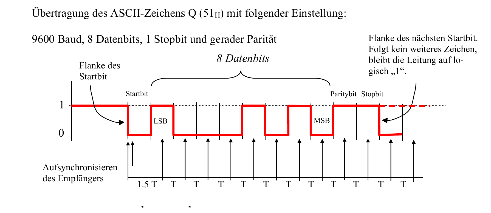
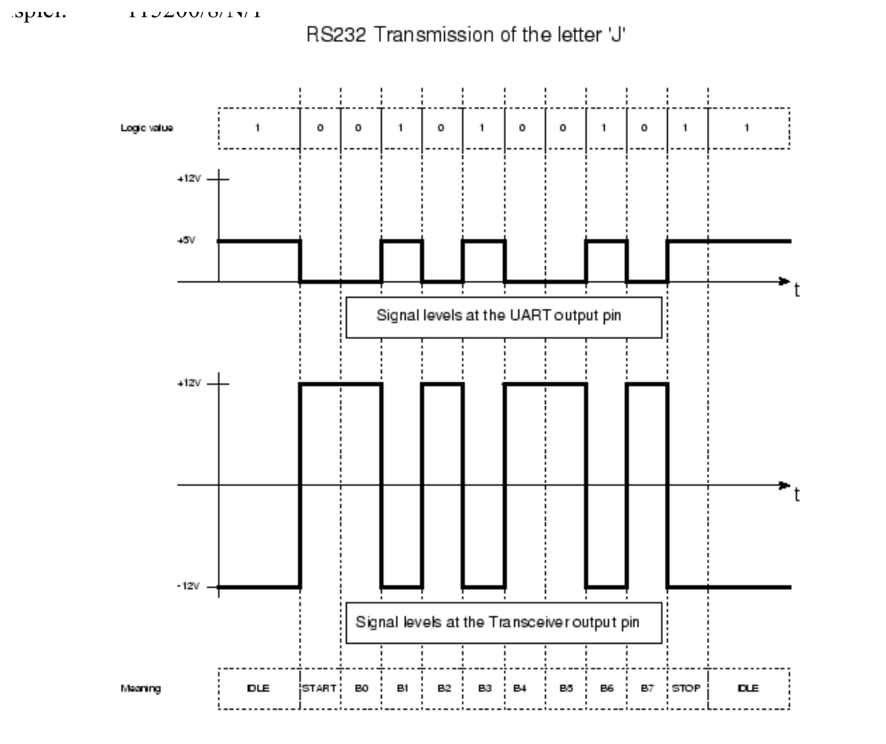

:::hbox
:::vbox
**Voraussetzungen**
- [[Serielle Datenübertragung (Grundlagen)]]
:::
:::vbox
**Verwandte Artikel**
- [[RS232 & RS485]]
- [[Protokoll-Decoder]]
- [[Logikanalysator]]
:::
:::

---

Die einfachste und zugleich am weitesten verbreitete serielle Schnittstelle in der Mikrocontroller-Welt ist der **UART** (Universal Asynchronous Receiver Transmitter). Sie braucht nur zwei Datenleitungen, keinen gemeinsamen Takt und keinen Protokoll-Overhead — und ist damit das ideale Werkzeug, um die im Artikel → [[Serielle Datenübertragung (Grundlagen)|Grundlagen der seriellen Datenübertragung]] beschriebenen Prinzipien in der Praxis zu erleben.

## Zwei Leitungen, über Kreuz verbunden

:::merke
Ein UART besitzt zwei Leitungen: **TX** (Transmit, Senden) und **RX** (Receive, Empfangen). Damit zwei Geräte miteinander kommunizieren können, müssen diese Leitungen **über Kreuz** verbunden werden — TX des einen Geräts auf RX des anderen, und umgekehrt. Dieses Kreuzen der Sende- und Empfangsleitung ist der mit Abstand häufigste Verdrahtungsfehler bei seriellen Verbindungen! Ein gemeinsamer Takt existiert nicht — stattdessen müssen Sender und Empfänger auf dieselbe **Baudrate** (Bits pro Sekunde) eingestellt sein, damit beide Seiten die Bits zur richtigen Zeit abtasten.
:::

## Der Rahmen: wie ein einzelnes Byte verpackt wird

Jedes zu übertragende Byte wird in einen genau definierten **Rahmen (Frame)** verpackt — exakt nach jenem Muster, das im Artikel zur seriellen Datenübertragung als "asynchrones Protokoll" beschrieben wurde:

:::tip
Ein typischer UART-Rahmen besteht aus: einem **Startbit** (die Leitung fällt von logisch 1 auf logisch 0 — genau diese fallende Flanke nutzt der Empfänger zur Aufsynchronisierung), 5 bis 9 **Datenbits** (meist 8, beginnend mit dem niederwertigsten Bit LSB), einem optionalen **Paritätsbit** zur Fehlererkennung und einem oder zwei **Stoppbits** (die Leitung kehrt auf logisch 1 zurück).

Konkretes Beispiel — Übertragung des Zeichens 'Q' (51₁₆) mit der Konfiguration **9600 Baud, 8 Datenbits, 1 Stoppbit, gerade Parität**: Die Dauer eines einzelnen Bits beträgt T = 1 / Baudrate = 1 / 9600 ≈ **104,167 µs**. Der Empfänger tastet das erste Datenbit nach 1,5 T ab — also genau in der Mitte des LSB-Bits — und danach im Abstand von je 1 T. Da der Empfänger Anzahl Datenbits und Paritätsdefinition kennt, weiss er exakt, an welcher Stelle das Paritätsbit folgt. Folgt kein weiteres Zeichen, bleibt die Leitung einfach auf logisch 1 ("Idle"), bis die fallende Flanke des nächsten Startbits eintrifft.

:::

## Das Paritätsbit: eine einfache Fehlerkontrolle

:::info
Das **Paritätsbit** ist eine elementare Form des im Grundlagenartikel erwähnten Datenchecks. Es lässt sich auf drei Arten konfigurieren:

- **Gerade Parität (Even Parity)**: Das Paritätsbit wird so ergänzt, dass die Gesamtzahl der Einsen in Datenbits **und** Paritätsbit gerade ist. Beispiel: Bei den Datenbits 1001 0010 (drei Einsen) wird das Paritätsbit auf 1 gesetzt — gesendet wird 1001 0010 **1** (vier Einsen, gerade).
- **Ungerade Parität (Odd Parity)**: Hier soll die Gesamtzahl der Einsen ungerade sein. Bei denselben Datenbits 1001 0010 wird das Paritätsbit auf 0 gesetzt — gesendet wird 1001 0010 **0** (drei Einsen, ungerade).
- **Keine Parität (None Parity)**: Auf das Paritätsbit wird ganz verzichtet — schneller, aber ohne jede eingebaute Fehlererkennung.

Stimmt beim Empfänger die Anzahl der empfangenen Einsen nicht mit der vereinbarten Parität überein, wurde mindestens ein Bit verfälscht — die Übertragung kann als fehlerhaft erkannt und gegebenenfalls neu angefordert werden.
:::

## Stoppbits: dem langsamen Empfänger Zeit geben

Für das Stoppbit existieren drei Varianten: **1, 1,5 oder 2 Stoppbits**. "1,5 Stoppbit" bedeutet, dass die Leitung während 1,5 × T auf logisch 1 verbleibt. Bei langsameren Rechnern arbeitet man mitunter mit 2 Stoppbits, um dem Empfänger mehr Zeit für die Auswertung der Daten zu geben — üblich ist heute aber meist ein einzelnes Stoppbit.

## Vollduplex und Halbduplex

Eine UART-Verbindung kann **vollduplex** betrieben werden — mit je einer eigenen Leitung für Senden (TX) und Empfangen (RX), sodass beide Seiten gleichzeitig kommunizieren können. Steht hingegen nur eine einzige Datenleitung zur Verfügung, spricht man von **halbduplex**: Senden und Empfangen müssen sich dann zeitlich abwechseln.

## Typische Baudraten

| Baudrate | Bits/s | Bytes/s (ca.) |
|---|---|---|
| 9600 | 9 600 | 960 |
| 115 200 | 115 200 | 11 520 |
| 1 000 000 | 1 MBit | 100 000 |

## Pegel: Vorsicht beim Verbinden

:::warning
Die Spannungspegel eines UARTs entsprechen den **logischen Pegeln** des jeweiligen Mikrocontrollers — typischerweise 3,3 V oder 5 V. Der ältere PC-seitige Standard → [[RS232 & RS485|RS232]] arbeitet hingegen mit Pegeln von etwa ±12 V (und dazu noch invertierter Logik: Low = +Spannung, High = −Spannung)! Verbindet man beide Welten direkt, ohne Pegelwandler-Baustein (z. B. den MAX232), wird der Mikrocontroller mit hoher Wahrscheinlichkeit zerstört.

:::

## In der Praxis: das Schweizer Taschenmesser für Debug-Ausgaben

:::tip
UART ist der einfachste Weg, um auf einem Mikrocontroller Debug-Ausgaben sichtbar zu machen: Ein USB-UART-Adapter (z. B. mit FTDI- oder CH340-Chip) genügt, um die Ausgaben in einem seriellen Terminal am PC mitzulesen — ganz ohne aufwendigen Hardware-Debugger. Genau aus diesem Grund findet man in praktisch jedem Mikrocontroller-Board mindestens eine UART-Schnittstelle.
:::

Damit ist die einfachste aller seriellen Schnittstellen vorgestellt — zwei Leitungen, ein vereinbartes Protokoll, fertig. Doch UART hat auch Grenzen: Es verbindet immer nur **zwei** Geräte direkt miteinander (Punkt-zu-Punkt) und erreicht moderate Geschwindigkeiten. Wie man mehrere Geräte gleichzeitig an einen gemeinsamen Bus anschliesst — und welche cleveren Schaltungstricks dabei zum Einsatz kommen —, zeigen die beiden nächsten Artikel: → [[SPI|SPI]] und → [[I2C|I2C]].
