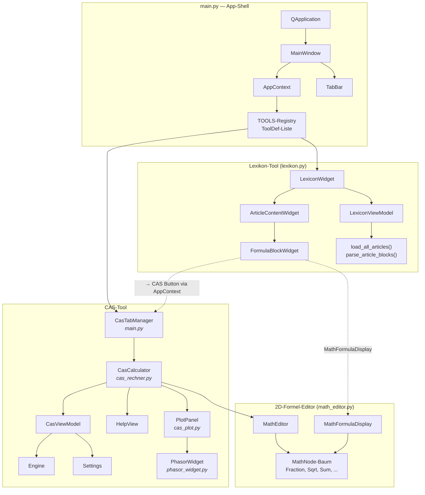
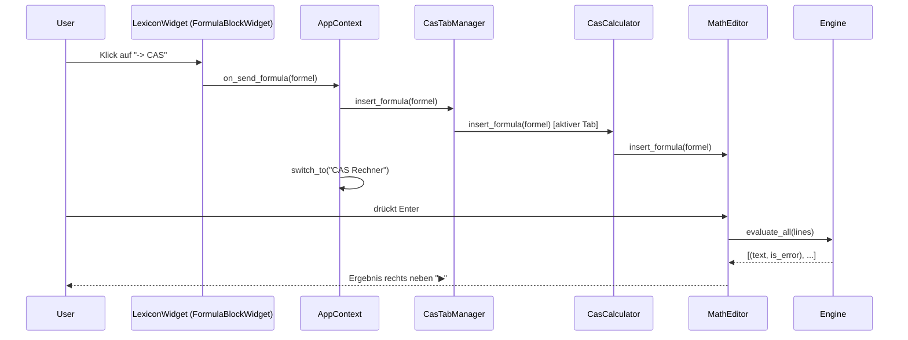

# Elektronik-Lexikon Dokumentation

Überblick über die Architektur des Projekts. Einzelne Aspekte sind in
separaten Dateien im Detail beschrieben.

## Inhalt

| Datei | Thema | Quellcode |
| --- | --- | --- |
| [lexikon.md](lexikon.md) | Artikel-Anzeige, Navigation, MVVM | [lexikon.py](../lexikon.py) |
| [cas.md](cas.md) | CAS-Rechner, SymPy-Engine, Einheiten, Plots | [cas_rechner.py](../cas_rechner.py), [cas_plot.py](../cas_plot.py), [phasor_widget.py](../phasor_widget.py) |
| [math_nodes.md](math_nodes.md) | 2D-Formel-Editor, Node-Baum, Cursor | [math_editor.py](../math_editor.py) |

## Architektur auf einen Blick

Das Projekt besteht aus zwei Tools: dem **Lexikon** (Markdown-basierte
Artikel mit Wiki-Verlinkung) und dem **CAS-Rechner** (symbolische Mathematik
mit 2D-Formel-Eingabe, Plots und Phasor-Diagramm). Beide Tools leben als
Tabs im selben Hauptfenster, das von `main.py` als schlanke App-Shell
bereitgestellt wird.



## Datenfluss: vom Klick auf eine Formel zum Ergebnis



## Tool-Registry-Muster

`main.py` kennt die einzelnen Tools nur über die `TOOLS`-Liste:

```python
TOOLS: list[ToolDef] = [
    ToolDef("Lexikon",      _make_lexikon),
    ToolDef("CAS Rechner",  lambda _ctx: CasTabManager()),
    # Neues Tool einfach hier anfügen.
]
```

Tools kommunizieren über `AppContext`, ohne sich direkt zu kennen:

```python
ctx.switch_to("CAS Rechner")   # Tab wechseln
ctx.get_tool("CAS Rechner")    # Referenz auf anderes Tool holen
```

## MVVM-Muster

Beide Tools folgen dem Model-View-ViewModel-Muster:

- **Model**: pure Funktionen (`load_all_articles`, `parse_article_blocks`)
  und Daten-Container (`Settings`).
- **ViewModel**: `LexiconViewModel`, `CasViewModel` — halten Zustand und
  sind frei von PySide6-Abhängigkeiten.
- **View**: `LexiconWidget`, `CasCalculator`, `ArticleContentWidget` —
  reine Darstellung, delegieren an ihre ViewModels.

## Zusammenspiel auf einer Seite

- **Einstieg**: [`main()`](../main.py) startet `QApplication` und zeigt
  `MainWindow`. Das Fenster instanziiert alle Tools aus der `TOOLS`-Registry.
- **Tab-Wechsel**: [`TabBar`](../main.py) in `main.py` schaltet zwischen
  `LexiconWidget` und `CasTabManager`.
- **Mehrere CAS-Tabs**: [`CasTabManager`](../main.py) hält beliebig viele
  unabhängige `CasCalculator`-Instanzen. Neuer Tab per `+`-Knopf oder
  `Ctrl+T`, Umbenennen per Doppelklick.
- **Formel-Übergabe**: Eine Formel aus dem Lexikon wird via `AppContext`
  an `CasTabManager.insert_formula` → aktivem `CasCalculator` →
  `MathEditor` weitergeleitet.
- **Plots**: [`PlotPanel`](../cas_plot.py) zeigt 2D- und 3D-Graphen für
  im Editor definierte Funktionen (`f(x) :=`, `g(x,y) :=`).
- **Phasor-Diagramm**: [`PhasorWidget`](../phasor_widget.py) stellt
  komplexe Variablen als Zeiger in der Gaußschen Zahlenebene dar.
- **Styling**: Zentral in [`main.qss`](../main.qss) via `objectName`-
  Selektoren (`#appHeader`, `#casToolbar`, `#casTabBar`, ...).
