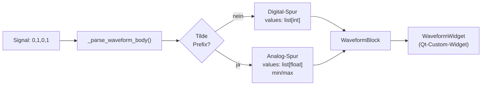
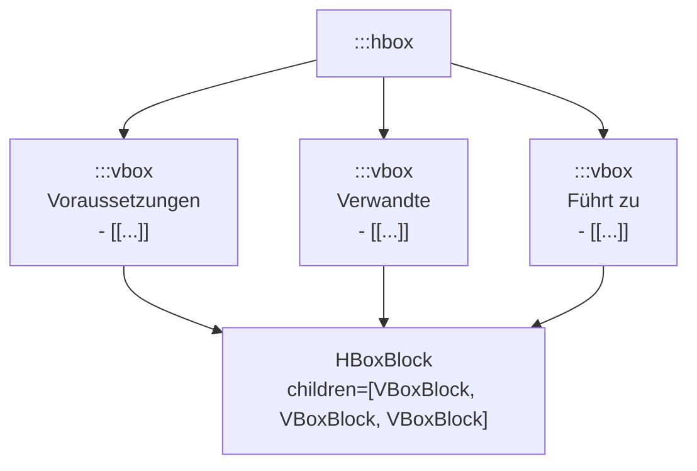

# Artikel-Format — Referenz

Alle Artikel liegen als `*.md`-Dateien unter `artikel/`. Das Format
besteht aus einem YAML-Frontmatter-Block gefolgt von Markdown-Text mit
optionalen `:::`-Direktiven.

## Dateistruktur

```
artikel/
├── ET/Grundlagen/Ohmsches_Gesetz.md   # Normaler Artikel
├── Diagramm/diode_0.txt               # SVG-Beschreibung (keine Artikel!)
└── _VORLAGE.md                        # Vorlage mit allen Block-Typen
```

> **Hinweis**: Die `*.txt`-Dateien im `Diagramm/`-Ordner sind **keine
> Artikel**, sondern Textbeschreibungen für extern generierte SVG-Dateien
> (z. B. für KI-basierte Diagramm-Generierung). Sie werden vom Lexikon
> nicht geladen.

## Frontmatter

```yaml
---
title: Artikeltitel          # Pflicht — Anzeigename und Suchschlüssel
kategorie: ET                # Pflicht — Kategoriecode (s. u.)
tags: [tag1, tag2, tag3]     # Liste für die rechte Sidebar und Suche
symbol: U                    # Optional — Formelzeichen (erscheint als Badge)
einheit: Volt                # Optional — SI-Einheit (erscheint als Badge)
---
```

### Kategorie-Codes

| Code | Bedeutung |
| --- | --- |
| `ET` | Elektrotechnik |
| `EK` | Elektronik |
| `SH` | Schaltungstechnik / Digital |
| `FT` | Fertigungstechnik |
| `MT` | Messtechnik |
| `SI` | Sicherheit |
| `EN` | Entwicklung / Engineering |

## Standard-Markdown

Folgende Standard-Markdown-Elemente werden unterstützt:

| Syntax | Ergebnis |
| --- | --- |
| `# Titel` / `## Abschnitt` / `### Unterabschnitt` | Überschrift Ebene 1–3 |
| `**fett**` | Fettschrift |
| `` `inline-code` `` | Inline-Code-Span |
| `- Listenpunkt` | Aufzählung |
| `\| Kopf \| ...\|` (Pipe-Tabelle) | Tabelle mit Kopfzeile |
| `![[alt]](pfad.svg)` | Eingebettetes Bild |
| `[[Artikel-Titel]]` | Wiki-Link (blau = vorhanden, grau = fehlt) |
| `[[Titel\|Anzeige]]` | Wiki-Link mit eigenem Anzeige-Text |
| `---` | Horizontale Trennlinie |

## Direktiven (`:::`) — Alle Block-Typen

### Formel-Blöcke

```markdown
:::formel
U = R * I          # Ohmsches Gesetz
P = U * I          # Leistung
P = I^2 * R        # Leistung über Strom
:::
```

Jede Zeile erscheint als `FormulaBlockWidget` mit 2D-Rendering und
`→ CAS`-Button.

### Hinweis-Blöcke

```markdown
:::info
Allgemeiner Hinweis — blauer Rahmen.
:::

:::tip
Praktischer Tipp aus der Erfahrung — grüner Rahmen.
:::

:::warning
Achtung! Wichtige Warnung — gelber Rahmen.
:::

:::danger
Gefahr! Sicherheitsrelevant — roter Rahmen.
:::

:::norm
IEC 60479-1: Normreferenz mit Quellenangabe — grauer Rahmen.
:::

:::merke
Prüfungsrelevante Kernaussage — lila Rahmen.
:::
```

Der Inhalt eines Hinweis-Blocks wird wie regulärer Artikeltext geparst:
neben Fliesstext sind also auch Bilder, Tabellen und Formeln möglich, z. B.

```markdown
:::tip
Faustregel mit Beispielwerten:

| Größe | Wert |
|-------|------|
| U     | 5 V  |
| I     | 1 A  |

:::formel
P = U \cdot I
:::
:::
```

### Schaltplan einbetten

```markdown
:::schematic Grundschaltung Spannungsteiler
schaltplaene/spannungsteiler.svg
:::
```

Der Text nach `:::schematic` wird als Bildunterschrift angezeigt.
Der Pfad im Körper ist relativ zum Artikel-Ordner.

### Zeitdiagramm (Waveform)

```markdown
:::waveform
labels: T0,T1,T2,T3,T4      # optionale X-Achsen-Beschriftung
CLK:    0,1,0,1,0            # digital: Werte 0 oder 1
DATA:   0,0,1,1,0
UAUS:   ~0.0,1.5,3.3,1.5,0.0  # analog: Tilde-Prefix → Kurve
:::
```



### Funktions-Plot

```markdown
:::plot
var:    t
range:  0, 5
Laden:    1 - exp(-t)
Entladen: exp(-t)
xlabel: Zeit (τ)
ylabel: U / U₀
:::
```

Erlaubte Funktionen: `exp`, `log`, `log10`, `sqrt`, `abs`, `sin`,
`cos`, `tan`, `asin`, `acos`, `atan`, `pi`, `e`, `max`, `min`.

### IC-Pinbelegung

```markdown
:::pinout NE555 (DIP-8)
1: GND  | Masse
2: TRIG | Trigger-Eingang (aktiv LOW)
3: OUT  | Ausgangs-Spannung
4: RST  | Reset (aktiv LOW)
5: CV   | Steuerspannung
6: THR  | Schwellwert-Eingang
7: DIS  | Entlade-Anschluss
8: VCC  | Versorgungsspannung
:::
```

Syntax Kopf: `Bauteilname (Gehäuse)` oder `Bauteilname Gehäuse`.
Syntax Zeile: `PinNr: Signalname | Beschreibung` — die Beschreibung
nach `|` ist optional.

### Wahrheitstabelle

```markdown
:::truth A,B | Q,Q̄
0,0 | 1,0
0,1 | 0,1
1,0 | 0,1
1,1 | 0,1
:::
```

Kopfzeile: Eingangsvariablen `|` Ausgangsvariablen — Komma-getrennt.
Wertzeilen: `0` oder `1`, Trenner `|` zwischen Ein- und Ausgängen.

### Layout-Boxen

```markdown
:::hbox
:::vbox
**Voraussetzungen**
- [[Ohmsches Gesetz]]
- [[Elektrische Leistung]]
:::
:::vbox
**Verwandte Artikel**
- [[Spannungsteiler]]
:::
:::vbox
**Führt weiter zu**
- [[Kirchhoffsche Gesetze]]
:::
:::
```

`:::hbox` legt seine `:::vbox`-Kinder **nebeneinander** — ideal für
die Navigations-Box am Artikelanfang. `:::vbox` stapelt seine Kinder
**untereinander**. Beide Direktiven können beliebig verschachtelt werden.



### Monospace-Block

```markdown
:::monospace
0000 1010 1111 0001
0011 0000 0000 1100
:::
```

Anzeige als vorformatierter Text mit Monospace-Font — ohne
Formel-Interpretation (kein `→ CAS`-Button).

## Vollständiges Artikel-Beispiel

```markdown
---
title: Spannungsteiler
kategorie: ET
tags: [Widerstand, Spannung, Grundschaltung]
---

Teilt eine Eingangsspannung im Verhältnis zweier Widerstände.

:::hbox
:::vbox
**Voraussetzungen**
- [[Ohmsches Gesetz]]
:::
:::vbox
**Führt weiter zu**
- [[Kirchhoffsche Gesetze]]
- [[Wheatstone Brücke]]
:::
:::

---

## Grundlagen

:::info
Der belastete Spannungsteiler verändert sein Teilungsverhältnis —
der Lastwiderstand bildet einen Parallelwiderstand zu R2.
:::

:::schematic Unbelasteter Spannungsteiler
schaltplaene/spannungsteiler.svg
:::

---

## Formeln

:::formel
U2 = Ue * R2 / (R1 + R2)
Ri = R1 * R2 / (R1 + R2)
:::

| Größe | Symbol | Einheit | Beschreibung |
|---|---|---|---|
| Eingangsspannung | Ue | V | Zu teilende Spannung |
| Ausgangsspannung | U2 | V | Spannung an R2 |
| Innenwiderstand | Ri | Ω | Aus Quellensicht |

---

## Vertiefung

:::warning
Bei niederohmiger Last bricht U2 ein — den Belastungsfall immer prüfen.
:::

:::merke
Spannungsteiler sind nur für hochohmige Lasten geeignet (RL ≥ 10 × R2).
:::
```

## Bilder und Schaltpläne

Schaltpläne liegen als SVG unter `schaltplaene/`. Einbetten:

```markdown
# Via :::schematic (empfohlen — mit Titel):
:::schematic Grundschaltung
schaltplaene/uri_dreieck.svg
:::

# Via Standard-Markdown (kein Titel):

```

SVG-Dateien werden mit `QSvgWidget` nativ gerendert. Rasterformate
(PNG, JPG, …) werden mit `QPixmap` geladen, auf max. 600 px Breite
beschränkt.

## Inhaltsverzeichnis und redaktioneller Status

[`artikel/inhaltsverzeichnis.txt`](../artikel/inhaltsverzeichnis.txt)
pflegt den Status aller Artikel:

```
[ ] = noch nicht geprüft
[x] = geprüft
[~] = in Bearbeitung
```

Fehlende Bilder und offene TODOs werden dort per Kommentar `← BILD FEHLT`
bzw. `← TODO` markiert.
