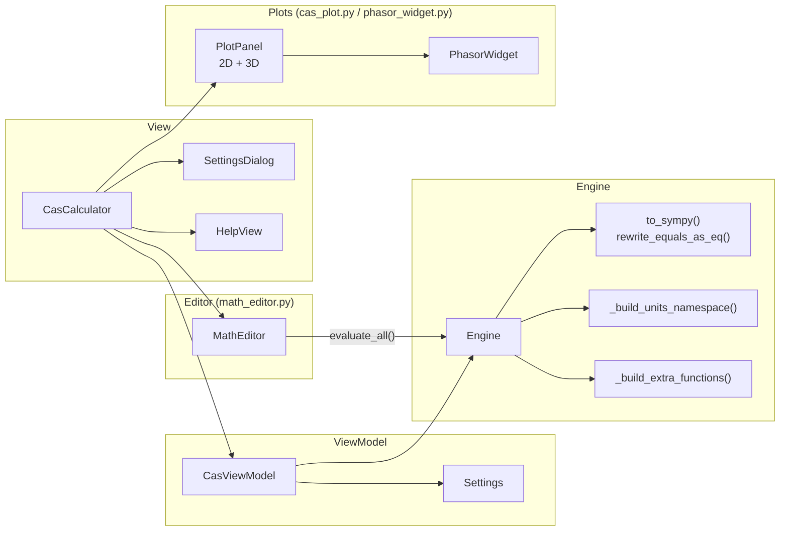
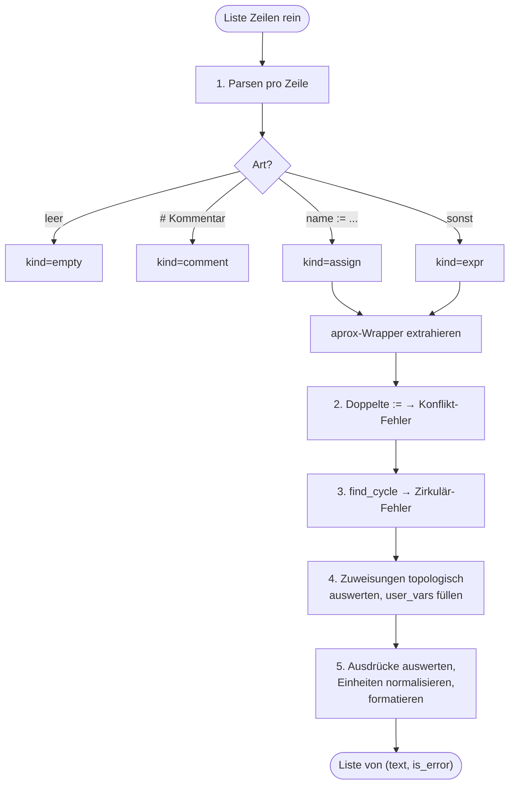
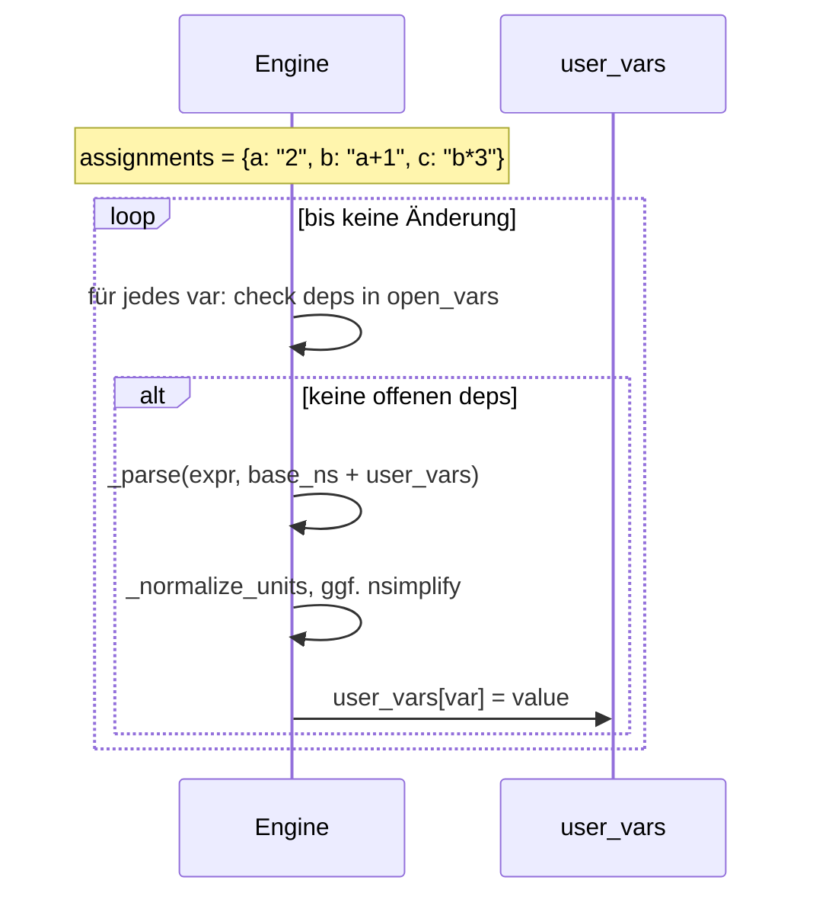
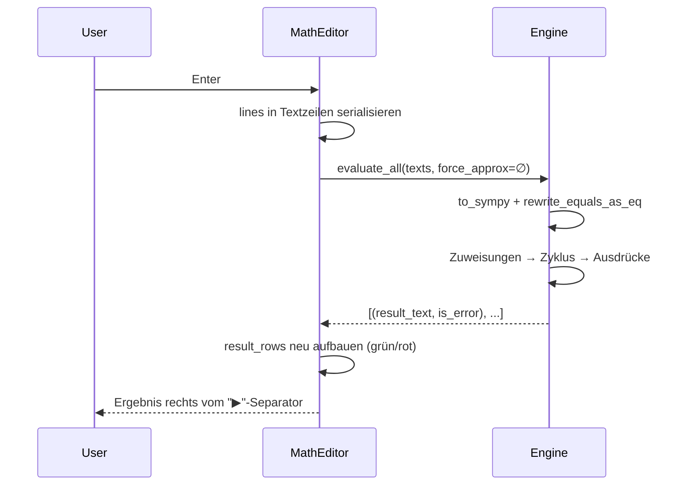

# CAS-Rechner — [cas_rechner.py](../cas_rechner.py), [cas_plot.py](../cas_plot.py), [phasor_widget.py](../phasor_widget.py)

Computer-Algebra-System im Stil eines TI-NSpire: Multi-Line-Editor,
symbolische Auswertung per **SymPy**, Einheiten (SI mit Präfixen),
drei Zahlenformate (Standard, SIC, ENG), 2D/3D-Plots und
Phasor-Diagramm für komplexe Größen.

Der `CasTabManager` in `main.py` hält mehrere unabhängige
`CasCalculator`-Instanzen als Tabs. Neuer Tab: `+`-Knopf oder `Ctrl+T`;
Umbenennen: Doppelklick auf den Tab-Namen.

## Grobe Einordnung

Fünf Hauptbausteine:



## Modul-Konstanten

| Name | Zweck |
| --- | --- |
| `HELP_FOLDER` | `cas_hilfe/` — Markdown-Quelle für `HelpView`. |
| `_UNITS_CACHE` | Lazy-Cache für den Einheiten-Namespace (SymPy-Import ist teuer). |
| `_SUPERSCRIPT_DIGITS` | `str.maketrans`-Tabelle Ziffern → Unicode-hochgestellt. |
| `_PREFIX_FOR_EXP3` | `{24: "Y", …, -24: "y"}` — SI-Präfix je Drei-Exponent. |
| `_UNITS_WITH_PREFIX` | Welche Basiseinheiten dürfen via Präfix skaliert werden (ENG). |

## Die drei Kern-Transformationen

Bevor SymPy parsen kann, muss die NSpire-artige Schreibweise umgeschrieben
werden.

### [`to_sympy(s)`](../cas_rechner.py#L100)

| Eingabe | Ausgabe |
| --- | --- |
| `x^2` | `x**2` |
| `√(x+1)` / `√x` | `sqrt(x+1)` / `sqrt(x)` |
| `\|x\|` | `Abs(x)` |
| `π`, `∞` | `pi`, `oo` |
| `2x`, `3(a+b)` | `2*x`, `3*(a+b)` (implizite Multiplikation) |
| `3_N` | `3*_N` (Einheiten-Präfix vor `_`) |

`:=` wird **nicht** angefasst — das behandelt `evaluate_all` separat.

### [`rewrite_equals_as_eq(s)`](../cas_rechner.py#L120)

SymPys eingebautes `convert_equals_signs` ist token-basiert und frisst
Kommas in `Eq`. Dieser Rewriter läuft klammer- und kommabewusst:

- `solve(x^2 = 4, x)` → `solve(Eq(x^2, 4), x)` (nicht `Eq(x^2, 4, x)`).
- Lässt `==`, `!=`, `<=`, `>=`, `:=` unberührt.
- Scannt rückwärts, damit Positionen stabil bleiben.

### [`find_cycle(assigns)`](../cas_rechner.py#L191)

Tiefensuche im Abhängigkeitsgraph der `:=`-Zuweisungen. Gibt den Zyklus
als Liste zurück (z. B. `["a", "b", "c", "a"]`) oder `None`.

## Settings

[`class Settings`](../cas_rechner.py#L226) — einfacher Datencontainer:

| Attribut | Werte | Bedeutung |
| --- | --- | --- |
| `angle_mode` | `"RAD"` / `"DEG"` | wrappt sin/cos/... in DEG mit `π/180`. |
| `number_format` | `"auto"` / `"SIC"` / `"ENG"` | Format bei `aprox(...)`. |
| `decimal_places` | 1..15 | Nachkommastellen. |

## Einheiten-Namespace

[`_build_units_namespace()`](../cas_rechner.py#L243) baut das Dict
`{"_m": meter, "_kN": 1000*newton, "_µs": Rational(1, 10**6)*second, …}`.

**Konvention**: alle Einheiten beginnen mit `_`, damit sie vom Variablen-
namen unterscheidbar sind. Basiseinheiten haben Vorrang bei Namens-
kollisionen (wichtig: `_m` ist Meter, **nicht** Milli-X).

| Basis | Präfix-Kombinationen |
| --- | --- |
| `m, s, A, K, mol, N, J, W, Pa, Hz, V, F, C, T, H, Wb, S, g, L, eV` | `Y Z E P T G M k h da d c m u/µ n p f a z y` |
| `kg, min, h, d` | keine (bereits präfigiert bzw. nicht-SI) |

## Zusatz-Funktionen (TI-Stil)

[`_build_extra_functions(sy)`](../cas_rechner.py#L413) ergänzt den
SymPy-Namespace um NSpire-Äquivalente. Gruppiert:

| Gruppe | Funktionen |
| --- | --- |
| Analysis | `deriv`, `integral`, `taylor`, `fMin`, `fMax` |
| Algebra | `nSolve`, `zeros`, `poly` |
| Vektor/Matrix | `dotP`, `crossP`, `norm`, `unitV`, `det`, `trace`, `rank`, `inv`, `transp`, `eigVl`, `eigVc`, `identity`, `zeroMat` |
| Statistik | `mean`, `median`, `variance`, `stdDev`, `sumL`, `prodL`, `nCr`, `nPr`, `mod` |
| Aliase | `ceil`, `conj`, `round` |

`_to_matrix` und `_to_flat_list` normalisieren Listen/Matrizen, damit
`[1,2,3]` genauso funktioniert wie `Matrix([1,2,3])`.

## Engine — Kern der Auswertung

[`class Engine`](../cas_rechner.py#L652) hält den SymPy-Namespace und
wertet Multi-Line-Eingaben in einem Durchlauf aus.

### Ablauf von `evaluate_all(expressions, force_approx)`



**Wichtige Schritte im Detail**:

- [`_base_namespace`](../cas_rechner.py#L698) — baut frisches Namespace
  aus SymPy-Attributen + Einheiten + Extras. Entfernt `__builtins__`.
  In DEG-Modus werden sin/cos/tan/cot/sec/csc (und ihre Inversen)
  mit `π/180` gewrappt.
- [`_parse`](../cas_rechner.py#L732) — ruft zuerst
  `rewrite_equals_as_eq`, dann `sympy.parsing.sympy_parser.parse_expr`
  mit `standard_transformations`.
- [`_normalize_units`](../cas_rechner.py#L933) — probiert die Ausdruck
  auf `_PREFERRED_UNIT_NAMES` zu reduzieren (`J/m → N`, `V/A → Ω`),
  sonst Reduktion auf SI-Basis.
- [`_format`](../cas_rechner.py#L982) — wenn `approx=True`:
  numerische Darstellung mit `_format_numeric` / `_format_numeric_with_unit`.
  Exakter Modus zeigt Rationale direkt; numerischer Vergleichswert wird
  nach `  ≈  ` angehängt, falls er sich sichtbar unterscheidet.

### Zuweisungen — topologische Auswertung



Erkennt der Algorithmus einen Fortschritts-Stopp bei noch offenen
Variablen, meldet er `"Konnte nicht aufgelöst werden"`.

## SIC / ENG Zahlenformat

| Funktion | Beispiel `x=1.23e5` |
| --- | --- |
| [`format_number_scientific`](../cas_rechner.py#L376) | `1.23·10⁵` |
| [`format_number_engineering`](../cas_rechner.py#L385) | `("123", 3)` → wird extern zu `123·10³` oder mit Einheit `123 _kHz` |
| [`_format_mantissa`](../cas_rechner.py#L368) | Hängt Nullen ab: `1.230 → 1.23` |
| [`_unit_allows_prefix`](../cas_rechner.py#L398) | Erlaubt ENG den SI-Präfix? Nur wenn Text genau eine Einheit aus `_UNITS_WITH_PREFIX` ist (keine `*`, `/`, `^`). |

Im ENG-Modus mit Einheit: die Engine wählt direkt den passenden
SI-Präfix — `1200 _V` wird zu `1.2 _kV`.

## Hilfe-Ansicht

[`class HelpView`](../cas_rechner.py#L1228) — zeigt Markdown-Artikel
aus `cas_hilfe/`. Aufbau ähnlich Lexikon, aber gekapselt: linke Liste
(gruppiert nach `kategorie`-Frontmatter-Feld), rechts ein `QTextBrowser`.

Der Markdown→HTML-Wandler ist simpler als im Lexikon:

- [`_parse_frontmatter`](../cas_rechner.py#L1116) — YAML `---`-Block.
- [`_format_inline`](../cas_rechner.py#L1131) — `**fett**`, Inline-Code.
- [`_markdown_to_html`](../cas_rechner.py#L1146) — Überschriften,
  Absätze, Listen, Code-Blöcke.

## SettingsDialog

[`class SettingsDialog`](../cas_rechner.py#L1341) — modaler Dialog mit
drei Sektionen:

```
┌──────────────────────────────────┐
│ Winkelmodus                      │
│   ( ) RAD - Bogenmass            │
│   ( ) DEG - Grad                 │
│                                  │
│ Zahlenformat bei aprox           │
│   ( ) Standard - Dezimalbruch    │
│   ( ) SIC - wissenschaftlich     │
│   ( ) ENG - Ingenieur            │
│                                  │
│ Nachkommastellen  [ 6 ] (1-15)   │
│                                  │
│         [Abbrechen] [Übernehmen] │
└──────────────────────────────────┘
```

`_apply()` schreibt direkt in das übergebene `Settings`-Objekt (Referenz).
Die Engine liest `settings` bei jeder Auswertung neu — Änderungen
wirken sofort.

## CasViewModel

[`class CasViewModel`](../cas_rechner.py#L1440):

| Member | Rolle |
| --- | --- |
| `settings: Settings` | Laufzeit-Konfiguration. |
| `engine: Engine` | Auswerter, erhält `settings` per Konstruktor. |
| `_help_active: bool` | Zeigt `HelpView` statt Editor. |
| `toggle_help()` | Schaltet um, gibt neuen Zustand zurück. |
| `status_text()` | `"RAD · SIC"` etc. für das Toolbar-Label. |

## CasCalculator — View

[`class CasCalculator`](../cas_rechner.py#L1486):

```
┌──────────────────────────────────────────────────────────────┐
│ casToolbar: CAS Rechner │ │ ? Hilfe │ Einstellungen │ RAD··  │
│                                           [Leeren (Ctrl+L)]  │
├──────────────────────────────────────────────────────────────┤
│ QStackedWidget:                                              │
│   Index 0  = editor_scroll → MathEditor                      │
│   Index 1  = HelpView                                        │
└──────────────────────────────────────────────────────────────┘
```

- `_toggle_help` → stellt den Stack zwischen Editor und Hilfe um,
  deaktiviert/aktiviert `clear_button` und `settings_button`.
- `_open_settings` → wenn der Dialog `OK` liefert, ruft
  `editor._evaluate()`, damit die Zeilen mit neuer Konfiguration neu
  berechnet werden.
- [`insert_formula(formula)`](../cas_rechner.py#L1607) — public API,
  wird vom Lexikon aufgerufen. Beendet bei Bedarf den Hilfe-Modus,
  reicht dann an `MathEditor.insert_formula` weiter.

## Was passiert bei Enter im Editor?



Bei **Ctrl+Enter** wird der Index der aktuellen Zeile in `force_approx`
gesetzt — die Zeile wird numerisch ausgewertet.

## PlotPanel — [cas_plot.py](../cas_plot.py)

[`class PlotPanel`](../cas_plot.py) ist ein `QTabWidget` mit zwei Karten,
das rechts neben dem `MathEditor` eingeblendet wird:

| Karte | Inhalt |
| --- | --- |
| **2D** | Einargumentige Funktionen `f(x) :=` — Checkboxen, Bereichs-Eingaben, Matplotlib-Leinwand + NavigationToolbar |
| **3D** | Zweiargumentige Funktionen `g(x, y) :=` — gleiches Prinzip, 3D-Surface-Plot |

**Ablauf**: Die Funktionsdefinitionen werden per Regex aus den
Editor-Zeilen gelesen (`_FUNC_DEF_RE`). Einfache Variablen-Zuweisungen
(`a := 2`) werden für Substitutionen ausgewertet. SymPy `lambdify` +
NumPy übernehmen die Abtastung (500 Punkte in 2D, 45×45 in 3D).

Mausrad zoomt (`_SCROLL_SCALE = 1.2`). Die dritte Karte des
`QTabWidget` ist der [`PhasorWidget`](../phasor_widget.py).

## PhasorWidget — [phasor_widget.py](../phasor_widget.py)

[`class PhasorWidget`](../phasor_widget.py) zeigt komplexe Variablen
aus dem CAS-Namespace als farbige Zeiger (Phasoren) in der Gaußschen
Zahlenebene — Betrag als Pfeillänge, Winkel als Richtung.

**CAS-Syntax**:

```
U := 5 * exp(j * pi / 6)   # 5∠30°, Exponentialform
I := 2 + 3*j               # Kartesische Form
Z := phasor(10, 45)        # 10∠45° (Grad), Hilfsfunktion
```

Jeder Phasor erhält automatisch eine der Farben aus `_COLORS` (Blau,
Rot, Grün, Orange, Lila, …). Das Widget berechnet aus allen Phasoren
den gemeinsamen Sichtbereich und zeichnet Winkelbogen mit
Gradangabe.

## Syntax-Zusammenfassung

| Schreibweise | Bedeutung |
| --- | --- |
| `x := 3` | globale Zuweisung (gilt im ganzen Dokument, überall lesbar). |
| `f(x) := x^2` | Funktionsdefinition — erscheint automatisch im 2D-Plot. |
| `g(x, y) := x*y` | Zweiargumentige Funktion — erscheint im 3D-Plot. |
| `x = 3` | Gleichung, wird zu `Eq(x, 3)`. |
| `aprox(x)` | zwingt numerische Auswertung dieser Teilformel. |
| `# Kommentar` | wird nicht ausgewertet. |
| `π`, `∞`, `√x`, `\|x\|`, `x^2`, `2x` | NSpire-Notation, wird von `to_sympy` übersetzt. |
| `_V`, `_kHz`, `_µs` | Einheiten mit optionalem SI-Präfix. |
| `phasor(r, θ_deg)` | Erzeugt komplexen Zeiger für das Phasor-Diagramm. |
