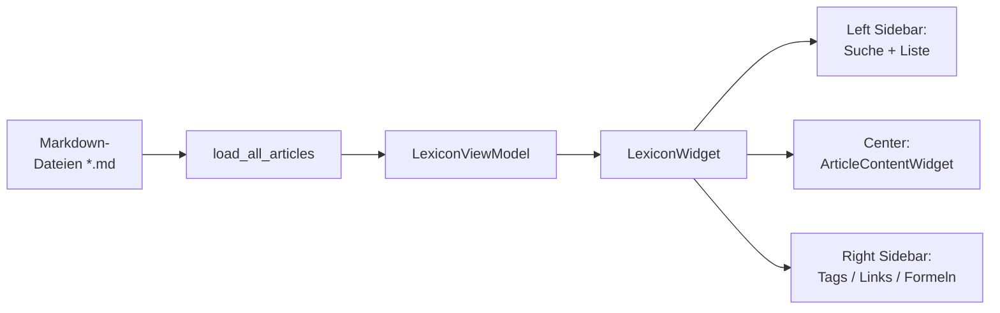
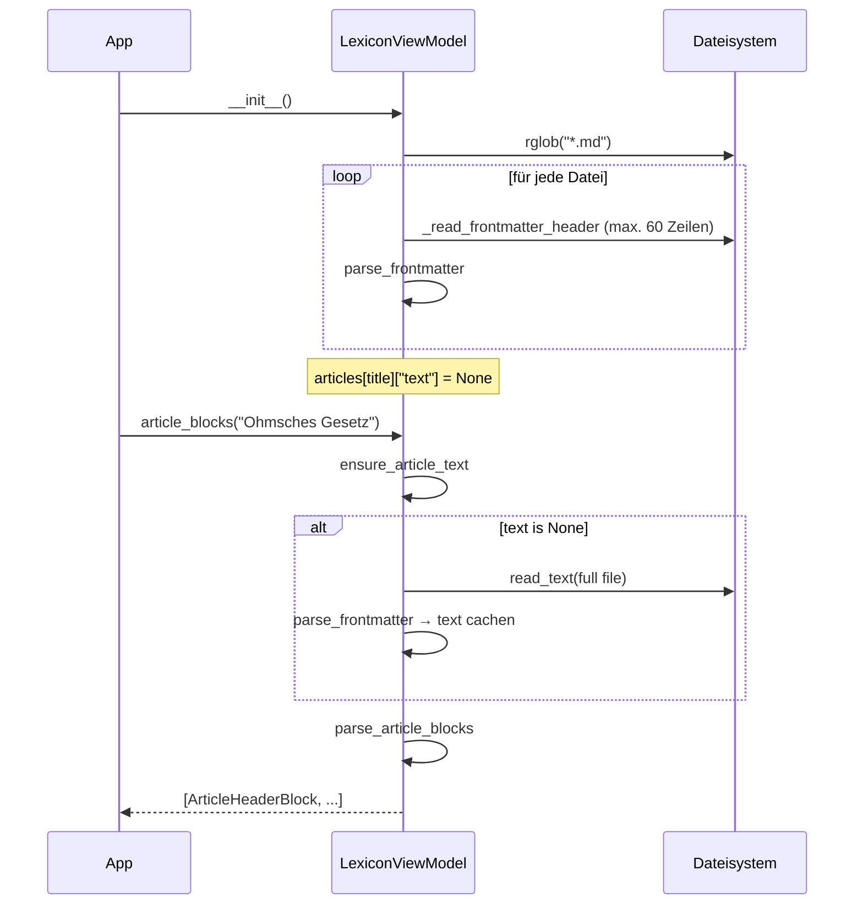
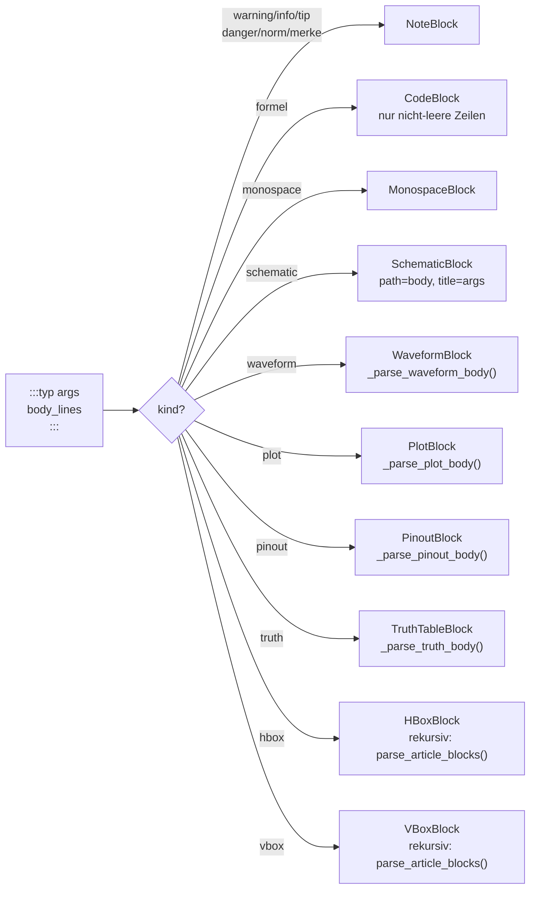
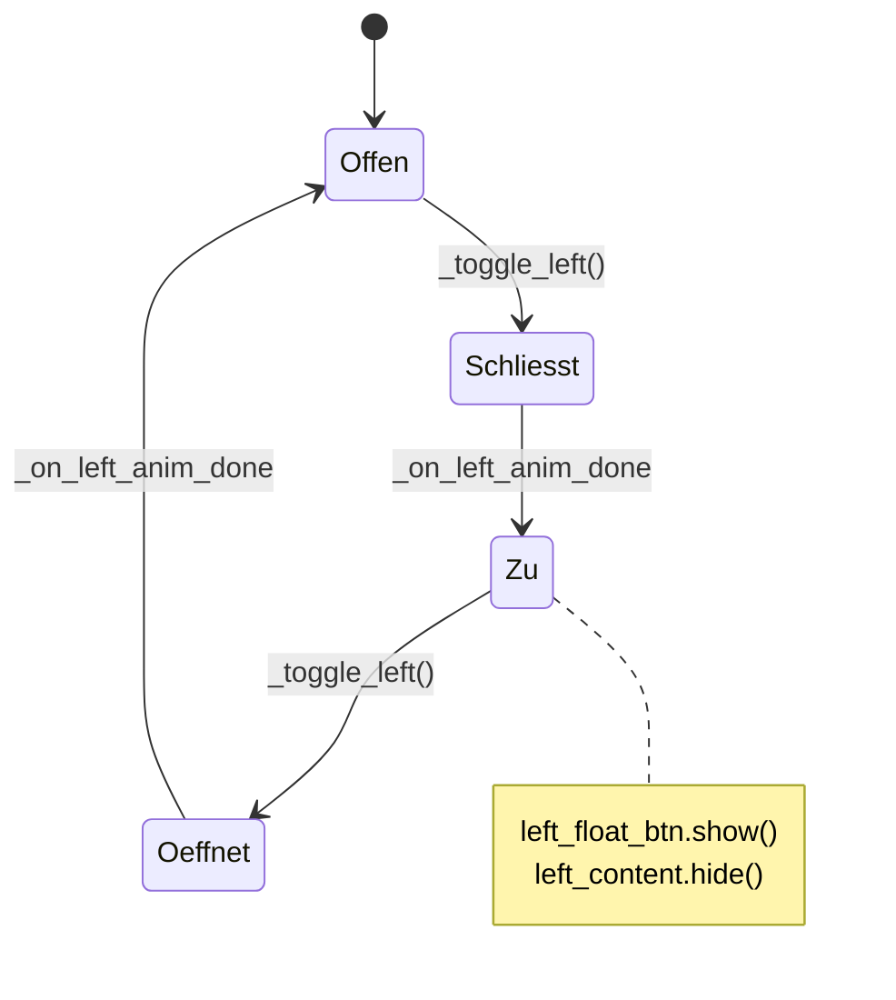
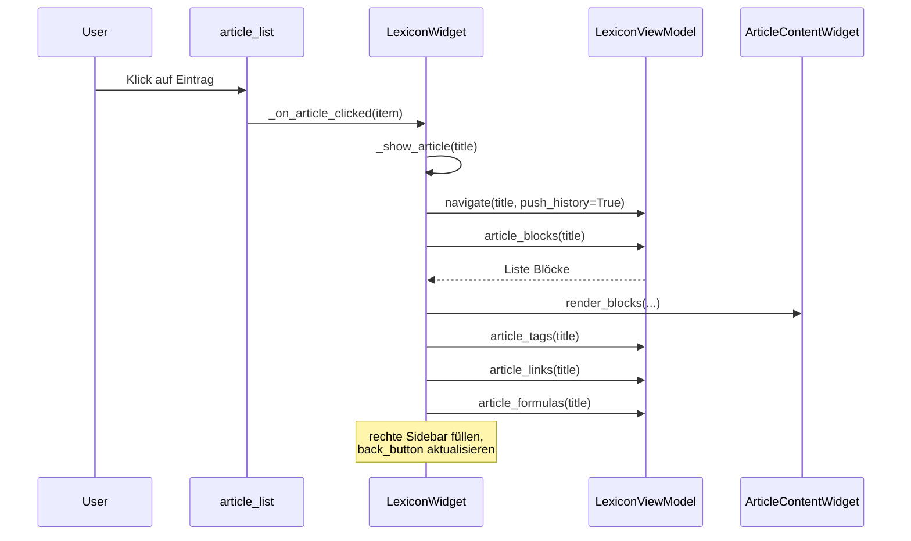

# Lexikon — [lexikon.py](../lexikon.py)

Das Lexikon zeigt Markdown-Artikel aus `artikel/` an. Jeder Artikel hat
einen YAML-Frontmatter (Titel, Kategorie, Tags, optional Symbol/Einheit).
Wiki-Links der Form `[[Ziel]]` verknüpfen Artikel, erkannte Formeln
können per Knopfdruck in den CAS-Rechner übernommen werden.

## Grobe Einordnung



## MVVM-Aufteilung

| Schicht | Akteure | Verantwortung |
| --- | --- | --- |
| **Model** | `load_all_articles`, `parse_frontmatter`, `parse_tags`, `parse_article_blocks`, `format_inline`, `ensure_article_text` | Markdown-IO und Block-Erzeugung. Reine Funktionen. |
| **ViewModel** | `LexiconViewModel` | Artikeldaten, Navigations-Verlauf, Filterung. Keine Qt-Importe. |
| **View** | `LexiconWidget`, `HamburgerButton`, `ArticleContentWidget`, `FormulaBlockWidget` | Darstellung, Delegation an das ViewModel. |

## Block-Typen (Dataclasses)

Der Artikel-Text wird in typisierte Blöcke zerlegt, nicht in HTML
gekippt — so bleiben Formeln und Spezial-Widgets separat und können als
eigene Widgets gerendert werden. Es gibt **15 Block-Typen**:

```mermaid
classDiagram
    class ArticleBlock {
        <<TypeAlias>>
    }
    class HeadingBlock {
        +int level
        +str text
    }
    class ParagraphBlock {
        +str html
    }
    class CodeBlock {
        +list~str~ lines
        Quelle: :::formel
    }
    class MonospaceBlock {
        +list~str~ lines
        Quelle: :::monospace
    }
    class ListBlock {
        +list~str~ items
    }
    class ImageBlock {
        +str alt
        +str path
    }
    class TableBlock {
        +list~str~ headers
        +list~list~str~~ rows
    }
    class ArticleHeaderBlock {
        +str kategorie
        +str symbol
        +str einheit
    }
    class SchematicBlock {
        +str path
        +str title
        Quelle: :::schematic
    }
    class WaveformBlock {
        +list~dict~ signals
        +list~str~ sample_labels
        Quelle: :::waveform
    }
    class PlotBlock {
        +str var
        +tuple x_range
        +list~dict~ curves
        +str xlabel
        +str ylabel
        Quelle: :::plot
    }
    class PinoutBlock {
        +str component
        +list~dict~ pins
        +str package
        Quelle: :::pinout
    }
    class TruthTableBlock {
        +list~str~ inputs
        +list~str~ outputs
        +list~list~int~~ rows
        Quelle: :::truth
    }
    class NoteBlock {
        +str text
        +str kind
        Quelle: :::info|tip|warning|danger|norm|merke
    }
    class HBoxBlock {
        +list~ArticleBlock~ children
        Quelle: :::hbox
    }
    class VBoxBlock {
        +list~ArticleBlock~ children
        Quelle: :::vbox
    }

    ArticleBlock <|-- HeadingBlock
    ArticleBlock <|-- ParagraphBlock
    ArticleBlock <|-- CodeBlock
    ArticleBlock <|-- MonospaceBlock
    ArticleBlock <|-- ListBlock
    ArticleBlock <|-- ImageBlock
    ArticleBlock <|-- TableBlock
    ArticleBlock <|-- ArticleHeaderBlock
    ArticleBlock <|-- SchematicBlock
    ArticleBlock <|-- WaveformBlock
    ArticleBlock <|-- PlotBlock
    ArticleBlock <|-- PinoutBlock
    ArticleBlock <|-- TruthTableBlock
    ArticleBlock <|-- NoteBlock
    ArticleBlock <|-- HBoxBlock
    ArticleBlock <|-- VBoxBlock
```



## Artikel laden — Lazy Loading

Beim Start werden **nur** die Frontmatter aller `.md`-Dateien gelesen.
Der Fließtext wird erst nachgeladen, wenn ein Artikel geöffnet wird —
und dann gecached.



**Wichtige Funktionen**:

- [`_read_frontmatter_header`](../lexikon.py) — stoppt nach dem
  schließenden `---` oder spätestens nach 60 Zeilen.
- [`_subfolder_category`](../lexikon.py) — leitet die Default-
  Kategorie aus dem direkten Unterordner-Namen ab; Artikel im Wurzelordner
  sind `"Allgemein"`.
- [`ensure_article_text`](../lexikon.py) — lädt den Text bei Bedarf;
  füllt `article["text"]`.
- [`load_all_articles`](../lexikon.py) — baut das Dictionary
  `Titel → {titel, kategorie, tags, meta, text, datei}`.

## Markdown → Blöcke — Gesamtablauf

Der Parser [`parse_article_blocks`](../lexikon.py) arbeitet zeilenweise.
Vor dem eigentlichen Parsen werden Wiki-Links (`[[Ziel|Anzeige]]`) per
Regex in HTML-Anker umgewandelt:

- **Existiert der Zielartikel** → blauer Link (`#2563eb`).
- **Existiert nicht** → grauer Span (`#9ca3af`).

```mermaid
flowchart TD
    Start([Zeile einlesen]) --> Q0{":::typ Block?"}
    Q0 -- "öffnend :::" --> Directive["Direktiven-Modus\nbody_lines sammeln"]
    Directive --> DEnd{"schließendes :::?"}
    DEnd -- nein --> Directive
    DEnd -- ja --> ParseDir["_parse_directive()\n→ Block-Objekt"]
    ParseDir --> Start

    Q0 -- nein --> Q1{"``` -Block?"}
    Q1 -- öffnend --> Code[in_code = True]
    Q1 -- schließend --> CodeOut[CodeBlock anhängen]
    Q1 -- nein --> Q2{im Code-Block?}
    Q2 -- ja --> Buf[code_buf.append]
    Q2 -- nein --> Q3{"# / ## / ###"}
    Q3 -- ja --> H[HeadingBlock]
    Q3 -- nein --> Q4{"| Tabellen-Zeile?"}
    Q4 -- ja --> TB[TableBlock aufbauen]
    Q4 -- nein --> Q5{"- " am Anfang?}
    Q5 -- ja --> LB[list_buf.append]
    Q5 -- nein --> Q6{"!Bild?"}
    Q6 -- ja --> IB[ImageBlock]
    Q6 -- nein --> Q7{Leerzeile?}
    Q7 -- ja --> Flush[flush_list]
    Q7 -- nein --> P[ParagraphBlock\nmit format_inline]

    Code --> Start
    CodeOut --> Start
    Buf --> Start
    H --> Start
    TB --> Start
    LB --> Start
    IB --> Start
    Flush --> Start
    P --> Start
```

## Direktiven-Parsing — `_parse_directive`

Alle `:::typ [args] ... :::` Blöcke werden durch
[`_parse_directive`](../lexikon.py) in Block-Objekte umgewandelt:



### Direktiven-Syntax — Übersicht

| Direktive | Syntax | Ergebnis |
| --- | --- | --- |
| `:::formel` | Formel-Zeilen | `CodeBlock` → FormulaBlockWidget |
| `:::monospace` | Vorformatierter Text | `MonospaceBlock` → Mono-Label |
| `:::schematic Titel` | Pfad zur SVG/PNG | `SchematicBlock` → Bild + Titel |
| `:::waveform` | `Signal: 0,1,0,1` pro Zeile | `WaveformBlock` → Zeitdiagramm |
| `:::plot` | `var:`, `range:`, `Kurve: expr` | `PlotBlock` → matplotlib-Graph |
| `:::pinout IC (Gehäuse)` | `1: GND \| Masse` pro Zeile | `PinoutBlock` → Pin-Tabelle |
| `:::truth A,B \| Q` | `0,0 \| 1` pro Zeile | `TruthTableBlock` → Wahrheitstabelle |
| `:::info` / `:::tip` / `:::warning` | Hinweistext | `NoteBlock` (farbiger Rahmen) |
| `:::danger` / `:::norm` / `:::merke` | Hinweistext | `NoteBlock` (farbiger Rahmen) |
| `:::hbox` | Verschachtelte Direktiven | `HBoxBlock` → horizontales Layout |
| `:::vbox` | Verschachtelte Direktiven | `VBoxBlock` → vertikales Layout |

### Waveform-Syntax

```
:::waveform
labels: T0,T1,T2,T3        # optionale X-Achsen-Beschriftung
CLK:    0,1,0,1             # digital: Werte 0 oder 1
DATA:   0,0,1,1             # digital
UAUS:   ~0.0,1.5,3.3,0.0   # analog: Tilde-Prefix → float-Werte
:::
```

### Plot-Syntax

```
:::plot
var:    t
range:  0, 5
Laden:    1 - exp(-t)       # Kurvenname: Python-Ausdruck
Entladen: exp(-t)
xlabel: Zeit (τ)
ylabel: U / U₀
:::
```

Erlaubte Funktionen: `exp`, `log`, `log10`, `sqrt`, `abs`, `sin`, `cos`,
`tan`, `asin`, `acos`, `atan`, `pi`, `e`, `max`, `min`.

### Pinout-Syntax

```
:::pinout NE555 (DIP-8)
1: GND | Masse-Anschluss
2: TRIG | Trigger-Eingang
3: OUT  | Ausgang
:::
```

### Wahrheitstabellen-Syntax

```
:::truth A,B | Q
0,0 | 0
0,1 | 1
1,0 | 1
1,1 | 0
:::
```

Trenner `|` zwischen Eingängen und Ausgängen ist optional — ohne `|`
werden alle Spalten aus dem Kopf abgeleitet.

## LexiconViewModel — was passiert wann

| Methode | Was sie tut |
| --- | --- |
| [`filtered_categories(query)`](../lexikon.py) | Sucht in Titel, Tags und Kategorie (case-insensitive). Gruppiert Ergebnisse nach Kategorie. |
| [`navigate(title, push_history)`](../lexikon.py) | Setzt `current_title`. Push-History: aktueller Artikel landet in `self.history`. |
| [`go_back()`](../lexikon.py) | Pop vom `history`-Stack; `None` wenn leer. |
| [`can_go_back()`](../lexikon.py) | Aktiviert/deaktiviert den Zurück-Button. |
| [`article_blocks(title)`](../lexikon.py) | Liefert `[ArticleHeaderBlock, ...]` inkl. Lazy-Load des Texts. |
| [`home_html()`](../lexikon.py) | Baut die Startseite: alle Artikel als Chips gruppiert nach Kategorie. |
| [`article_tags(title)`](../lexikon.py) | Gibt die Tag-Liste zurück (für die rechte Sidebar). |
| [`article_links(title)`](../lexikon.py) | Dedup-Wiki-Link-Liste: `[(anzeige, gefundener_titel_oder_None)]`. |
| [`article_formulas(title)`](../lexikon.py) | Sucht Inline-Code mit `=+-*/` und Zeilen in Code-Blöcken. Dedup, mind. 3 Zeichen. |

## LexiconWidget — Aufbau

Das `LexiconWidget` verwaltet sein eigenes Layout komplett selbst
(Toolbars, Navigation, Sidebars) — `main.py` kennt es nur als `QWidget`.

```
┌─────────────────────────────────────────────────────────────────┐
│ Lexikon-Toolbar  (Titel + <- Zurück + Hamburger-Buttons)        │
├──────────┬─────────────────────────────────────┬────────────────┤
│ left_    │ ArticleContentWidget                │ right_sidebar  │
│ sidebar  │ (Artikel / Startseite)              │ (Tags / Links  │
│ (Suche + │                                     │  / Formeln)    │
│ Liste)   │                                     │                │
└──────────┴─────────────────────────────────────┴────────────────┘
```

### Sidebar-Animation

`HamburgerButton` toggelt Seitenleisten. Eine `QPropertyAnimation` auf
`maximumWidth` läuft 260 ms mit `OutCubic`. Bei geschlossener Sidebar
erscheint ein **Floating-Button** (`left_float_btn` / `right_float_btn`)
am unteren Fensterrand — positioniert in `_reposition_float_buttons`.



## ArticleContentWidget — Rendering

Zentrale Klasse für die Anzeige. Zwei Render-Modi:

- [`render_blocks(blocks, article_folder)`](../lexikon.py) — typisierte
  Blöcke werden zu Qt-Widgets (für Artikelseiten).
- [`render_html(html)`](../lexikon.py) — reines HTML in einem
  `QTextBrowser` (für die Startseite).

Dispatch in [`_block_to_widget`](../lexikon.py):

| Block | Widget-Methode | Ergebnis-Widget |
| --- | --- | --- |
| `ArticleHeaderBlock` | `_make_header` | Kategorie-Label + Symbol-/Einheit-Badges |
| `HeadingBlock` | `_make_heading` | `QLabel` mit level-abhängigem Style |
| `ParagraphBlock` | `_make_paragraph` | `QLabel` mit RichText, `linkActivated` → `_on_link_clicked` |
| `CodeBlock` | `_make_code_section` | je Zeile ein `FormulaBlockWidget` |
| `MonospaceBlock` | `_make_monospace` | `QLabel` mit Monospace-Font |
| `ListBlock` | `_make_list` | `QLabel`s mit Bullet-Zeichen |
| `ImageBlock` | `_make_image` | `QSvgWidget` (SVG) oder `QLabel` mit `QPixmap` (Raster) |
| `TableBlock` | `_make_table` | `QTableWidget` mit Kopfzeile |
| `SchematicBlock` | `_make_schematic` | SVG/Raster-Bild + optionaler Titel-Label |
| `WaveformBlock` | `_make_waveform` | Benutzerdefiniertes `WaveformWidget` |
| `PlotBlock` | `_make_plot` | Matplotlib-`FigureCanvas` |
| `PinoutBlock` | `_make_pinout` | `QTableWidget` Pin-Tabelle |
| `TruthTableBlock` | `_make_truth_table` | `QTableWidget` mit 0/1-Zellen |
| `NoteBlock` | `_make_note` | Farbiger Rahmen-`QFrame` + `QLabel` |
| `HBoxBlock` | `_make_hbox` | `QHBoxLayout` mit rekursiv gerenderten Kindern |
| `VBoxBlock` | `_make_vbox` | `QVBoxLayout` mit rekursiv gerenderten Kindern |

```mermaid
flowchart TD
    BW["_block_to_widget(block)"] --> T{type(block)}
    T -- ArticleHeaderBlock --> H["_make_header()"]
    T -- HeadingBlock --> HE["_make_heading()"]
    T -- ParagraphBlock --> P["_make_paragraph()"]
    T -- CodeBlock --> CB["_make_code_section()\nje Zeile → FormulaBlockWidget"]
    T -- MonospaceBlock --> MB["_make_monospace()"]
    T -- ListBlock --> LB["_make_list()"]
    T -- ImageBlock --> IB["_make_image()\n.svg → QSvgWidget\nRaster → QPixmap"]
    T -- TableBlock --> TB["_make_table()\nQTableWidget"]
    T -- SchematicBlock --> SB["_make_schematic()\nBild + Titel"]
    T -- WaveformBlock --> WB["_make_waveform()\nWaveformWidget"]
    T -- PlotBlock --> PB["_make_plot()\nmatplotlib Canvas"]
    T -- PinoutBlock --> PI["_make_pinout()\nPin-Tabelle"]
    T -- TruthTableBlock --> TT["_make_truth_table()\n0/1-Tabelle"]
    T -- NoteBlock --> NB["_make_note()\nFarbiger Rahmen\ninfo=blau tip=grün\nwarning=gelb danger=rot\nnorm=grau merke=lila"]
    T -- HBoxBlock --> HX["_make_hbox()\nrekursiv horizontal"]
    T -- VBoxBlock --> VX["_make_vbox()\nrekursiv vertikal"]
```

`_make_image` prüft den Dateisuffix: `.svg` → `QSvgRenderer`,
`_RASTER_SUFFIXES` (png/jpg/jpeg/bmp/gif/webp) → `QPixmap`. Breite
ist auf 600 px gedeckelt.

## FormulaBlockWidget — Brücke ins CAS

Jede Zeile eines `CodeBlock` wird als `FormulaBlockWidget` gerendert:
eine 2D-Formel (`MathFormulaDisplay` aus `math_editor.py`) links,
ein Knopf `-> CAS` rechts. Klick löst den Callback
`on_send_formula(formula)` aus, der beim Erstellen des Widgets von
`main.py` über `AppContext` verdrahtet wird:

```python
# In main.py (_make_lexikon):
def send_formula(formula: str) -> None:
    cas = ctx.get_tool("CAS Rechner")
    if cas is not None and hasattr(cas, "insert_formula"):
        cas.insert_formula(formula)
        ctx.switch_to("CAS Rechner")

return LexiconWidget(on_send_formula=send_formula)
```

## Navigation — Was passiert beim Artikel-Klick



### Wiki-Link-Klick

Paragraphen-Labels haben `linkActivated` verdrahtet. URLs mit Schema
`artikel://x/<quote(titel)>` landen in
[`_on_link_clicked`](../lexikon.py) — dekodiert per `unquote` und
löst `_show_article` aus.

## Artikel-Format — Frontmatter

```yaml
---
title: Artikeltitel
kategorie: ET          # EK | ET | SH | FT | MT | SI | EN
tags: [tag1, tag2]
symbol: X              # optional: Formelzeichen
einheit: Volt          # optional: SI-Einheit
---
```

Kategorien im Überblick:

| Kürzel | Bedeutung | Unterordner |
| --- | --- | --- |
| ET | Elektrotechnik | Bauelemente, Drehstrom, Grundlagen, Kondensator, Leistung, … |
| EK | Elektronik | Akku, Aktorik, Filter, Halbleiter, Motoren, OPV, … |
| SH | Schaltungstechnik / Digital | Digitaltechnik, Flipflop, Logik, Prozessor, … |
| FT | Fertigungstechnik | ESD, Löttechnik, PCB |
| MT | Messtechnik | Fehlersuche, Multimeter, Oszilloskop, Spektrum, … |
| SI | Sicherheit | Funktionale_Sicherheit, IP_Schutzarten, Personenschutz, … |
| EN | Entwicklung / Engineering | Bauteilmanagement, DesignForX |

## Konstanten am Modul-Kopf

| Name | Zweck |
| --- | --- |
| `ARTICLES_FOLDER` | Path auf `artikel/` neben `lexikon.py`. |
| `TAG_COLORS` | 5 (bg, fg)-Farbpaare, rotierend per `index % len` auf Tag-Badges. |
| `_RASTER_SUFFIXES` | Frozenset unterstützter Rasterformat-Endungen. |
| `_PLOT_NS` | Erlaubte Funktionen für `:::plot`-Ausdrücke (kein `eval` auf globalem Scope). |

## Einstieg

Das Lexikon wird nicht mehr direkt gestartet. `main.py` ist der Einstiegspunkt:

[`main()`](../main.py):

1. `QApplication(sys.argv)` — Qt-Einstieg.
2. `app.setStyle("Fusion")` — plattformunabhängiges Look-and-Feel.
3. Lädt `main.qss` als globalen Stylesheet (falls vorhanden).
4. Zeigt `MainWindow`, das alle Tools aus der `TOOLS`-Registry instanziiert.
5. `sys.exit(app.exec())` — Event-Loop.
