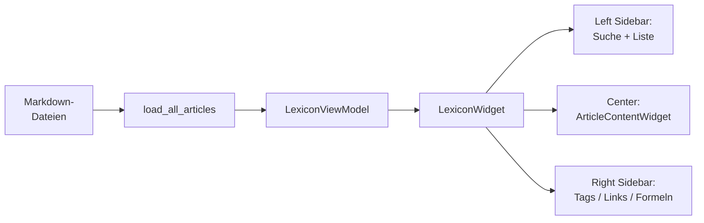
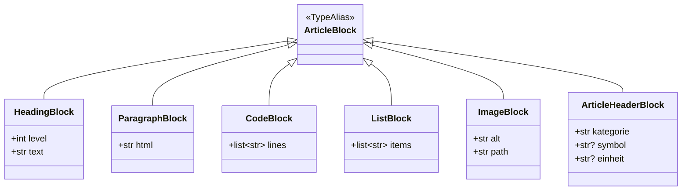
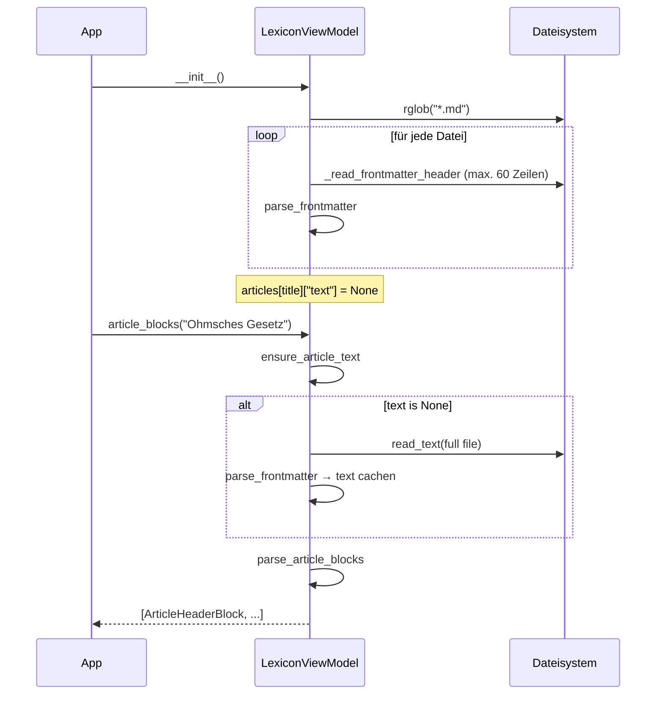
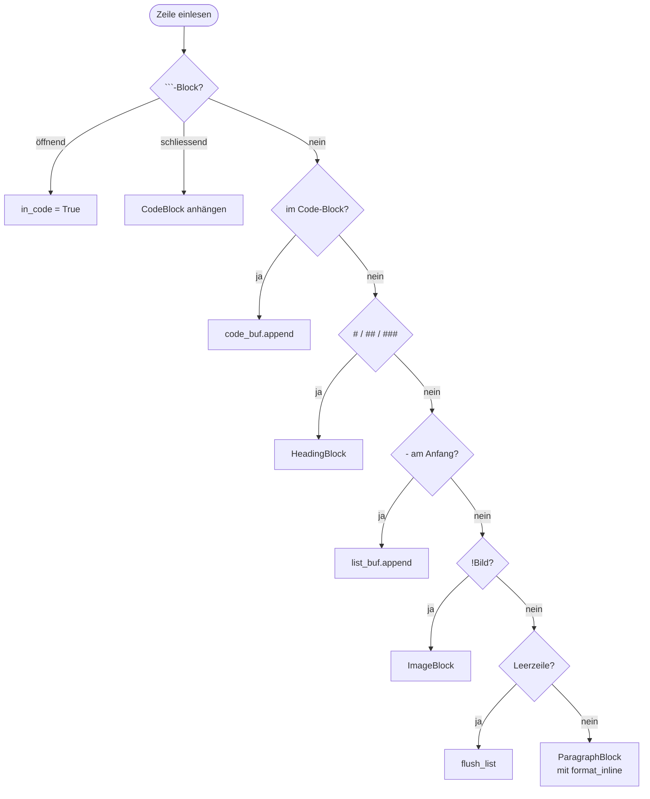
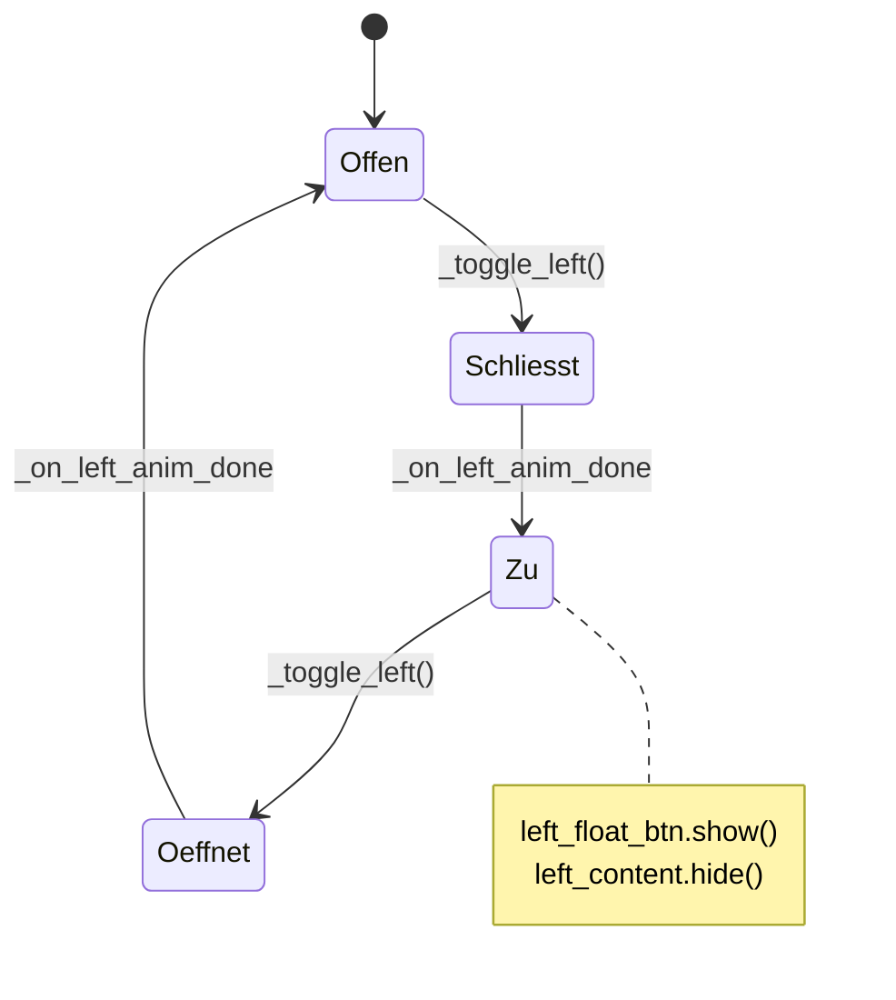
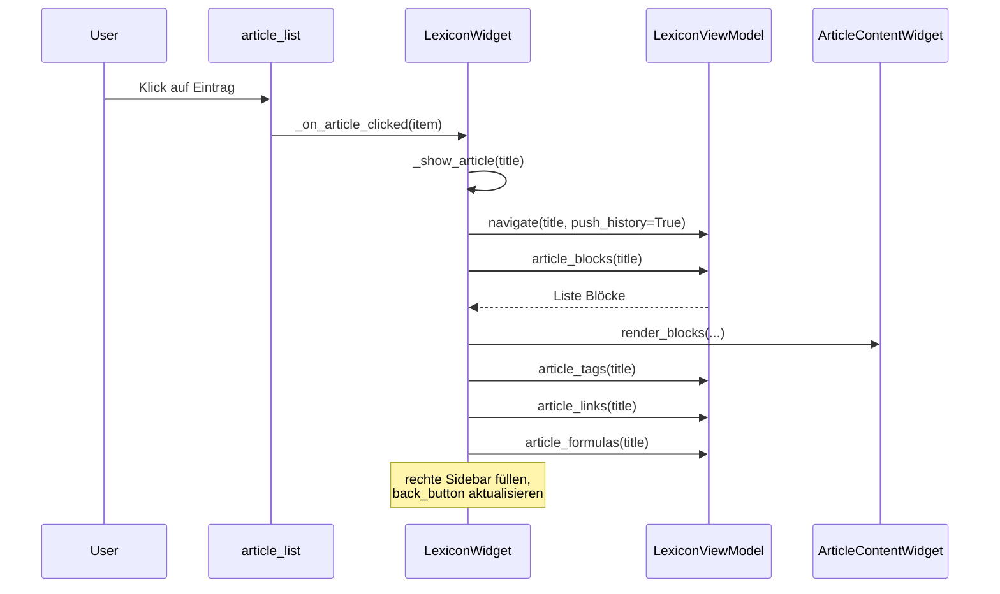

# Lexikon — [lexikon.py](../lexikon.py)

Das Lexikon zeigt Markdown-Artikel aus `artikel/` an. Jeder Artikel hat
einen YAML-Frontmatter (Titel, Kategorie, Tags, optional Symbol/Einheit).
Wiki-Links der Form `[[Ziel]]` verknüpfen Artikel, erkannte Formeln
können per Knopfdruck in den CAS-Rechner übernommen werden.

## Grobe Einordnung



## MVVM-Aufteilung

| Schicht | Akteure | Verantwortung |
| --- | --- | --- |
| **Model** | `load_all_articles`, `parse_frontmatter`, `parse_tags`, `parse_article_blocks`, `format_inline`, `ensure_article_text` | Markdown-IO und Block-Erzeugung. Reine Funktionen. |
| **ViewModel** | `LexiconViewModel` | Artikeldaten, Navigations-Verlauf, Filterung. Keine Qt-Importe. |
| **View** | `LexiconWidget`, `HamburgerButton`, `ArticleContentWidget`, `FormulaBlockWidget` | Darstellung, Delegation an das ViewModel. |

## Block-Typen (Dataclasses)

Der Artikel-Text wird in typisierte Blöcke zerlegt, nicht in HTML
gekippt — so bleiben Formeln separat und können als eigene Widgets
gerendert werden.



## Artikel laden — Lazy Loading

Beim Start werden **nur** die Frontmatter aller `.md`-Dateien gelesen.
Der Fließtext wird erst nachgeladen, wenn ein Artikel geöffnet wird —
und dann gecached.



**Wichtige Funktionen**:

- [`_read_frontmatter_header`](../lexikon.py) — stoppt nach dem
  schließenden `---` oder spätestens nach 60 Zeilen.
- [`_subfolder_category`](../lexikon.py) — leitet die Default-
  Kategorie aus dem direkten Unterordner-Namen ab; Artikel im Wurzelordner
  sind `"Allgemein"`.
- [`ensure_article_text`](../lexikon.py) — lädt den Text bei Bedarf;
  füllt `article["text"]`.
- [`load_all_articles`](../lexikon.py) — baut das Dictionary
  `Titel → {titel, kategorie, tags, meta, text, datei}`.

## Markdown → Blöcke

Der Parser [`parse_article_blocks`](../lexikon.py) arbeitet zeilenweise.
Vor dem eigentlichen Parsen werden Wiki-Links (`[[Ziel|Anzeige]]`) per
Regex in HTML-Anker umgewandelt:

- **Existiert der Zielartikel** → blauer Link (`#2563eb`).
- **Existiert nicht** → grauer Span (`#9ca3af`).



`flush_list()` wird aufgerufen, sobald ein nicht-Listen-Element kommt.
`format_inline` übersetzt `**fett**` → `<strong>` und Inline-Code
`` `…` `` → `<code>`.

## LexiconViewModel — was passiert wann

| Methode | Was sie tut |
| --- | --- |
| [`filtered_categories(query)`](../lexikon.py) | Sucht in Titel, Tags und Kategorie (case-insensitive). Gruppiert Ergebnisse nach Kategorie. |
| [`navigate(title, push_history)`](../lexikon.py) | Setzt `current_title`. Push-History: aktueller Artikel landet in `self.history`. |
| [`go_back()`](../lexikon.py) | Pop vom `history`-Stack; `None` wenn leer. |
| [`can_go_back()`](../lexikon.py) | Aktiviert/deaktiviert den Zurück-Button. |
| [`article_blocks(title)`](../lexikon.py) | Liefert `[ArticleHeaderBlock, ...]` inkl. Lazy-Load des Texts. |
| [`home_html()`](../lexikon.py) | Baut die Startseite: alle Artikel als Chips gruppiert nach Kategorie. |
| [`article_tags(title)`](../lexikon.py) | Gibt die Tag-Liste zurück (für die rechte Sidebar). |
| [`article_links(title)`](../lexikon.py) | Dedup-Wiki-Link-Liste: `[(anzeige, gefundener_titel_oder_None)]`. |
| [`article_formulas(title)`](../lexikon.py) | Sucht Inline-Code mit `=+-*/` und Zeilen in Code-Blöcken. Dedup, mind. 3 Zeichen. |

## LexiconWidget — Aufbau

Das `LexiconWidget` verwaltet sein eigenes Layout komplett selbst
(Toolbars, Navigation, Sidebars) — `main.py` kennt es nur als `QWidget`.

```
┌─────────────────────────────────────────────────────────────────┐
│ Lexikon-Toolbar  (Titel + <- Zurück + Hamburger-Buttons)        │
├──────────┬─────────────────────────────────────┬────────────────┤
│ left_    │ ArticleContentWidget                │ right_sidebar  │
│ sidebar  │ (Artikel / Startseite)              │ (Tags / Links  │
│ (Suche + │                                     │  / Formeln)    │
│ Liste)   │                                     │                │
└──────────┴─────────────────────────────────────┴────────────────┘
```

### Sidebar-Animation

`HamburgerButton` toggelt Seitenleisten. Eine `QPropertyAnimation` auf
`maximumWidth` läuft 260 ms mit `OutCubic`. Bei geschlossener Sidebar
erscheint ein **Floating-Button** (`left_float_btn` / `right_float_btn`)
am unteren Fensterrand — positioniert in `_reposition_float_buttons`.



## ArticleContentWidget — Rendering

Zentrale Klasse für die Anzeige. Zwei Render-Modi:

- [`render_blocks(blocks, article_folder)`](../lexikon.py) — typisierte
  Blöcke werden zu Qt-Widgets (für Artikelseiten).
- [`render_html(html)`](../lexikon.py) — reines HTML in einem
  `QTextBrowser` (für die Startseite).

Dispatch in [`_block_to_widget`](../lexikon.py):

| Block | Widget-Methode | Ergebnis-Widget |
| --- | --- | --- |
| `ArticleHeaderBlock` | `_make_header` | Kategorie-Label + Symbol-/Einheit-Badges |
| `HeadingBlock` | `_make_heading` | `QLabel` mit level-abhängigem Style |
| `ParagraphBlock` | `_make_paragraph` | `QLabel` mit RichText, `linkActivated` → `_on_link_clicked` |
| `CodeBlock` | `_make_code_section` | je Zeile ein `FormulaBlockWidget` |
| `ListBlock` | `_make_list` | `QLabel`s mit Bullet-Zeichen |
| `ImageBlock` | `_make_image` | `QSvgWidget` (SVG) oder `QLabel` mit `QPixmap` (Raster) |

`_make_image` prüft den Dateisuffix: `.svg` → `QSvgRenderer`,
`_RASTER_SUFFIXES` (png/jpg/jpeg/bmp/gif/webp) → `QPixmap`. Breite
ist auf 600 px gedeckelt.

## FormulaBlockWidget — Brücke ins CAS

Jede Zeile eines Code-Blocks wird als `FormulaBlockWidget` gerendert:
eine 2D-Formel (`MathFormulaDisplay` aus `math_editor.py`) links,
ein Knopf `-> CAS` rechts. Klick löst den Callback
`on_send_formula(formula)` aus, der beim Erstellen des Widgets von
`main.py` über `AppContext` verdrahtet wird:

```python
# In main.py (_make_lexikon):
def send_formula(formula: str) -> None:
    cas = ctx.get_tool("CAS Rechner")
    if cas is not None and hasattr(cas, "insert_formula"):
        cas.insert_formula(formula)
        ctx.switch_to("CAS Rechner")

return LexiconWidget(on_send_formula=send_formula)
```

## Navigation — Was passiert beim Artikel-Klick



### Wiki-Link-Klick

Paragraphen-Labels haben `linkActivated` verdrahtet. URLs mit Schema
`artikel://x/<quote(titel)>` landen in
[`_on_link_clicked`](../lexikon.py) — dekodiert per `unquote` und
löst `_show_article` aus.

## Konstanten am Modul-Kopf

| Name | Zweck |
| --- | --- |
| `ARTICLES_FOLDER` | Path auf `artikel/` neben `lexikon.py`. |
| `TAG_COLORS` | 5 (bg, fg)-Farbpaare, rotierend per `index % len` auf Tag-Badges. |
| `_RASTER_SUFFIXES` | Frozenset unterstützter Rasterformat-Endungen. |

## Einstieg

Das Lexikon wird nicht mehr direkt gestartet. `main.py` ist der Einstiegspunkt:

[`main()`](../main.py):

1. `QApplication(sys.argv)` — Qt-Einstieg.
2. `app.setStyle("Fusion")` — plattformunabhängiges Look-and-Feel.
3. Lädt `main.qss` als globalen Stylesheet (falls vorhanden).
4. Zeigt `MainWindow`, das alle Tools aus der `TOOLS`-Registry instanziiert.
5. `sys.exit(app.exec())` — Event-Loop.
