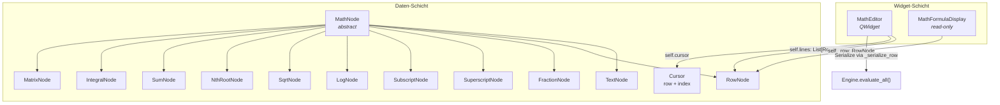
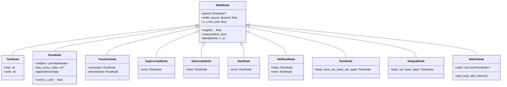
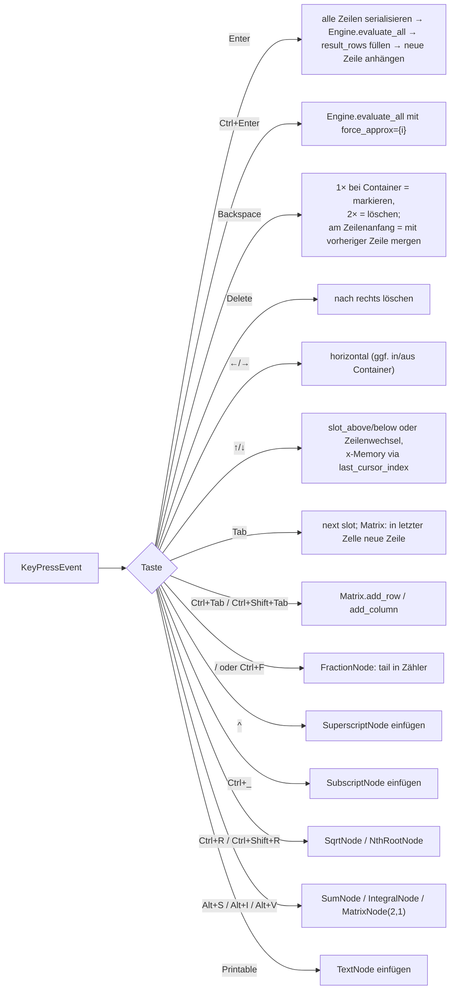
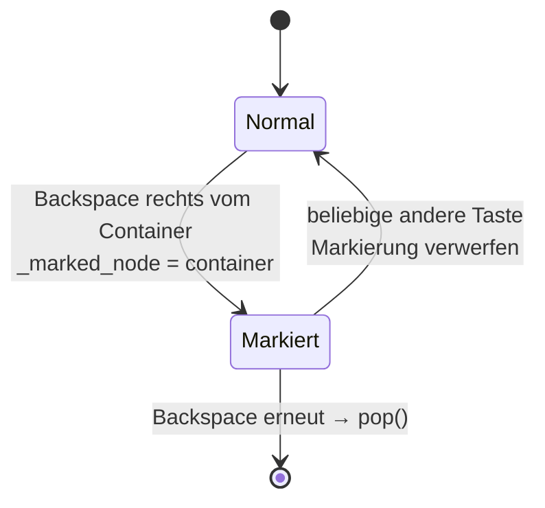
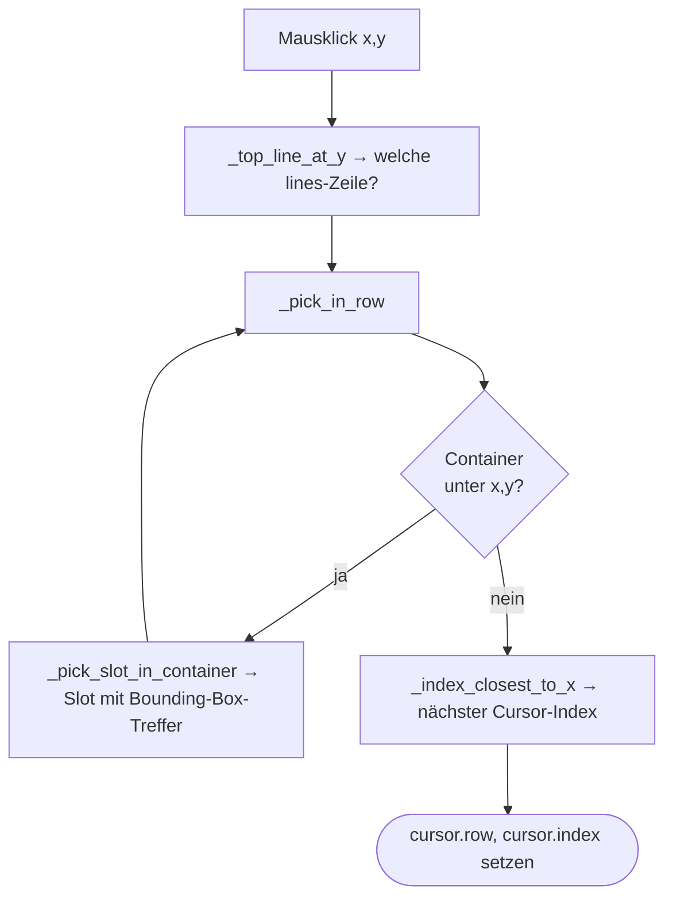
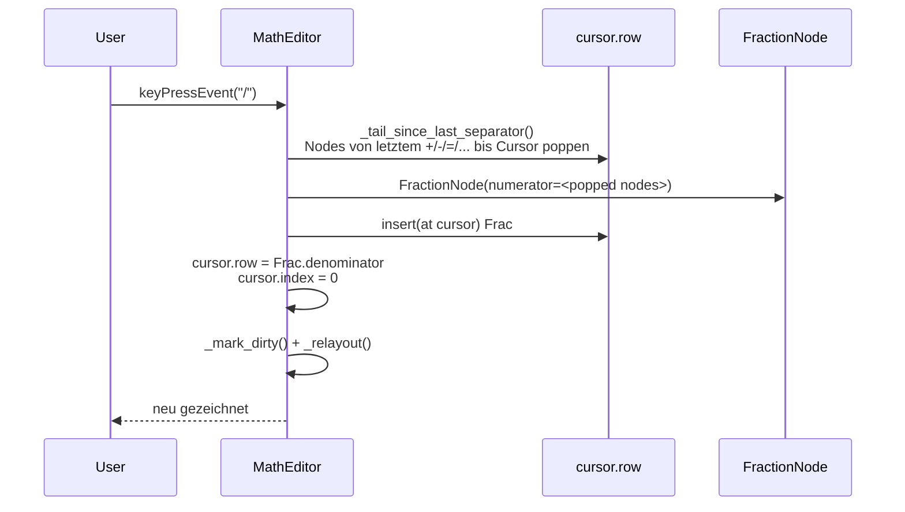

# Math Nodes & 2D-Editor — [math_editor.py](../math_editor.py)

Strukturierter 2D-Formel-Editor im Stil von Word / TI-NSpire. Jede
Formel ist ein **Baum** aus Nodes — kein Text-Buffer, kein LaTeX.
Das macht Cursor-Navigation, Exponent-Slots, Bruch-Zähler/Nenner
und Matrix-Zellen trivial adressierbar.

## Große Architektur



## Node-Hierarchie — Maße & Malen

Jeder Node kann zwei Dinge:

1. `measure(font_size)` — berechnet `width`, `ascent`, `descent`.
2. `paint(painter, x, y)` — zeichnet sich ab `(x, y)` (obere linke Ecke).

```
     ┌─ ascent ──┐
     │           │
 ────┼───────────┼─── Baseline
     │           │
     └─ descent ─┘
     └─── width ──┘
```



### Der Ein-Zeichen-Trick

`TextNode` hält **genau ein Zeichen**. Jeder Buchstabe, jede Ziffer,
jeder Operator ist ein eigener Node in der `RowNode.children`-Liste.
Cursor-Index `i` bedeutet: **links** vom Kind `i` (bzw. am Ende,
wenn `i == len(children)`). Das macht:

- Einfügen an Position: `row.insert(i, node)`.
- Backspace links: `row.pop(i - 1)`.
- Cursor-Zeichnung: Summe der Breiten der Kinder `[:i]`.

Keine Textpositions-Rechnerei, keine Range-Auswahl-Buchhaltung.

## RowNode als Slot

`RowNode` ist Container — horizontal aneinandergereihte Kinder auf
gemeinsamer Baseline. Gleichzeitig **Slot** in höheren Containern
(Zähler eines Bruchs, Exponent, Wurzel-Radikand, Matrix-Zelle).

Slots tragen das Spezial-Attribut `_container_parent`, damit die
Cursor-Navigation "aus dem Slot heraus" in den umgebenden Row findet.
Die Helferfunktionen dafür:

| Helper | Zweck |
| --- | --- |
| [`_container_of(row)`](../math_editor.py#L1142) | gibt den `_container_parent` zurück (z. B. `FractionNode`). |
| [`_find_enclosing_row(container)`](../math_editor.py#L1148) | findet die Row und den Index, in der der Container als Kind hängt. |

## Container-Protokoll

Jeder Container-Node implementiert optional:

| Methode | Aufgabe |
| --- | --- |
| `slots() -> List[RowNode]` | alle Slots in **Tab-Reihenfolge**. |
| `slot_above(row)` / `slot_below(row)` | für ↑/↓-Navigation. |
| `first_slot()` / `last_slot()` | Eintrittspunkt beim Hinein-/Heraus-Navigieren. |
| `horizontal_next(row)` / `horizontal_prev(row)` | Sonderfall: Σ unten `var = val`, Matrix-Spalten. |

**Beispiel `SumNode`**: `slots()` gibt `[body, lower_var, lower_val, upper]`
zurück → Tab führt `body → var → val → upper`. Horizontal springt `→` von
`lower_var` direkt zu `lower_val`.

## Modul-Konstanten (Tuning-Stellschrauben)

Am Modul-Kopf sind alle Geometrien offen-liegend — gut zum Feintuning.

| Konstante | Bedeutung |
| --- | --- |
| `FONT_FAMILY`, `FONT_SIZE_PT` | Basis-Font (Cambria Math, 18 pt). |
| `FRAC_GAP`, `FRAC_PAD_X`, `FRAC_SCALE` | Bruch-Layout: Abstand, Padding, Schriftverkleinerung. |
| `SUPER_SCALE`, `SUPER_RAISE_FACTOR` | Exponent-Skalierung + Hebung. |
| `SUB_SCALE`, `SUB_DROP_FACTOR` | Subscript-Skalierung + Senkung. |
| `SQRT_PAD_TOP / LEFT / RIGHT`, `SQRT_RADIX_W_FACTOR` | Wurzel-Haken + Vinculum. |
| `BIGOP_LIMIT_SCALE`, `SUM_SIZE_FACTOR`, `INT_SIZE_FACTOR` | Σ / ∫ Glyph und Grenzen. |
| `MATRIX_COL_GAP`, `MATRIX_ROW_GAP`, `MATRIX_BRACKET_W` | Matrix-Layout. |
| `LINE_GAP`, `SEP_TEXT` | Abstand zwischen Zeilen bzw. Separator `"  ▶  "`. |
| `C_TEXT`, `C_CURSOR`, `C_SLOT_EMPTY`, `C_SLOT_FOCUS`, `C_RES_OK`, `C_RES_ERR`, `C_COMMENT` | Farben. |

## Cursor

[`@dataclass Cursor`](../math_editor.py#L1120):

```python
row: RowNode     # in welcher Row stehen wir
index: int       # zwischen welchen Kindern (0..len(children))
```

`Cursor.clamp()` hält den Index in Grenzen. Alle Bewegungen passieren
im `MathEditor` — der Cursor selbst ist dumme Datenhaltung.

## MathEditor — was tut er

[`class MathEditor`](../math_editor.py#L1582) — Multi-Line 2D-Editor.

| Attribut | Rolle |
| --- | --- |
| `lines: List[RowNode]` | jede Zeile = Top-Level Row. |
| `results: List[Tuple[str, bool]]` | pro Zeile `(text, is_error)`. |
| `result_rows: List[Optional[RowNode]]` | geparster Ergebnis-Baum für die Anzeige rechts vom `▶`. |
| `cursor: Cursor` | aktuelle Position. |
| `_marked_node` | für den 2-stufigen Backspace (siehe unten). |
| `_sel_anchor` | Textauswahl-Anker oder `None`. |
| `_engine` | CAS-Engine — Enter → `engine.evaluate_all(...)`. |
| `_blink: QTimer` | 530 ms Blink-Intervall. |

### Multi-Line-Layout

```
┌────────────────────────────────────────┐
│ Line 0          ▶  Ergebnis 0          │
│ Line 1                                  │
│ # Kommentar (grau)                      │
│ Line 3          ▶  fehler (rot)         │
└────────────────────────────────────────┘
```

Jede `lines[i]` wird eigenständig vermessen, die Zeilen werden
vertikal mit `LINE_GAP` gestapelt.

### Tastatur — was passiert wann



### Der 2-stufige Backspace

Beim Löschen rechts neben einem Container (z. B. einem Bruch) wäre
direktes Verschwinden gefährlich. Ablauf:



Die Markierung wird im `paintEvent` als blauer Rahmen
(`_mark_border`) mit halbtransparentem Füll (`_mark_fill`) gezeichnet.

## Ergebnis-Anzeige: Text → navigierbarer Baum

Die Engine liefert Ergebnisse als **Strings** — z. B. `"1/(2*pi*f)"`
oder `"Matrix([[1,2],[3,4]])"`. Damit Cursor und Kopieren funktionieren,
wird der Text in einen eigenen Node-Baum zurück-geparst.

| Funktion | Aufgabe |
| --- | --- |
| [`_lex_result(s)`](../math_editor.py#L1259) | Lexer: Tokens wie `NUM`, `NAME`, `OP`, `(`, `)`. |
| [`class _ResultParser`](../math_editor.py#L1309) | Parser: baut rekursiv `RowNode`/`FractionNode`/`SuperscriptNode`/... auf. |
| [`_parse_result_to_row(text)`](../math_editor.py#L1539) | Convenience-Wrapper. |
| [`_colorize_result_row(row, color)`](../math_editor.py#L1553) | färbt alle `TextNode` grün (`C_RES_OK`) oder rot (`C_RES_ERR`). |
| `MathEditor._build_result_row(text, is_error)` | orchestriert: parsen + färben. |

Das Resultat landet in `result_rows[i]` und wird rechts vom
Separator-Text `  ▶  ` gezeichnet — navigierbar per Pfeiltasten,
aber schreibgeschützt (`_is_in_result_row()`).

## Serialisierung — Editor → Engine

[`_serialize_row(row)`](../math_editor.py#L2931) wandelt den Baum in
einen String, den `to_sympy` / `parse_expr` versteht:

| Node | Ausgabe |
| --- | --- |
| `TextNode` | `char` |
| `FractionNode` | `(zähler)/(nenner)` |
| `SuperscriptNode` | `^(inner)` |
| `SubscriptNode` | `_inner` (ohne Klammern — wird Teil des Symbolnamens) |
| `LogNode` | `log(arg)` oder `log(arg, base)` |
| `SqrtNode` / `NthRootNode` | `sqrt(inner)` / `(inner)**(1/(index))` |
| `SumNode` | `Sum(body, (var, lower, upper))` |
| `IntegralNode` | `Integral(body, (var, lower, upper))` |
| `MatrixNode` | `Matrix([[…], […]])` |

## Mehrzeilige Ausdrücke

[`_group_by_brackets(texts)`](../math_editor.py#L2866) — wenn eine
Zeile mit offener Klammer endet, wird die nächste angehängt, bis die
Klammern ausbalanciert sind. So kann `solve({`, `x+y=5,`, `x-y=1`,
`}, {x,y})` über vier Editor-Zeilen stehen und trotzdem als ein
Ausdruck an die Engine gehen.

## Maus-Interaktion — Klick trifft Cursor



Das ermöglicht auch das Klicken **in** einen Bruch-Zähler oder eine
Matrix-Zelle — der Cursor landet exakt dort.

## MathFormulaDisplay — das read-only Pendant

[`class MathFormulaDisplay`](../math_editor.py#L2824) — minimales
Widget für eine einzige Formel-Zeile, ohne Cursor, ohne Fokus.

Einsatzbereich: das `FormulaBlockWidget` im Lexikon zeigt damit die
gerenderte Formel neben dem `-> CAS`-Knopf an. Implementierung:

```python
self._row = RowNode()
for ch in formula: self._row.append(TextNode(ch))
self._row.measure(FONT_SIZE_PT)
# im paintEvent: self._row.paint(painter, PADDING_X, PADDING_Y)
```

Die Höhe wird aus `row.height + 2*PADDING_Y` fest gesetzt.

## Die komplette Einfüge-Kette

Beispiel: Benutzer tippt `/` in der Mitte von `a+b+c`.



So kann der Benutzer weiter im Nenner tippen, und der Zähler hat
genau den Text, der gerade links vom Cursor stand.
